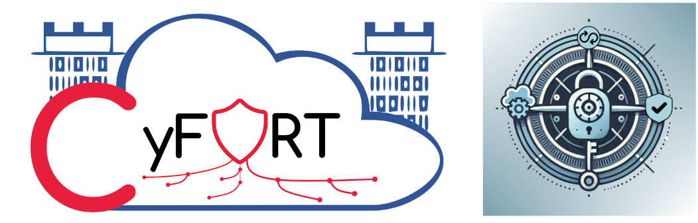

# C5-DEC

C5-DEC, short for "Common Criteria for Cybersecurity, Cryptography, Clouds – Design, Evaluation and Certification", is a sub-project of the [CyFORT](https://abstractionslab.com/index.php/research/) project, which in turn stands for "Cloud Cybersecurity Fortress of Open Resources and Tools for Resilience". CyFORT is carried out in the context of the [IPCEI-CIS](https://ec.europa.eu/commission/presscorner/detail/en/ip_23_6246) project, with further details available [here](https://www.bmwk.de/Redaktion/EN/Artikel/Industry/ipcei-cis.html).



C5-DEC CAD, the software component of C5-DEC, is a suite of tools for computer-aided design and development (CAD), mainly dealing with: the creation and evaluation of secure IT systems according to the [Common Criteria](https://www.commoncriteriaportal.org) standards, secure software development life cycle (SSDLC), software verification and validation model (SVVM), and what we refer to as cyber-physical system security assessment (CPSSA).

This repository contains the source code and full documentation (requirements, technical specifications, schematics, user manual, test case specifications and test reports) of C5-DEC CAD, exemplifying the C5-DEC method, which relies on storing, interlinking and processing all software development life cycle (SDLC) artifacts in a unified manner; see our [traceability web page](https://abstractionslab.github.io/c5dec/docs/traceability/index.html) for a concrete example reflecting the technical specifications of C5-DEC CAD itself.

## Table of contents

- [Overview](#overview)
- [Features](#features)
- [User manual](#user-manual)
- [Technical specifications](#documentation-and-technical-specifications)
- [Getting started](#getting-started)
- [Usage](#usage)
- [Roadmap](#roadmap)
- [License](#license)
- [Contact](#contact)

## Overview

The overall goal of the C5-DEC method is to bring together and contextualize SSDLC, SVVM and CPSSA within the Common Criteria framework. This means tackling the problem of building secure systems, while ensuring full traceability between system artifacts spanning the entire DLC and incorporating threat modelling and system security risk assessment into the design process, all in the context of the Common Criteria framework. 

To this end, C5-DEC CAD is aimed at assisting both system/software designers/developers as well as system security analysts with creating and evaluating secure software systems. For instance, it can be used by evaluation laboratories for the execution of impartial assessments of the security of computer systems and software according to the Common Criteria (CC), a set of internationally recognized standards (ISO/IEC 15408), and the complementary ISO/IEC 18045, dealing with a common methodology for computer security evaluation (CEM). CC certification gives users the assurance that a product satisfies the security guarantees and properties it claims to possess.

C5-DEC consists of two key elements that complement each other to form a coherent ensemble: a software component (C5-DEC CAD) and a knowledge base (KB) consisting of SSDLC and CPSSA methodologies as well as a [wiki of key CC concepts](./c5dec/assets/database/KnowledgeBase/0_MapofContent.md).

As certain parts of our KB reports rely on ISO standards (ISO/IEC/IEEE 12207, ISO 29119:2022 and ISO 29148:2018), if you wish to access them, please contact us at info@abstractionslab.lu. Simply provide evidence that you are eligible for accessing the standard(s), and upon successful verification, we will share the reports.

## Features

### Design

- Free/libre and open source;
- Cross platform: works on GNU/Linux, MacOS and Windows;
- Easily and highly extensible due to a modular design and architecture;
- Based on open data formats such as Markdown, (La)TeX, YAML, XML, JSON, CSV and HTML;
- Straightforward integration into well-known Dev(Sec)Ops platforms such as GitHub and GitLab;
- Import/export from and to open data formats;

### Interfaces

- User-friendly and efficient graphical user interface (**GUI**), powered by the [Flask](https://flask.palletsprojects.com/en/3.0.x/) web framework and the [Bootstrap](https://getbootstrap.com/) free and open-source CSS framework;
- A command-line interface (**CLI**) for more efficient user interactions and automation via scripting integration;
- Rich and extensible textual user interface (**TUI**), powered by the open-source [asciimatics](https://github.com/peterbrittain/asciimatics) framework;

### Common Criteria

- A comprehensive [Common Criteria](https://www.commoncriteriaportal.org) Toolbox (CCT), with a focus on efficient browsing of the CC database, creating and processing evaluation checklists, including
   - all baseline CC Security Functional Requirements (SFR) and Security Assurance Requirements (SAR);
   - CEM evaluation checklist creation in spreadsheet format;
   - built-in capabilities for assisting the process of generating evaluation technical reports (ETR);
   - ETR document part generation from C5-DEC checklist spreadsheets;
   - an ETR template based on our customized Quarto project tailored to our ETR generation function, and
   - a [CC wiki](./c5dec/assets/database/KnowledgeBase/0_MapofContent.md) capturing the key concepts of Common Criteria (work in progress).
- An object-oriented model and implementation of CC concepts, with the CC database serialized and stored in Markdown and YAML files, with traceability features built on top of Doorstop;

### Secure software development life cycle (SSDLC)

- The KB report is inspired by and builds on ISO/IEC/IEEE 12207 - Software life cycle processes, the European Cooperation for Space Standardization (ECSS) standard ECSS-E-ST-40C, ISO/IEC/IEEE 29119:2022 Software testing, ISO/IEC/IEEE 29148:2018 Requirements engineering, the DevSecOps Platform Independent Model (PIM) by the Software Engineering Institute (SEI) of Carnegie Mellon University (CMU), SAFECode, OWASP, as well as McGraw’s publications on software security;
- Tools for enhancing secure software development life cycle (SSDLC), powered by the open-source [Doorstop](https://github.com/doorstop-dev/doorstop) tool;
- A second KB report on software verification and validation model (SVVM) complementing the SSDLC;
- A dedicated, robust and complete publishing solution based on [Quarto](https://quarto.org/) (an open-source scientific and technical publishing system), enhanced via our Quarto project configurations, dedicated LaTeX customizations and pre-render and post-render scripts providing a baseline automated publishing pipeline (see [SSDLC](./docs/manual/ssdlc.md) and [CCT](./docs/manual/cct.md));

### Project (resource) management

- Dedicated chapters in the SSDLC report, part of our KB, describing our software project management method based on the HERMES method, complemented by our interpretation and implementation of templates in open-source software such as OpenProject, GitLab and Nextcloud;
- Processing of OpenProject time reports and conversion to custom formats;
- Consolidation of time reports;
- Dedicated software for detailed resource and cost management;

## User manual

Please see the [CAD user manual](./docs/manual/overview.md) to learn more about the installation, setup requirements, overall usage and specific modules of C5-DEC CAD. A concise guide for getting quickly started is given below.

## Documentation and technical specifications

You can visit our [traceability page](https://abstractionslab.github.io/c5dec/docs/traceability/index.html) to view the technical specifications of C5-DEC CAD, which have been published to HTML from the source specification files via the `publish` CLI command of C5-DEC CAD, which in turn acts as a wrapper for the underlying Doorstop publish feature, offering some enhancements.

## Getting Started

C5-DEC CAD can be deployed using any of the following methods:

- Deployment using Docker and our shell scripts: `build-c5dec.sh` and `c5dec.sh` (**recommended for users**);
- Deployment in a development containerized environment in VS Code (**recommended for developers**);
- Installation via [pipx](https://pypa.github.io/pipx/) using the official distribution file, accessible through the [releases page](https://github.com/AbstractionsLab/c5dec/releases);

Below we describe the deployment using Docker and shell scripts. For other installation methods, please see the [installation](./docs/manual/installation.md) page of the user manual; these include installation via our distribution wheel file and `pipx` or Windows installations without using Windows Subsystem for Linux (WSL).

For the easiest and recommended way to get a local copy of the development environment up and running, see the section `Installation in a containerized environment` of the [Installation](./docs/manual/installation.md) page.

### Installing C5-DEC CAD via Docker and our scripts

The fastest and most reliable way to deploy and run C5-DEC CAD is to use our already existing Docker definition file, with the build and execution scripts found in the repository. The instructions below work on GNU/Linux, MacOS and WSL.

Simply clone the repository or download a ZIP archive of the project, and then proceed as follows:

- install [Docker engine](https://docs.docker.com/engine/install/) and make sure it is running;
- unzip the archive, switch to the extracted directory (`cd foldername`) via a terminal running a shell (e.g., bash, zsh) and make the two shell scripts executable: `chmod +x script-name.sh`;
- build the image by running our build script: `./build-c5dec.sh`;
- launch C5-DEC CAD by running `./c5dec.sh`, which by default starts the CLI with no arguments and shows the help menu.

#### Installing Doorstop (optional)

- [Doorstop](https://github.com/doorstop-dev/doorstop) (recommended to install via `pipx`)

Strictly speaking, a Doorstop installation is not required; nevertheless, we strongly recommend installing Doorstop such that it can be used in combination with C5-DEC CAD. This is mainly due to the fact that the SSDLC module in the current implementation does not provide a full coverage of the Doorstop API, which is why users may find it easier to carry out certain complementary operations using Doorstop.

To install Doorstop, we recommend the following method using [pipx](https://pypa.github.io/pipx/) as it is rather straightforward. On a GNU/Linux distribution, MacOS or Windows Subsystem for Linux (WSL), simply open a terminal (e.g., bash, Zsh) and execute the following commands:

1. Install `pipx` if not already installed:
```sh
python3 -m pip install --user pipx
python3 -m pipx ensurepath
```

2. Once `pipx` is installed, use it to install Doorstop:
```sh
pipx install doorstop==3.0b10
```

## Usage

To start C5-DEC CAD through your GNU/Linux/MacOS/WSL terminal, first change your current working directory to the one containing an unpacked copy of the [c5dec-main.zip](https://github.com/AbstractionsLab/c5dec/archive/refs/heads/main.zip) archive. For the sake of this example, we assume that the zip archive is unpacked at the following path `/home/user/c5dec`:

```sh
cd /home/user/c5dec
```

To access the command line interface (CLI), simply run `./c5dec.sh`, which by default shows the help menu if no arguments are provided, i.e., similar to the behavior resulting from the use of the `-h` flag. You can access the TUI and the GUI by using the `-t` and `-g` flags, respectively. The following subsections cover the three interfaces; see the [user manual](./docs/manual/overview.md) for a more detailed breakdown of features.

Note that for the TUI and the GUI, you can change the CC database prior to launching the software by modifying the selected DB in the `c5dec_params.yml` YAML file found in the `c5dec/assets` folder within the project folder.

### C5-DEC CAD command line interface (CLI)

```sh
./c5dec.sh
```
This would display the help menu of the CLI, as shown below. You can then choose one of the available subcommands to execute the desired operation.


You can for instance invoke the work unit evaluation checklist export to spreadsheet, e.g., for the ALC class, as follows:

```sh
./c5dec.sh export alc-checklist 3R5 -c ALC
```

or publish the entire technical specifications to HTML:

```sh
./c5dec.sh publish
```

### C5-DEC CAD textual user interface (TUI)

You can launch the TUI using the `-t` flag.

```sh
./c5dec.sh -t
```
This would launch the TUI and start with the module selection menu, as shown below.


### C5-DEC CAD graphical user interface (GUI)

```sh
./c5dec.sh -g
```
This would launch the GUI, as shown below, starting a web server that listens on port `5432` on the local host, meaning that you can access the application by pointing your browser to `127.0.0.1:5432`.


## Roadmap

Currently planned items include:
- [Cryptography-related functionality](./docs/manual/cryptography.md) aimed at improving SSDLC;
- Software complementing our KB reports describing methods for
   - Cyber-Physical System Security Assessment ([CPSSA](./docs/manual/cpssa.md)) and related functionality, and
   - Secure Software Development Life Cycle (see [SSDLC](./docs/manual/ssdlc.md)).

For details on our roadmap and features planned for future releases, please see the [Wiki](https://github.com/AbstractionsLab/c5dec/wiki) section of this repository.

## License

Copyright (c) itrust Abstractions Lab and itrust consulting. All rights reserved.

Licensed under the [GNU Affero General Public License (AGPL) v3.0](LICENSE) license.

## Acknowledgment

The creation of the C5-DEC software tools and its knowledge base is co-funded by the Ministry of the Economy of Luxembourg, in the context of the CyFORT project.

## Contact

If you wish to learn more about the project, feel free to contact us at Abstractions Lab: info@abstractionslab.lu