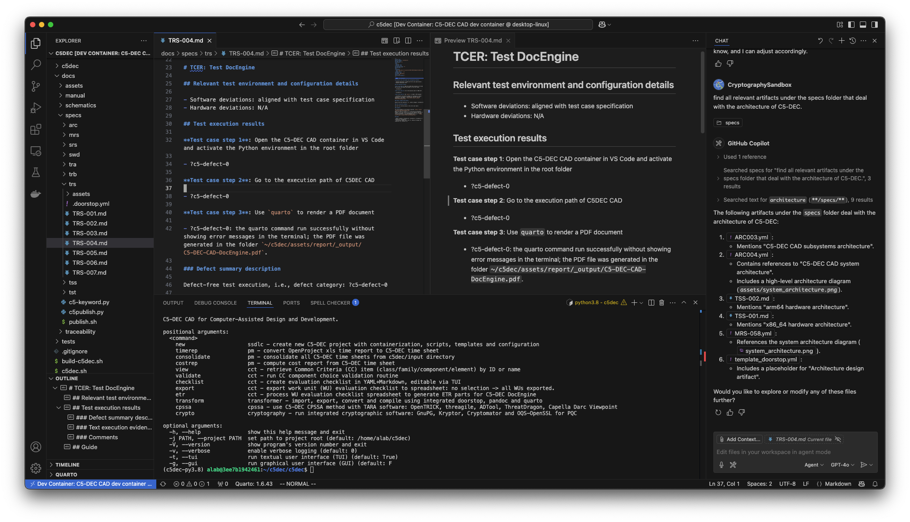

# C5-DEC

C5-DEC, short for "Common Criteria for Cybersecurity, Cryptography, Clouds – Design, Evaluation and Certification", is a sub-project of the [CyFORT](https://abstractionslab.com/index.php/research-and-development/cyfort/) project, which in turn stands for "Cloud Cybersecurity Fortress of Open Resources and Tools for Resilience", carried out in the context of the [IPCEI-CIS](https://ec.europa.eu/commission/presscorner/detail/en/ip_23_6246) project.


C5-DEC CAD, the software component of C5-DEC, is a suite of [AI-enabled](./docs/manual/ssdlc.md#ai-enabled-design-and-specification) tools for computer-aided design and development (CAD) enforcing the C5-DEC method. The method mainly deals with the creation and evaluation of secure IT systems following a structured and systematic approach, based on the [Common Criteria](https://www.commoncriteriaportal.org) standards, a secure software development life cycle (SSDLC) method, a software verification and validation model (SVVM), and our cyber-physical system security assessment (CPSSA) method.

This repository contains the source code and full documentation (requirements, technical specifications, schematics, [user manual](./docs/manual/overview.md), test case specifications and test reports) of C5-DEC CAD, exemplifying the C5-DEC method, which relies on storing, interlinking and processing all software development life cycle (SDLC) artifacts in a unified manner; see our [traceability web page](https://abstractionslab.github.io/c5dec/docs/traceability/index.html) for a concrete example reflecting the technical specifications of C5-DEC CAD itself.

## Table of contents

- [Overview](#overview)
- [Features](#features)
- [User manual](#user-manual)
- [Technical specifications](#documentation-and-technical-specifications)
- [Getting started](#getting-started)
- [Usage](#usage)
- [Roadmap](#roadmap)
- [License](#license)
- [Contact](#contact)

## Overview

The overall goal of the C5-DEC method is to bring together and contextualize SSDLC, SVV and CPSSA within the Common Criteria framework while enabling the use of rigorous digital engineering (RDE) tools. This means tackling the problem of building secure systems, while ensuring full traceability between system artifacts spanning the entire DLC and incorporating cryptographic checks as well as threat modelling and system security risk assessment into the design process, all in the context of the Common Criteria framework. 

To this end, C5-DEC CAD is aimed at assisting both system/software designers/developers as well as system security analysts with creating and evaluating secure software systems. For instance, it can be used by evaluation laboratories for the execution of impartial assessments of the security of computer systems and software according to the Common Criteria (CC), a set of internationally recognized standards (ISO/IEC 15408), and the complementary ISO/IEC 18045, dealing with a common methodology for computer security evaluation (CEM). CC certification gives users the assurance that a product satisfies the security guarantees and properties it claims to possess.

C5-DEC consists of two key elements that complement each other to form a coherent ensemble: a software component (C5-DEC CAD) and a knowledge base (KB) consisting of SSDLC, SVV and CPSSA methodologies as well as a [wiki of key CC concepts](./c5dec/assets/database/KnowledgeBase/0_MapofContent.md).

### Knowledge base

As certain parts of our KB reports rely on ISO standards (ISO/IEC/IEEE 12207, ISO 29119:2022 and ISO 29148:2018), if you wish to access them, please contact us at info@abstractionslab.lu. Simply provide evidence that you are eligible for accessing the standard(s), and upon successful verification, we will share the reports.

## Features

### Design

- Free/libre and open source;
- Cross platform: works on GNU/Linux, MacOS and Windows
- Easily and highly extensible due to a modular design and architecture;
- Based on open data formats such as Markdown, (La)TeX, YAML, XML, JSON, CSV and HTML;
- Straightforward integration into well-known Dev(Sec)Ops platforms such as GitHub and GitLab;
- Import/export from and to open data formats;
- Containerized development and deployment.

### Interfaces

- A command-line interface ([**CLI**](#c5-dec-cad-command-line-interface-cli)) for efficient user interactions and automation via scripting integration;
- A user-friendly and efficient graphical user interface ([**GUI**](#c5-dec-cad-graphical-user-interface-gui)), powered by [Flask](https://flask.palletsprojects.com/en/3.0.x/) and [Bootstrap](https://getbootstrap.com/);
- A rich and extensible textual user interface ([**TUI**](#c5-dec-cad-textual-user-interface-tui)), powered by [asciimatics](https://github.com/peterbrittain/asciimatics);
- [VS Code](https://github.com/microsoft/vscode) with extensions and `devcontainer` configurations preinstalled in the `C5-DEC CAD dev container`.

### Common Criteria

- A comprehensive [Common Criteria](https://www.commoncriteriaportal.org) Toolbox ([CCT](./docs/manual/cct.md)), with a focus on efficient browsing of the CC database, creating and processing evaluation checklists, including
   - all baseline CC Security Functional Requirements (SFR) and Security Assurance Requirements (SAR);
   - [CEM evaluation](./docs/manual/cct.md#create-an-evaluation-checklist) checklist creation in [spreadsheet](./docs/manual/cct.md#exporting-evaluation-checklists-to-spreadsheet-format) format;
   - built-in capabilities for assisting the process of generating evaluation technical reports (ETR);
   - ETR [document part generation](./docs/manual/cct.md#make-etr-document-parts-from-an-evaluation-checklist-spreadsheet) from C5-DEC checklist spreadsheets;
   - an [ETR generation](./docs/manual/cct.md#c5-dec-docengine-for-etr-generation) solution based on customized Quarto project templates tailored to our ETR part generation function, and
   - a [CC wiki](./c5dec/assets/database/KnowledgeBase/0_MapofContent.md) capturing the key concepts of Common Criteria (work in progress).
- An object-oriented model and implementation of CC concepts, with the CC database serialized and stored in Markdown and YAML files, with traceability features built on top of Doorstop.

### Secure software development life cycle (SSDLC)

- The SSDLC report, part of the [C5-DEC KB](#knowledge-base), is inspired by and builds on ISO/IEC/IEEE 12207 - Software life cycle processes, the European Cooperation for Space Standardization (ECSS) standard ECSS-E-ST-40C, ISO/IEC/IEEE 29119:2022 Software testing, ISO/IEC/IEEE 29148:2018 Requirements engineering, the DevSecOps Platform Independent Model (PIM) by the Software Engineering Institute (SEI) of Carnegie Mellon University (CMU), SAFECode, OWASP, as well as McGraw’s publications on software security;
- Create [new project repositories based on C5-DEC (batteries included)](./docs/manual/ssdlc.md#c5-dec-project-creation): a fresh development repository with containerized development artifacts, all dependencies installed, templates, DocEngine, source code and technical specification processing software for enhancing [SSDLC](./docs/manual/ssdlc.md) and enforcing the C5-DEC method, powered by [Doorstop](https://github.com/doorstop-dev/doorstop), and [**AI-enabled**](./docs/manual/ssdlc.md#ai-enabled-design-and-specification) approach facilitating the generation and [processing of technical specifications](#c5-dec-vs-code-workbench-and-containerized-development-environment), documentation, and design artifacts, including requirements, test cases, and technical reports;
- C5-DEC [DocEngine](./docs/manual/ssdlc.md#c5-dec-docengine-for-report-generation): a flexible, easily extensible, and complete publishing solution based on [Quarto](https://quarto.org/) (an open-source scientific and technical publishing system), enhanced by our Quarto configurations, dedicated LaTeX customizations and pre-render and post-render Python scripts providing a baseline automated publishing pipeline (see [SSDLC](./docs/manual/ssdlc.md) and [CCT](./docs/manual/cct.md));
- [Transformer](./docs/manual/ssdlc.md#transformer): a suite of integrated tools dedicated to universal document transformation, format conversion, content import/export, publishing, and file management automation based on our customized use of [Doorstop](https://github.com/doorstop-dev/doorstop), [Quarto](https://github.com/quarto-dev/quarto), [pandoc](https://pandoc.org/) and [organize](https://github.com/tfeldmann/organize);
- Another [KB](#knowledge-base) element dedicated to software verification and validation (SVV) complementing the SSDLC.


### Project (resource) management

- Chapters in the SSDLC report describing the C5-DEC software project management approach based on the [HERMES](https://www.hermes.admin.ch/en/project-management/method-overview.html) method, complemented by our interpretation and implementation of templates in open-source software such as OpenProject, GitLab and Nextcloud;
- [Processing of OpenProject time reports](./docs/manual/pm.md#openproject-time-report-assistant) and conversion to custom formats;
- [Consolidation](./docs/manual/pm.md#time-report-consolidation-assistant) of C5-DEC time sheets;
- Dedicated software for detailed resource and [cost computations](./docs/manual/pm.md#cost-report-computation).

### Cyber-Physical System Security Assessment

- Our CPSSA report, a third [KB element](#knowledge-base), describing the C5-DEC method for Cyber-Physical System Security Assessment (CPSSA);
- A [guide](./docs/manual/cpssa.md) on the use of existing open-source software to enforce the CPSSA method.

### Cryptography

- A containerized and pre-configured deployment of open-source cryptographic software in the development environment for classical cryptography: [GnuPG](https://gnupg.org/), [Kryptor](https://www.kryptor.co.uk/), [Cryptomator CLI](https://github.com/cryptomator/cli);
- A VS Code dev container packaging of [OQS-OpenSSL provider](https://github.com/open-quantum-safe/oqs-provider) for post-quantum cryptography.
- A [guide](./docs/manual/cryptography.md) on the use of the integrated cryptographic software.

## User manual

Please see the [CAD user manual](./docs/manual/overview.md) to learn more about the installation, setup requirements, overall usage and specific modules of C5-DEC CAD. A concise guide for getting quickly started is given below.

## Documentation and technical specifications

You can visit our [traceability page](https://abstractionslab.github.io/c5dec/docs/traceability/index.html) to view the technical specifications of C5-DEC CAD, which have been published to HTML from the source specification files via the `publish` CLI command of C5-DEC CAD, which in turn acts as a wrapper for the underlying Doorstop publish feature, offering some enhancements.

## Getting Started

C5-DEC CAD can be deployed using any of the following methods:

1. Deployment using Docker and our shell scripts: `build-c5dec.sh` and `c5dec.sh`: our runner script (`c5dec.sh`) offers a command mode tailored to the use of the Common Criteria Toolbox (CCT) and the Project Management (PM) modules, as well as an interactive session mode (`c5dec.sh session`) for using the [Transformer](./docs/manual/ssdlc.md#transformer) and [Cryptography](./docs/manual/cryptography.md) features and a PQC entrypoint (`c5dec.sh pqc`).
2. Deployment in a containerized development environment in VS Code (**recommended for advanced usage, development, data science**): this mode is the preferred option for effective use of the Quarto-based [DocEngine](./docs/manual/ssdlc.md#c5-dec-docengine-for-report-generation), Cryptography and Transformer modules. Note that all the features available via the CLI, TUI and GUI when using the deployment model (1) would also be available using this second approach.

For more details on the installation options, please see the [installation](./docs/manual/installation.md) page of the user manual.

### Installing C5-DEC CAD via Docker and our scripts

The fastest and most reliable way to deploy and run C5-DEC CAD is to use our already existing Docker definition file, with the build and execution scripts found in the repository. The instructions below work on GNU/Linux, MacOS and WSL.

Simply clone the repository or download a ZIP archive of the project, and then proceed as follows:

1. Install [Docker engine](https://docs.docker.com/engine/install/) and make sure it is running;
1. Unzip the archive, switch to the extracted directory (`cd foldername`) via a terminal running a shell (e.g., bash, zsh) and make the two shell scripts executable: `chmod +x script-name.sh`;
1. Build the images by running our build script: `./build-c5dec.sh`;
1. Launch C5-DEC CAD runner script by running `./c5dec.sh`, which by default starts the CLI with no arguments and shows the help menu. Run `./c5dec.sh help` for usage instructions.

### Installing C5-DEC CAD in a containerized development environment

1. Install [Docker Desktop](https://www.docker.com/products/docker-desktop/) (or [Docker engine](https://docs.docker.com/engine/install/)), [Visual Studio Code](https://code.visualstudio.com/) (VS Code), and the [Dev Containers](https://marketplace.visualstudio.com/items?itemName=ms-vscode-remote.remote-containers) extension for VS Code by Microsoft.
2. Clone the C5-DEC repository:

```sh
git clone https://github.com/AbstractionsLab/c5dec.git 
```

3. Start Docker Desktop if not already running and open the project folder in VS Code;
4. Select the "Reopen in Container" option in the notification that pops up in VS Code; or launch the command palette (Cmd/Ctrl+Shift+P) and select "Dev Containers: Reopen in Container" from the list of available commands. You will then be prompted to select a dev container configuration: the `C5-DEC CAD dev container` provides the bulk of the functionality, while the `C5-DEC CAD cryptography dev container` provides an environment with [OpenSSL](https://docs.openssl.org/master/man7/ossl-guide-libcrypto-introduction/) and the [OQS-OpenSSL provider](https://github.com/open-quantum-safe/oqs-provider) installed.


5. For the following sections, we assume having selected the `C5-DEC CAD dev container`. Once selected, wait for the container to build and start. This may take a few minutes, depending on your internet connection and the performance of your machine.
6. Once the container is up and running, you will see a terminal window open in VS Code, and you can start using C5-DEC CAD. If a terminal window does not open automatically, you can open a new terminal by selecting "Terminal" from the top menu and then "New Terminal". This will open a terminal window inside the container.

Note that the local file system is automatically mapped to that of the GNU/Linux container.

Once installed, the C5-DEC CAD tool can be launched from the VS Code terminal in any of the three modes of operation (CLI, TUI, GUI). Upon opening a VS Code terminal, the currently selected directory will be the project root folder, i.e., `/home/alab/c5dec`. Change to the `c5dec` folder inside the former:

```sh
cd /home/alab/c5dec/c5dec
```

To avoid having to precede the commands with `poetry run` each time, e.g., `poetry run c5dec <command>`, we recommend running `poetry shell` to activate the virtual environment; you can then run the commands directly by invoking `c5dec`:

```sh
c5dec -h
```

## Usage

To [start](./docs/manual/start.md) C5-DEC CAD through your GNU/Linux/MacOS/WSL terminal, first change your current working directory to the one containing an unpacked copy of the [c5dec-main.zip](https://github.com/AbstractionsLab/c5dec/archive/refs/heads/main.zip) archive. For the sake of this example, we assume that the zip archive is unpacked at the following path `/home/user/c5dec`:

```sh
cd /home/user/c5dec
```

To access the command line interface (CLI), simply run `./c5dec.sh`, which by default shows the help menu if no arguments are provided, i.e., similar to the behavior resulting from the use of the `-h` flag. You can access the TUI and the GUI by using the `-t` and `-g` flags, respectively. The following subsections cover the three interfaces; see the [user manual](./docs/manual/overview.md) for a more detailed breakdown of features.

Note that for the TUI and the GUI, you can change the CC database prior to launching the software by modifying the selected DB in the `c5dec_params.yml` YAML file found in the `c5dec/assets` folder within the project folder.

A summary of the `c5dec.sh` runner options are provided below:

- To open the C5-DEC CLI help menu:

```sh
./c5dec.sh
```

- To run a C5-DEC CLI command:

```sh
./c5dec.sh <command>
```

- To get help for a C5-DEC CLI command:

```sh
./c5dec.sh <command> -h
```

- To start an interactive C5-DEC session for using the [Transformer](./docs/manual/ssdlc.md#transformer) and [Cryptography](./docs/manual/cryptography.md) features:

```sh
./c5dec.sh session <workspace>
```

The argument `<workspace>` can be optionally used to provide the path to a directory on the user's file system (outside the C5-DEC folder); see the [usage section of the start page](./docs/manual/start.md#usage) for more details.

- To use the [OQS-OpenSSL](./docs/manual/cryptography.md#post-quantum-cryptography-pqc) provider for post-quantum cryptography:

```sh
./c5dec.sh pqc
```

### C5-DEC CAD command line interface (CLI)

```sh
./c5dec.sh
```
This would display the help menu of the CLI, as shown below. You can then choose one of the available subcommands to execute the desired operation.


You can for instance invoke the [work unit evaluation checklist export to spreadsheet](./docs/manual/cct.md#exporting-evaluation-checklists-to-spreadsheet-format) command, e.g., for the ALC class, as follows:

```sh
./c5dec.sh export alc-checklist 3R5 -c ALC
```

or create a new [C5-DEC project (batteries included)](./docs/manual/ssdlc.md#c5-dec-project-creation):

```sh
./c5dec.sh new
```

You can define a project name and GNU/Linux username for Dockerized development environment using the `-p` and `-u` parameters, e.g., `./c5dec.sh new -p "someproject" -u "someuser"`

### C5-DEC CAD textual user interface (TUI)

You can launch the TUI using the `-t` flag.

```sh
./c5dec.sh -t
```
This would launch the TUI and start with the module selection menu, as shown below.


### C5-DEC CAD graphical user interface (GUI)

```sh
./c5dec.sh -g
```
This would launch the GUI, as shown below, starting a web server that listens on port `5432` on the local host, meaning that you can access the application by pointing your browser to `127.0.0.1:5432`.


### C5-DEC VS Code workbench and containerized development environment

Finally, using VS Code, you can access the various user interfaces in the same workbench while also benefitting from dedicated VS Code extensions integrated into our containerized development environment (e.g., Code Spell Checker, Quarto, Jupyter, Data Wrangler, Docker) as well as the code editor's own built-in features. The screenshot below highlights an example of how the [C5-DEC method lends itself to AI-powered](./docs/manual/ssdlc.md#ai-enabled-design-and-specification) capabilities.



## Roadmap

We will continue to enhance C5-DEC CAD with new features and improvements. Some of the planned features include:
- Integrating locally stored generative AI (GenAI) models and implementing a GenAI assistant for the C5-DEC method enhancing its [AI-enabled design and technical specification](./docs/manual/ssdlc.md#ai-enabled-design-and-specification) approach with privacy-aware features and retrieval-augmented generation (RAG) capabilities;
- Enhancing our cryptographic dependencies (e.g., [OQS-OpenSSL](https://github.com/open-quantum-safe/oqs-provider), [OpenSSH](https://www.openssh.com/)) with verified implementations, e.g., [EverCrypt](https://www.microsoft.com/en-us/research/publication/evercrypt-a-fast-veri%EF%AC%81ed-cross-platform-cryptographic-provider/) and [HACL*](https://hacl-star.github.io/HaclValeEverCrypt.html).

For further details on our roadmap and features planned for future releases, please see the [Wiki](https://github.com/AbstractionsLab/c5dec/wiki) section of this repository.

## License

Copyright (c) itrust Abstractions Lab and itrust consulting. All rights reserved.

Licensed under the [GNU Affero General Public License (AGPL) v3.0](LICENSE) license.

## Acknowledgment

The creation of the C5-DEC software tools and its knowledge base is co-funded by the Ministry of the Economy of Luxembourg, in the context of the CyFORT project.

## Contact

If you wish to learn more about the project, feel free to contact us at Abstractions Lab: info@abstractionslab.lu