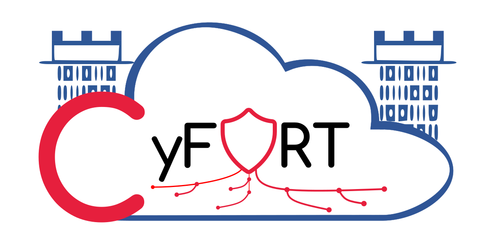

# C5-DEC CAD

This repository hosts the source code of C5-DEC CAD, the software component of C5-DEC for computer-assisted design and development (CAD), along with its associated documentation and guides, developed in the context of the CyFORT project. The documentation includes the full technical specifications, requirements, user manual, test case specifications and test reports, thereby highlighting the C5-DEC method that builds on capturing, storing and processing all software development life cycle (SDLC) artifacts in a unified manner.

**C5-DEC**, short for "Common Criteria for Cybersecurity, Cryptography, Clouds – Design, Evaluation and Certification", is a subproject of the CyFORT project, in turn short for "Cloud Cybersecurity Fortress of Open Resources and Tools for Resilience".

<!--  -->


## Overview

C5-DEC is aimed at assisting both system/software designers/developers as well as system security analysts with creating and evaluating secure software systems. C5-DEC CAD can be used by evaluation laboratories for the execution of impartial assessments of the security of computer systems and software according to the Common Criteria (CC), a set of internationally recognized standards (ISO/IEC 15408), and the complementary ISO/IEC 18045, dealing with a common methodology for computer security evaluation (CEM). CC certification gives users the assurance that a product satisfies the security guarantees and properties it claims to possess. Among other things, C5-DEC is also aimed at providing tools for supporting a secure software development life cycle (SSDLC).

C5-DEC consists of two key elements: a software component (C5-DEC CAD) and a knowledge base including guides and a wiki of key CC concepts. These elements complement each other to form a coherent set of tools aimed at supporting activities related to CC certification, SSDLC and security assessment of cyber-physical systems, based on the C5-DEC method for Cyber-Physical System Security Assessment (CPSSA).

## Features

- Free/libre and open source
- Cross platform: works on GNU/Linux, MacOS and Windows
- Easily and highly extensible due to a modular design and architecture
- Advanced and extensible textual user interface (TUI), powered by the open-source [asciimatics](https://github.com/peterbrittain/asciimatics) framework
- A command-line interface (CLI) for more efficient user interactions and scripting
- Comprehensive [Common Criteria](https://www.commoncriteriaportal.org/index.cfm) Toolbox (CCT), with a focus on efficient browsing of the CC database, creating and processing evaluation checlists
   - includes all baseline CC Security Functional Requirements (SFR) and Security Assurance Requirements (SAR)
   - built-in capabilities for assisting the process of generating technical evaluationr reports (ETR)
   - comes with a CC wiki capturing the key concepts of Common Criteria
- Tools for enhancing secure software development life cycle (SSDLC), powered by the open-source [Doorstop](https://github.com/doorstop-dev/doorstop) tool
- Complete integration of the CCT data store with the Doorstop data model and formats
- Based on and designed around open data formats such as Markdown, (La)TeX, YAML, XML, JSON, CSV, HTML, txt, etc.
- Straightforward integration into well-known Dev(Sec)Ops platforms such as GitHub and GitLab
- Project (resource) management functionality
- Import/export from and to open data formats
- Cryptography-related functionality aimed at improving SSDLC (currently not implemented, but on the roadmap and planned for [future releases](./docs/manual/cryptography.md))
- A method for Cyber-Physical System Security Assessment (CPSSA) and related functionality (see [CPSSA](./docs/manual/cpssa.md))

## User manual

Check the [CAD user manual](./docs/manual/overview.md) to learn more about the specific modules of C5-DEC CAD and its usage. The table of contents is also shown below:

- [Installation](./docs/manual/installation.md)
- [Setup](./docs/manual/setup.md)
- [Quick start](./docs/manual/start.md)
- [CCT: Common Criteria Toolbox](./docs/manual/cct.md)
- [SSDLC: secure software development life cycle](./docs/manual/ssdlc.md)
- [Cryptography](./docs/manual/cryptography.md)
- [CPSSA: Cyber-Physical System Security Assessment](./docs/manual/cpssa.md)
- [Transformer: import, export, publish](./docs/manual/transformer.md)
- [ISMS: document management](./docs/manual/isms.md)
- [PM: project (resource) management](./docs/manual/pm.md)
- [C5-DEC Common Criteria wiki](./c5dec/assets/database/KnowledgeBase/0_MapofContent.md)

## Getting Started

C5-DEC CAD can be deployed using any of the following methods:

- Installation via [pipx](https://pypa.github.io/pipx/) using the official [distribution file]() (recommended for end-users)
- Installation in a containerized environment (recommended for developers)
- Install via the official PyPI repository (**currently not available, coming soon**)

### Installing C5-DEC CAD via pipx

#### Requirements

- [Python 3](https://www.python.org/)
- [git](https://git-scm.com/), the distributed version control system

##### Optional

- [Doorstop](https://github.com/doorstop-dev/doorstop) (recommended to install via `pipx`)

Strictly speaking, a Doorstop installation is not required; nevertheless, we strongly recommend installing Doorstop such that it can be used in combination with C5-DEC CAD. This is mainly due to the fact that the SSDLC module in the current implementation of C5-DEC CAD does not provide a full coverage of the Doorstop API, which is why users may find it easier to carry out certain complementary operations using Doorstop.

To install Doorstop, we recommend the following method using [pipx](https://pypa.github.io/pipx/) as it is rather straightforward. On a GNU/Linux distribution or MacOS, open a terminal (e.g., bash, Zsh) and execute the following commands:

1. Install pipx if not already installed
```sh
python3 -m pip install --user pipx
python3 -m pipx ensurepath
```

2. Once `pipx` is installed, run the following command:
```sh
$ pipx install doorstop==3.0b10
```

#### Installation

Run the following command, assuming that the Wheel distribution file (.whl) is placed in the current directory and pipx is installed (see instructions above):

```sh
pipx install ./c5dec-0.1-py3-none-any.whl
```

#### Launching C5-DEC CAD

You can start C5-DEC CAD by simply entering “c5dec” in an open terminal, with the current directory being an unpacked copy of the C5-DEC CAD [project folder](). For the sake of this example, we assume that the zip archive is unpacked at the following path `/home/user/c5dec-cad-alpha`; it then suffices to change to this directory and run `c5dec`:

```sh
$ cd /home/user/c5dec-cad-alpha
$ c5dec
```
This would then launch the TUI by default, as shown below.


For more details and installing on Windows, see the [Installation](./docs/manual/installation.md) page of the user manual.

### Installation in a containerized environment

The easiest and recommended way to get a local copy of the development environment up and running is described next.

#### Requirements

The following pieces of software are necessary for setting up the C5-DEC CAD containerized environment.

* A local installation of [Docker Desktop](https://www.docker.com/products/docker-desktop/)
* [Visual Studio Code](https://code.visualstudio.com/) (VS Code)
* The [Dev Containers](https://marketplace.visualstudio.com/items?itemName=ms-vscode-remote.remote-containers) extension for VS Code by Microsoft

#### Installation

1. Clone this repository
```sh
git clone http://gitlab.abstractionslab.com/cyfort/c5-dec/cad.git
```
2. Verify that your Docker Desktop instance is running (if not, start it).
3. In VS Code, open the folder "cad", located at the root of the cloned project. This can be done directly in VS code or from the terminal, if the CLI of VS Code is installed:
```sh
code cad
```
4. In the notification that pops up in VS Code, select the option "Reopen in Container". This will create and run the project inside a Docker container; alternatively, the same command can be selected and invoked from the VS Code command palette.
4. Open a terminal in VS Code and run the following command in the GNU/Linux container for which the local file system is automatically mapped by VS Code to that of the Ubuntu container:
```sh
poetry install
```
This verifies the correct installation of all the dependencies.

_**Hint:**_ to solve warnings in the code related to missing imports, select the Python interpreter installed by poetry. This can be done quickly by clicking on the light bulb that appears next to the warnings.

## Usage

The C5-DEC CAD tool has two modes of operation: a textual user interface (TUI) and a command line interface (CLI).

### Textual User Interface

Once installed, the C5-DEC CAD tool can be launched from the VS Code terminal as follows:

```sh
$ cd c5dec
$ poetry run c5dec
```

Alternatively, the tool can be executed from Docker Desktop:

1. In the left-side menu, go to the tab "Containers".
2. Open the container associated to C5-DEC CAD (the image name starts with "vsc-cad").
3. Go to the "Exec" tab.
4. Run the same commands as above.

### Command Line Interface
In a VS Code (or Docker Desktop) terminal run:

```sh
$ cd c5dec
$ poetry run c5dec <command>
```
To see the available commands run:
```sh
$ poetry run c5dec -h
```

_**Disclaimer:**_ For the moment, we recommend using the TUI for functionality related to the CCT module. This note will be updated as soon as a stable version of the CLI for the referred module becomes available.

## Roadmap

This information is available in the project [Wiki](https://gitlab.abstractionslab.com/cyfort/c5-dec/cad/-/wikis/Roadmap) of this repository.

## License

This piece of software is released under the [GNU Affero General Public License (AGPL) v3.0](LICENSE) license.

## Contact

If you wish to learn more about the project, feel free to contact us at Abstractions Lab: info@abstractionslab.lu

## Design and development team

The C5-DEC knowledge base and its CAD software component have been designed and developed by Abstractions Lab (ALab) and itrust consulting (ITR).

Arash Atashpendar (ALab), Heinrich Fries (ITR), Itzel Vazquez Sandoval (ALab), Sven Angel (ex-ITR)