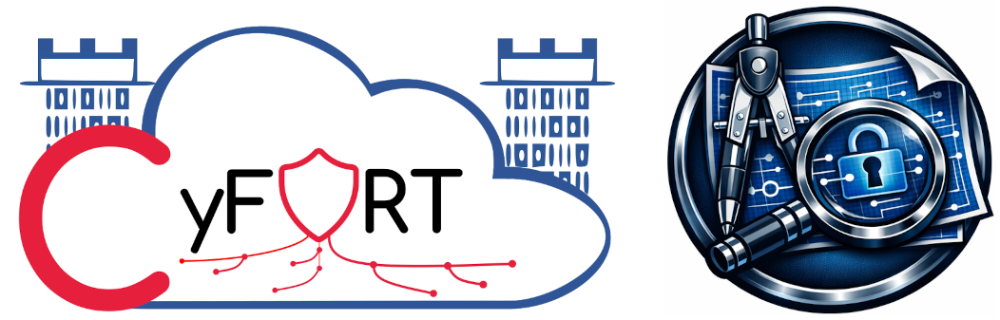
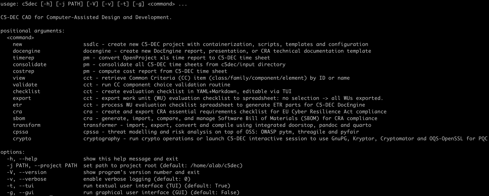
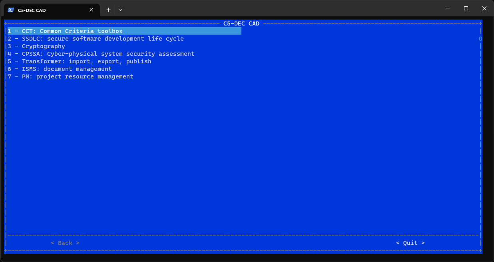
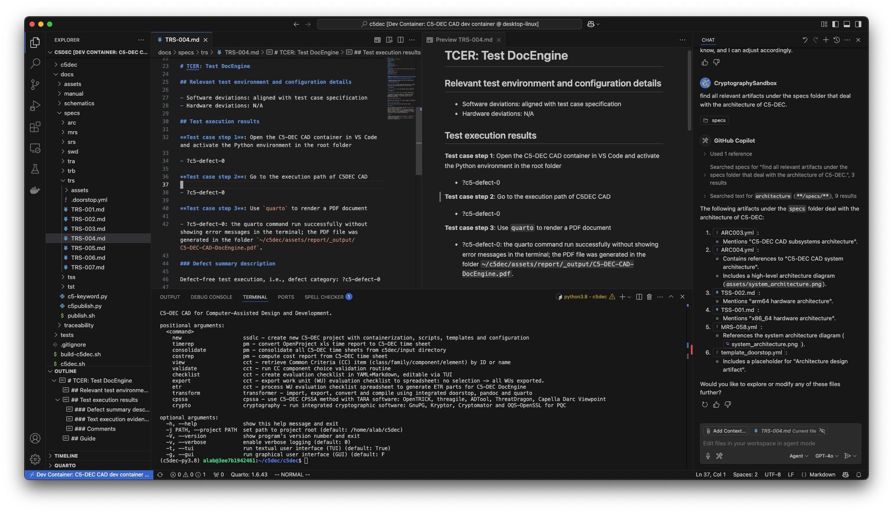

# C5-DEC

C5-DEC, short for "Common Criteria for Cybersecurity, Cryptography, Clouds – Design, Evaluation and Certification", is a sub-project of the [CyFORT](https://abstractionslab.com/index.php/research-and-development/cyfort/) project, which in turn stands for "Cloud Cybersecurity Fortress of Open Resources and Tools for Resilience", carried out in the context of the [IPCEI-CIS](https://ec.europa.eu/commission/presscorner/detail/en/ip_23_6246) project.



[](CHANGELOG.md) [](LICENSE) [](pyproject.toml)

C5-DEC CAD is the software component of C5-DEC — an [AI-enabled](./docs/manual/ssdlc.md#ai-enabled-design-specification-development-and-testing) toolkit for computer-aided secure system design, development and evaluation, accessible through native command-line and graphical [interfaces](#usage) (CLI, TUI, GUI), as well as a VS Code workbench with dedicated devcontainer support and preloaded extensions. Its modules cover: a [Common Criteria Toolbox (CCT)](./docs/manual/cct.md) (SFR/SAR database, CEM checklists, ETR generation); an [SSDLC](./docs/manual/ssdlc.md) pipeline (project scaffolding, [SpecEngine](./docs/specs/SpecEngine/README.md) for structured, fully traceable specification management aligned with [certification workflows](./docs/README.md), [DocEngine](./docs/manual/ssdlc.md#c5-dec-docengine-for-report-generation) for smart document authoring and technical/scientific publishing); [CRA compliance](./docs/manual/cra.md) (Annex I checklist, Annex VII tech doc, Annex V declaration); [SBOM management](./docs/manual/sbom.md) via [Syft](https://github.com/anchore/syft); a [CPSSA module](./docs/manual/cpssa.md) for STRIDE threat modelling and FAIR risk analysis; a [cryptography module](./docs/manual/cryptography.md) (classical and post-quantum crypto); and [project management](./docs/manual/pm.md) utilities. All artifacts are stored in open formats (Markdown, YAML), complemented by a [CC concept wiki](./c5dec/assets/database/KnowledgeBase/0_MapofContent.md) and an SSDLC/SVV/CPSSA knowledge base, making the full specification tree directly accessible to LLMs.

This repository contains the source code and full documentation (requirements, design artifacts, [user manual](./docs/manual/README.md), test case specifications and test reports) of C5-DEC CAD; see our [technical specification traceability web site](https://abstractionslab.github.io/c5dec/docs/traceability/index.html) for a live view of the full specification tree and traceability coverage, produced by the C5-DEC [SpecEngine](./docs/specs/SpecEngine/README.md).

## Table of contents

- [Overview](#overview)
- [Features](#features)
- [User manual](#user-manual)
- [Technical specifications](#documentation-and-technical-specifications)
- [Prerequisites](#prerequisites)
- [Getting started](#getting-started)
- [Usage](#usage)
- [Changelog](#changelog)
- [Contributing](#contributing)
- [License](#license)
- [Contact](#contact)

## Overview

C5-DEC CAD assists system/software designers, developers, testers and security analysts with building and evaluating secure software systems. It integrates SSDLC, SVV, and CPSSA within the Common Criteria framework, providing full artifact traceability across the entire development life cycle, along with cryptographic checks, threat modelling, quantitative risk analysis, Cyber Resilience Act (CRA) compliance support, and SBOM lifecycle management. Its DocEngine, built on Quarto with custom LaTeX enhancements and pre/post-render scripting, enables smart document authoring, scientific and technical publishing across report, presentation, and CRA technical documentation templates.

### Knowledge base

C5-DEC ships two complementary knowledge bases:

- **[CC concept wiki](./c5dec/assets/database/KnowledgeBase/0_MapofContent.md)**: A structured reference of 50+ articles organized across four areas:
  - *CC Concepts* — Target of Evaluation (TOE and its components: TSF, domain separation, self-protection, non-bypassability, composed TOE), Conformance Claims, Security Problem Definition (assets, threats, OSPs, assumptions), Security Objectives, Security Components (SFRs, SARs, the four operations, extended component definitions), Rationale, and Evaluation (methods, EALs, attack potential, evaluation evidence, single/multi/composite assurance);
  - *Core Constructs* — Security Target, Protection Profile, PP-Module, PP-Configuration, Package, Observation Report, and Evaluation Technical Report;
  - *Certification Schemes* — EUCC (EU Common Criteria scheme);
  - *Terms & Definitions* — a consolidated CC terminology register.
- **SSDLC, SVV, and CPSSA methodology reports**: Structured guidance covering the full software development life cycle, software verification and validation, and cyber-physical system security assessment. Parts rely on ISO standards (ISO/IEC/IEEE 12207, ISO 29119:2022, ISO 29148:2018); contact us at info@abstractionslab.lu with proof of eligibility to receive access.

## Features

### Interfaces

- A command-line interface ([**CLI**](./docs/manual/start.md)) for efficient user interactions and scripting automation;
- A user-friendly graphical user interface ([**GUI**](./docs/manual/start.md)), powered by [Flask](https://flask.palletsprojects.com/en/3.0.x/) and [Bootstrap](https://getbootstrap.com/);
- A rich textual user interface ([**TUI**](./docs/manual/start.md)), powered by [asciimatics](https://github.com/peterbrittain/asciimatics);
- A [VS Code](https://github.com/microsoft/vscode)-optimized workbench with preloaded extensions and `devcontainer` configurations preinstalled in the C5-DEC dev containers (CAD, DocEngine, PQC-OpenSSL);
- Straightforward integration with Dev(Sec)Ops platforms (GitHub, GitLab);
- Containerized development and deployment.

### Secure software development life cycle (SSDLC)

- [New C5-DEC project scaffolding](./docs/manual/ssdlc.md#c5-dec-project-creation) (`c5dec new`): containerized repository with dependencies, templates, DocEngine, SpecEngine, and Doorstop-based traceability, with an [AI-enabled](./docs/manual/ssdlc.md#ai-enabled-design-and-specification) approach for generating requirements, test cases, and technical reports;
- [DocEngine](./docs/manual/ssdlc.md#c5-dec-docengine-for-report-generation) (`c5dec docengine`): Quarto-based publishing pipeline with LaTeX customizations and pre/post-render scripts; scaffolds three template types — `report`, `presentation` (Reveal.js and PowerPoint with ALab branding), and `cra-tech-doc` (CRA Annex VII technical documentation);
- [Transformer](./docs/manual/ssdlc.md#transformer): document transformation and format conversion using [Doorstop](https://github.com/doorstop-dev/doorstop), [Quarto](https://github.com/quarto-dev/quarto), [pandoc](https://pandoc.org/), and [organize](https://github.com/tfeldmann/organize);
- [SpecEngine](./docs/specs/SpecEngine/) toolkit for specification management following the [C5-DEC method](./docs/specs/README.md): `c5graph.py` (interactive Cytoscape.js traceability graph with dagre layout, expand/collapse, color-coded coverage), `c5mermaid.py` (Mermaid-to-SVG/PNG pre-processor with undo and dry-run, integrated into `publish.sh`), `c5browser.py` (standalone Bootstrap + DataTables HTML browser for Doorstop items with sortable/filterable per-document-type tables), `c5traceability.py` (configurable traceability matrix statistics with console and HTML report output, auto-discovery of document trees from `.doorstop.yml` files), `prune_bad_links.py` (Doorstop link pruning), and `doorstop_yml_to_md.py` (YAML-to-Markdown item migration);
- A [KB element](#knowledge-base) dedicated to software verification and validation (SVV).

### Common Criteria

A comprehensive [Common Criteria Toolbox (CCT)](./docs/manual/cct.md) covering:

- Full CC database of Security Functional Requirements (SFRs) and Security Assurance Requirements (SARs), with an OOP model serialized in Markdown and YAML with Doorstop traceability;
- [CEM evaluation checklist](./docs/manual/cct.md#create-an-evaluation-checklist) creation and export to [spreadsheet format](./docs/manual/cct.md#exporting-evaluation-checklists-to-spreadsheet-format);
- [ETR document part generation](./docs/manual/cct.md#make-etr-document-parts-from-an-evaluation-checklist-spreadsheet) from C5-DEC checklist spreadsheets and a [DocEngine-backed ETR generation](./docs/manual/cct.md#c5-dec-docengine-for-etr-generation) pipeline;
- A structured [CC concept wiki](./c5dec/assets/database/KnowledgeBase/0_MapofContent.md) with 50+ articles covering CC Concepts (TOE and its components, Security Problem Definition, Security Objectives, SFRs/SARs and their four operations, Evaluation Assurance Levels, attack potential, evaluation evidence), Core Constructs (Security Target, Protection Profile, PP-Module, PP-Configuration, ETR, Observation Report), the EUCC certification scheme, and a Terms & Definitions register.

### CRA (Cyber Resilience Act) compliance

A comprehensive [CRA compliance module](./docs/manual/cra.md) supporting EU Regulation (EU) 2024/2847:

- [Essential requirements checklist](./docs/manual/cra.md#1-cra-essential-requirements-checklist) (Annex I, Parts I & II) with Doorstop integration, pass/fail/na verdict tracking, and Excel export with per-category compliance percentages;
- [CRA Technical Documentation generator](./docs/manual/cra.md#2-cra-technical-documentation-generator) (Annex VII, seven chapters) and [EU Declaration of Conformity](./docs/manual/cra.md#step-9-generate-eu-declaration-of-conformity) generator (Annex V); also available as `c5dec docengine cra-tech-doc`;
- [SBOM lifecycle management](./docs/manual/sbom.md) (`c5dec sbom`) with [Syft](https://github.com/anchore/syft) integration (CycloneDX and SPDX), generation, parsing, validation, version diff, Doorstop traceability, and automated CRA requirement cross-verification;
- Support for Default, Class I, Class II, and Critical CRA product risk classes.

### Cyber-Physical System Security Assessment

A fully integrated [CPSSA module](./docs/manual/cpssa.md) (`c5dec cpssa`) with five subcommands:

- `create-threat-model` — generates Threagile-compatible YAML threat models from Doorstop SRS/ARC artifacts with auto-discovery and sidecar YAML support (`threat-actors.yml`, `assumptions.yml`);
- `generate-report` — produces STRIDE-based CPSSA Markdown reports from a threat model;
- `generate-dfd` — generates PlantUML Data Flow Diagrams from Doorstop ARC items;
- `fair-input` — creates a FAIR parameters template YAML from a threat model;
- `risk-analysis` — runs FAIR-based Monte Carlo quantitative risk analysis using [pyfair](https://github.com/theonaunheim/pyfair) with PERT distribution support and `--fair-params` YAML override.

A water-treatment worked example is included in `c5dec/core/cpssa/examples/water-treatment/`. The CPSSA methodology is described in the [C5-DEC KB](#knowledge-base).

### Cryptography

- A native Python [cryptography module](./docs/manual/cryptography.md) exposed via `c5dec crypto` with 11 subcommands: `hash`, `verify-hash`, `sign`, `verify-sig`, `encrypt`, `decrypt`, `shamir-split`, `shamir-recover`, `nacl-keygen`, `nacl-sign`, `nacl-verify`;
- Covers SHA-256 file integrity, [GnuPG](https://gnupg.org/) signing and encryption, Shamir's Secret Sharing over GF(2¹²⁷−1), and NaCl Ed25519 digital signatures;
- Containerized deployment of [GnuPG](https://gnupg.org/), [Kryptor](https://www.kryptor.co.uk/), and [Cryptomator CLI](https://github.com/cryptomator/cli);
- A dedicated dev container with the [OQS-OpenSSL provider](https://github.com/open-quantum-safe/oqs-provider) for post-quantum cryptography.

### AI-enabled design, specification and development

C5-DEC CAD is designed from the ground up to be AI-friendly (more precisely, LLM-assisted). All artifacts — requirements, design elements, test cases, architecture items, and technical reports — use open text formats (Markdown, YAML, Quarto), making them machine-parseable without conversion. LLMs can work across the full specification tree in both conversational and agent mode:

- **Open-format artifact corpus**: Every requirement, design item, test case, traceability link, and knowledge base article is stored as plain Markdown or YAML. There is no proprietary binary format to decode and no export step needed — an LLM has direct read and write access to the complete artifact set.
- **Structured, domain-organized knowledge base**: The CC concept wiki, SSDLC methodology, SVV model, and CPSSA guidance are written as structured Markdown documents organized by module. This gives LLMs authoritative, project-specific context for each functional area (CCT, CRA, CPSSA, DocEngine, SpecEngine, cryptography, project management) without relying on generic training data.
- **Doorstop-backed traceability**: The specification tree (MRS → SRS → SWD → TST → TRA) provides explicit, navigable links between requirements, design decisions, and test cases. An LLM can follow the traceability graph forward or backward to perform gap analysis, consistency checking, or coverage assessment with precision.
- **Modular, task-aligned architecture**: Each C5-DEC module (CCT, SSDLC, CRA, CPSSA, SBOM, cryptography, PM) is independently documented and implemented, making it straightforward to scope AI assistance to a specific domain — Common Criteria component selection, threat modelling, CRA compliance, test authoring, or report generation — without requiring broad context.
- **Workflow-oriented structure**: C5-DEC workflows follow well-defined, repeatable procedures (new project bootstrapping, release cycle management, CRA compliance, CPSSA engagement, DocEngine publishing). The procedural nature of these workflows makes them well-suited to step-by-step AI-guided execution.

See the [AI-enabled design and specification](./docs/manual/ssdlc.md#ai-enabled-design-specification-development-and-testing) section of the user manual for a detailed description of the approach.

### Project (resource) management

- [OpenProject time report processing](./docs/manual/pm.md#openproject-time-report-assistant) and conversion to custom formats;
- [Time sheet consolidation](./docs/manual/pm.md#time-report-consolidation-assistant) and detailed resource and [cost computation](./docs/manual/pm.md#cost-report-computation);
- Project management approach based on the [HERMES](https://www.hermes.admin.ch/en/project-management/method-overview.html) method documented in the [C5-DEC KB](#knowledge-base).

## User manual

See the [C5-DEC CAD user manual](./docs/manual/README.md) for installation, setup, and module-by-module usage guidance.

## Documentation and technical specifications

The technical specifications of C5-DEC CAD are published to HTML via the `publish.sh` script in `docs/specs/`, backed by the SpecEngine toolchain. View them on our [traceability page](https://abstractionslab.github.io/c5dec/docs/traceability/index.html).

## Prerequisites

| Requirement | Docker + shell scripts | VS Code dev container |
|-------------|------------------------|----------------------|
| [Docker Engine](https://docs.docker.com/engine/install/) | Required | — |
| [Docker Desktop](https://www.docker.com/products/docker-desktop/) | — | Required |
| [Visual Studio Code](https://code.visualstudio.com/) | — | Required |
| [Dev Containers extension](https://marketplace.visualstudio.com/items?itemName=ms-vscode-remote.remote-containers) | — | Required |
| Git | Recommended | Required (for cloning) |

No local Python installation is needed — all Python dependencies are managed inside the Docker container.

> **Note on pre-release dependencies**: two runtime dependencies are pre-release upstream: `doorstop 3.0b10` (beta) and `pyfair 0.1a13` (alpha). No stable releases exist for these packages at the time of this release.

## Getting started

C5-DEC CAD supports two deployment models; see the [installation page](./docs/manual/installation.md) for full details.

### Docker and shell scripts

Install [Docker engine](https://docs.docker.com/engine/install/), clone or unzip the repository, make the scripts executable (`chmod +x *.sh`), build the image with `./build-c5dec.sh`, and run `./c5dec.sh`. This model covers all CLI commands and is best suited for CCT, PM, CRA, and CPSSA workflows.

### VS Code dev container (recommended for advanced usage)

Install [Docker Desktop](https://www.docker.com/products/docker-desktop/), [VS Code](https://code.visualstudio.com/), and the [Dev Containers](https://marketplace.visualstudio.com/items?itemName=ms-vscode-remote.remote-containers) extension. Clone the repository, open it in VS Code, and select "Reopen in Container". Three container configurations are available:

| Container | Contents | Best for |
|-----------|----------|----------|
| `C5-DEC CAD dev container` | CLI, TUI, GUI, CCT, CRA, SBOM, CPSSA, cryptography | General use and development |
| `C5-DEC DocEngine dev container` | `CAD dev container` plus Quarto, TeX Live, Kryptor, Cryptomator CLI | Report and document publishing |
| `C5-DEC CAD cryptography dev container` | OpenSSL, OQS-OpenSSL provider | Post-quantum cryptography |

Once inside the container, activate the poetry environment with `poetry shell` and run `c5dec -h`.

## Usage

C5-DEC CAD exposes two entry points depending on the deployment model:

- **`./c5dec.sh <command>`** — used with the Docker + shell scripts model. The runner script wraps the container invocation so no Poetry or Python setup is needed on the host.
- **`c5dec <command>`** — used inside the VS Code dev container after activating the Poetry environment (`poetry shell`). Provides the full feature set including DocEngine, Transformer, and advanced SSDLC workflows.

The TUI and GUI are launched with the `-t` and `-g` flags respectively. An interactive session mode (`c5dec.sh session <workspace>`) is available for Transformer and cryptography workflows; a PQC entrypoint (`c5dec.sh pqc`) opens the OQS-OpenSSL container.

| Interface | Launch command | Description |
|-----------|---------------|-------------|
| CLI | `./c5dec.sh` or `c5dec -h` | Primary interface; full command set |
| TUI | `./c5dec.sh -t` | Interactive terminal UI |
| GUI | `./c5dec.sh -g` | Web UI at `127.0.0.1:5432` |
| VS Code dev container | Reopen in container | ete |

```sh
./c5dec.sh
```
This would display the help menu of the CLI, as shown below. You can then choose one of the available subcommands to execute the desired operation.



You can launch the TUI using the `-t` flag.

```sh
./c5dec.sh -t
```
This would launch the TUI and start with the module selection menu, as shown below.



```sh
./c5dec.sh -g
```
This would launch the GUI, as shown below, starting a web server that listens on port `5432` on the local host, meaning that you can access the application by pointing your browser to `127.0.0.1:5432`.


Finally, you can access the [optimized VS Code dev containers](./docs/manual/installation.md#installation-in-a-containerized-development-environment) via the "Reopen in container" feature


and use the customized workbench for development:



See the [quick start page](./docs/manual/start.md) for the full list of runner options and first-run examples, and the [user manual](./docs/manual/README.md) for per-module command references.

## Changelog

See [CHANGELOG.md](CHANGELOG.md) for a full history of releases and changes.

## Contributing

Contributions are welcome. Please read [CONTRIBUTING.md](CONTRIBUTING.md) for branching conventions, commit message guidelines, how to run the test suite, and documentation standards before opening a pull request. To report a security vulnerability, follow the process described in [SECURITY.md](SECURITY.md).

## License

Copyright (c) itrust Abstractions Lab and itrust consulting. All rights reserved.

Licensed under the [GNU Affero General Public License (AGPL) v3.0](LICENSE) license.

## Acknowledgment

The creation of the C5-DEC software tools and its knowledge base is co-funded by the Ministry of the Economy of Luxembourg, in the context of the CyFORT project.

## Contact

If you wish to learn more about the project, feel free to contact us at Abstractions Lab: info@abstractionslab.lu