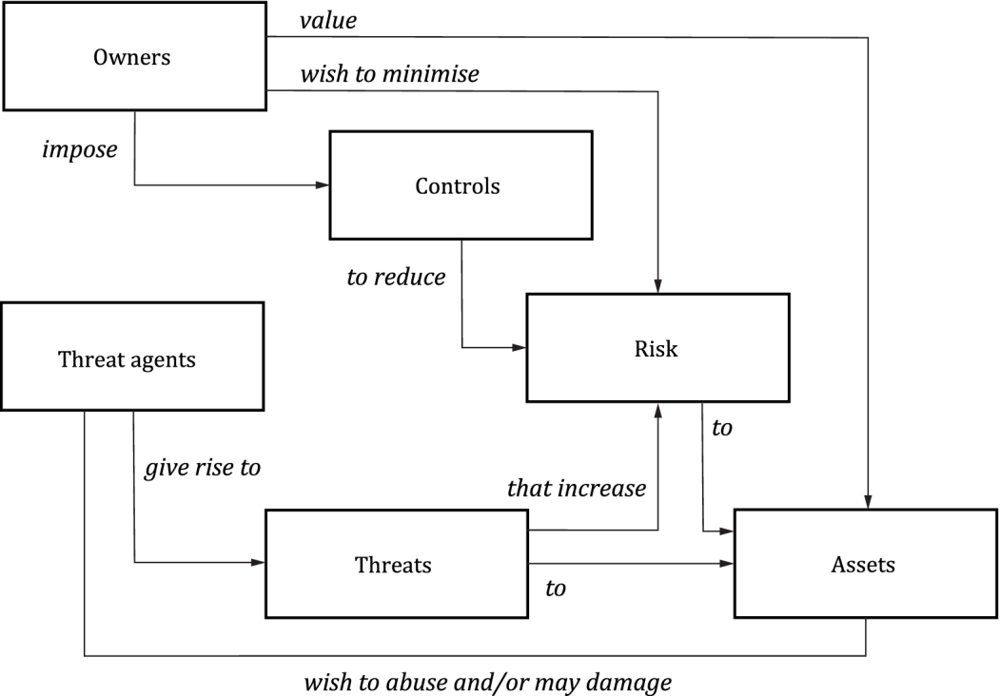

# Asset

**Acronym:** A

An **Asset** in cybersecurity refers to an item or information considered of value and thus necessitates protection. Assets, often in the form of information, are stored, processed, and transmitted by IT products and are vital to the functioning and continuity of an organization. The compromise of an asset, whether through loss of confidentiality, integrity, or availability, can result in a devaluation or potential operational disruptions. Protecting assets from [threats](./Threat.md) via security controls, usually referred to as [security objectives](./SecurityObjectives.md) in the context of CC, implemented in the [operational environment (OE)](./TOEOperationalEnvironment.md) is paramount.

Assets, particularly within the realm of Common Criteria, serve as focal points around which threats and security objectives are defined and evaluated. Ensuring the protection of assets translates to preserving organizational value and maintaining operational integrity.

## Practical Guidance

Asset identification is a foundational step in the cybersecurity lifecycle, especially within the framework of Common Criteria. Assets usually fall into one of three classes:
- **information assets** Data that is processed, stored, or transmitted by IT systems.
- **process assets** Established procedures and methodologies vital for operational continuity.
- **physical assets** Tangible items such as hardware, facilities, and physical infrastructure.

Assets can further be categorised as:

- **Primary assets** compromise of a primary asset will have immediate affect on the [Target of Evaluation (TOE)](./TargetofEvaluation.md).
- **Secondary assets** compromise of a secondary asset will not have immediate affect on the TOE, but may affect a primary asset.
- **TSF data** data for the operation of the TOE upon which the enforcement of the security functional requirement relies.
- **User data** data received or produced by the TOE, which is meaningful to some external entity, but which do not affect the operation of the [TOE security funtionality (TSF)](./TOESecurityFunctionality.md).

It is important not to identify too many assets or types of assets. If two assets or types of assets have the same potential for attack and consequences of attack, they should be grouped together into a composite asset type. Many TOEs will protect only two types of asset, TSF data and user data. More than six types of asset is probably inappropriate for anything other than a TOE that is expected to offer very complex or individualised protection capabilities.

### Key Steps in Asset Identification

1. **Understanding the Target of Evaluation (TOE):**
   - Gain a thorough understanding of the TOE, including its functionality, data it processes, and its operating environment.
   - Analyze the TOE’s functional and informational boundaries and the entities that interact with it.

2. **Analyzing TOE’s Functional and Security Architecture:**
   - Dive into the TOE's system architecture to understand data flow, storage, processing, and transmission aspects.
   - Evaluate the security attributes (confidentiality, integrity, availability) that are applicable to each component of the TOE.

3. **Engaging Stakeholders:**
   - Convene with TOE stakeholders, such as developers, administrators, and users, to glean insights into key functional and data components.
   - Ensure comprehensive awareness of user roles, data interactions, and functionalities by interacting with different stakeholders.

4. **Identifying TOE’s Information Assets:**
   - Identify information that the TOE processes, stores, or transmits which, if compromised, could impact the TOE or its stakeholders.
   - Determine the forms in which information assets exist, e.g., databases, configurations, user data, logs, cryptographic keys, and identify their locations and states (transit/storage).
   - Apply a preliminary risk outlook to guide prioritization in asset identification, especially for those handling sensitive or critical data.

5. **Exploring Dependence on Physical and External Assets:**
   - Identify physical assets (hardware, facilities) that are crucial for TOE’s operations and security.
   - Determine the TOE's dependence on external assets such as external databases, network infrastructure, or external services.

6. **Identifying Interconnections and Dependencies:**
   - Establish a clear understanding of how the TOE interacts with external entities and other IT systems.
   - Identify assets within these external entities that are crucial for the TOE’s operation and security.
   - Pinpoint and document relevant security attributes and potential risk vectors emerging from interconnections and dependencies.

7. **Develop an Asset Inventory:**
   - **Catalog Assets:** List all identified items of value within the organization, providing a unique identifier, an asset definition, and the asset's need for protection (Confidentiality, Integrity, Authenticity).
   - **Characterize and Group Assets:** Describe the nature, classification, and importance of each asset, and group similar assets accordingly.
   - **Secure Asset Inventory Management:** Ensure the asset inventory itself is securely stored, with strict access controls and audit logging to safeguard information about organizational assets.

### Additional Considerations:

- **Documentation of Process:**
   - Ensure systematic documentation of the asset identification process, capturing methods, data sources, interactions, and decisions, to facilitate auditability and future reference.
   
- **Dynamic and Adaptive Asset Management:**
   - Ensure that the asset identification process can dynamically adapt to technological, organizational, and environmental changes. Regularly review and adjust the asset inventory and characterizations in response to these changes.

- **Communication and Feedback Loops:**
   - Establish consistent communication channels and feedback mechanisms with asset owners and stakeholders to receive updates, insights, or alerts related to assets and to ensure the currency of the asset inventory and related attributes.

## Additional Resources

- **ISO/IEC 27001:** Provides guidelines on information security management and asset control.
- **NIST SP 800-53:** A detailed guide on security controls and risk management.
- **ISO/IEC TR 15446:** A Guide for the production of Protection Profiles and Security Targets.

## Related Documents

- [Deriving the Security Problem Definition](./SecurityProblemdefinition.md)
- [Identifying Threats](./Threat.md)
- [Deriving Security Objectives](./SecurityObjectives.md)
- [Understanding the Operational Environment (OE)](./TOEOperationalEnvironment.md)

