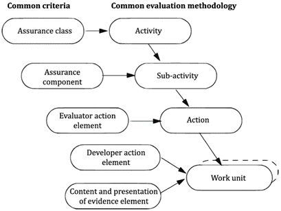

# Evaluation Methods and Activities

**Acronym:** EM, EA

While CC sets the security standards for IT products, CEM provides a detailed roadmap for evaluators to assess whether a product meets these standards. To this end, an Evaluation Method in the CEM is the structured evaluation process that encompasses a sequence of related Evaluation Activities, Sub-activities, Actions, and Work Units (defined as explicit evaluation tasks) designed to facilitate the evaluation of a [Security Assurance Requirement (SAR)](./SecurityAssuranceRequirement.md). Here's a breakdown of the conceptual hierarchy of an Evaluation Method:

1. **Evaluation Activity:** The high-level tasks or overarching actions that evaluators are expected to undertake to assess specific aspects of a TOE. 
2. **Evaluation Sub-Activity:** A defined subset of the activity that further breaks down the evaluation process by specifying the sub-activity's objective and the required evaluation evidence 
3. **Evaluation Action:** A container for all Work Units that exhaustively cover all aspects of an [Evaluation Action Element](./SecurityAssuranceRequirement.md). 
4. **Work Unit:** A concrete instruction of the evaluator's tasks to thoroughly assess the conformance of the evaluation evidence with the corresponding [Content and Presentation Element](./SecurityAssuranceRequirement.md).

Drawing from the outlined structure of an Evaluation Method, it becomes apparent that there is a systematic mapping between Evaluation Methods in the Common Evaluation Methodology and the [Security Assurance Components](./SecurityComponent.md) in the Common Criteria. The mapping between these two structures is shown in the figure below.

Each Assurance Component is mapped to an Evaluation Sub-Activity ensuring that every distinct assurance criterion is subjected to a specific evaluation sub-process. Analogously, each SAR is complemented by Evaluation Actions and Work Units corresponding respectively to the SARs Evaluation Action Elements and Developer and Content Elements.

## Practical Guidance

The CEM is fundamentally designed as a methodological guideline targeted towards evaluators, providing a structured and standardized pathway to evaluate IT products against the Common Criteria. It intends to establish a standardized evaluation process, aiming to enable comparability and consistency across evaluations, trying to ensure that irrespective of the evaluator or evaluation body, results are coherent and in alignment. However, the CEM only dictates the minimum requirements for an evaluation, making adherence to it a foundational necessity but not always sufficient, especially considering additional stipulations imposed by national certification schemes. Despite the foundational principle of ensuring comparability amongst CCRA participating members, the imposition of additional national requirements often impedes true comparability, introducing variations in the rigor and depth of evaluations. The European Union's [EUCC](./EUCC.md) (European Cybersecurity Certification) scheme aspires to bring about a more harmonized approach, aiming to unify the national schemes, at least within the European Union, and establish a common ground that allows for more genuine and unimpeded comparability between evaluations and certifications.

The general evaluation model prescribed by the CEM consists of the 
1. **Evaluation Input Task:** ensure that the correct version of the [evaluation evidence](./EvaluationEvidence.md) is available and create an [evaluation evidence index](./EvaluationEvidenceIndex.md);
2. **Evaluation Sub-activities:** depend on the type of evaluation (PP, PP-Configuration, or ST/TOE evaluation) and the selected assurance components
3. **Evaluation Output Task:** report evaluation results, write [Observation Reports (OR)](./ObservationReport.md) if needed and [Evaluation Technical Reports (ETR)](./EvaluationTechnicalReport.md);
4. **Demonstration of Technical Compotence Task:** validates the rigor and depth of the evaluation conducted. 

### Evaluation Input Task

The core objective of the "Evaluation Input Task" is to ensure that the evaluator has access to the correct version of the necessary evaluation evidence and that this evidence is adequately protected to uphold the technical accuracy and repeatability of the evaluation. This involves organizing and indexing the required evaluation evidence, which must be stable and formally-issued, ensuring all relevant evaluation evidence pertaining to the Target of Evaluation (TOE) is readily available and safeguarded throughout the evaluation.

### Evaluation Sub-activities - Determine the Evaluation Scope

Although, the evaluation scope is determined by the type of evaluation, e.g. a document evalution such as PP, PP-Configuration or ST, or a TOE evaluation, ultimately it is explicitly defined by the set of selected Assurance Components. In the case of a document evaluation the evaluation scope is immediatley derived from the Assurance Classes APE: Protection Profile evaluation, ACE: PP-Configuration evaluation, or ASE: Security Target evaluation. These classes only differentiate between the standard and low-assurance (CCv3R5) or [direct rationale](./DirectRationale.md) (CC2022) approach and do not depend on an [Evaluation Assurance Level (EAL)](./EvaluationAssuranceLevel.md), i.e., they do not differ in rigour and depth with increasing EAL. TOE evaluations, however, are typically tied to a selected EAL. For example, the components of the AVA_VAN Vulnerability Analysis assurance family are levelled based on an inscreasing rigour of vulnerability analysis and consideration of increased levels of [attack potential](./AttackPotential.md). This is immediately reflected in the EALs such that with increasing EAL a higher levelled component is selected to be evaluated.

Vulnerabliity Analysis Component | EAL Level
--- | ---
AVA_VAN.1 | EAL 1
AVA_VAN.2 | EAL 2, EAL 3
AVA_VAN.3 | EAL 4
AVA_VAN.4 | EAL 5
AVA_VAN.5 | EAL 6, EAL 7

### The decadent significance of EAL

Recent renovations in PP generation show that PPs do not claim EALs and assurance is rather gained by custom assurance/evaluation activities developed as part of the PP for the given TOE. In particular, NIAP does not recognize evaluation according to an EAL but only evaluation against a NIAP-approved technology-specific PP. With the release of CC2022 and the framework for the specification of evaluation methods and activities specified in Part 4, the CC supports this new notion.

Concurrently, the EUCC scheme foresees recognition of two distinct assurance levels 'substantial' and 'high', both tied to Vulnerability Assessment Levels (VALs) (corresponding to the component levels) of the AVA_VAN family instead of EALs. The respective assurance level for a VAL is attained if all dependencies of the selected level are satisfied during evaluation. In concrete terms, for a VAL 3 corresponding to an assurance level of 'substantial', the following assurance components must be considered:

AVA_VAN Component | Dependent Components
--- | ---
AVA_VAN.3 | ADV_FSP.3, 
| | ADV_FSP.4, 
| | AGD_PRE.1, 
| | ALC_TAT.1, 
| | ATE_FUN.1, 
| | ADV_IMP.1, 
| | ADV_ARC.1, 
| | ATE_COV.1, 
| | ADV_TDS.2, 
| | ADV_TDS.3, 
| | AGD_OPE.1, 
| | ATE_DPT.1

However, the EUCC still prefers that all assurance components of the EAL that is associated with the selected VAL are applied. Where an VAL is associated with multiple EALs either EAL may be chosen, though it is still possible to choose an even lower EAL (>=lowest associated EAL-2). The resulting assurance level is treated as an augmentation of the chosen EAL. Augmentation is also no longer indicated by a “+” sign, instead all added assurance components are listed. Still, the EAL level is no longer of immediate importance, since the CSA assurance level no longer depends on it. 

### Evaluation Output Task

Evaluators engage in two core sub-tasks to satisfy the documentation and reporting requirements:

- **Write OR Sub-Task:** This involves creating an Observation Report, which is performed as required to request clarification or to identify a problem, see [Observation Report](./ObservationReport.md)
- **Write ETR Sub-Task:** The Evaluation Technical Report must be compiled, serving as a detailed documentation of the evaluation results, see [Evaluation Technical Report](./EvaluationTechnicalReport.md)

### Evaluation Verdict

Evaluator action elements are assigned a verdict after performing the corresponding evaluation action and its constituent work units. A verdict, in this context, represents the outcome of the evaluation, indicating whether the element being evaluated has passed, failed, or requires further investigation (inconclusive). An evaluator action element can only be assigned the pass verdict if and only if the constituent Work Units and all evaluation evidence required are coherent, can be fully and completely understood and have no apparent (internal) inconsistencies with other evaluation evidence. All verdicts are initially inconclusive and remain so until either a pass or fail verdict is assigned. The overall verdict is pass, if and only if all the constituent verdicts are also pass.

### Demonstration of Technical Compotence Task

COMING SOON

## Additional Resources

- **Common Criteria Part 3 and Part 4**
- **Common Evaluation Methodology (CEM)**
- **European Cybersecurity Certification (EUCC) scheme**
- **[NIAP Certification compared to EAL Certification](https://www.blackbox.co.uk/gb-gb/page/45890/Resources/Technical-Resources/Black-Box-Explains/KVM/NIAP-Certification-vs-EAL-Certification-for-Security-Testing)**

## Related Articles

- [Single Assurance Evaluation](./SingleAssuranceEvaluation.md)
- [Multi Assurance Evaluation](./MultiAssuranceEvaluation.md)
- [Composite Evaluation](./CompositeEvaluation.md)
- [Observation Report](./ObservationReport.md)
- [Evaluation Technical Report](./EvaluationTechnicalReport.md)
- [Security Assurance Component](./SecurityComponent.md)
- [Security Assurance Requirement](./SecurityAssuranceRequirement.md)