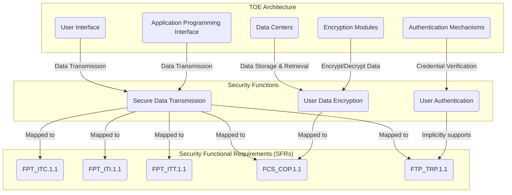

# TOE Summary Specification

**Acronym:** TSS

The TOE Summary Specification (TSS), exclusive to the [Security Target (ST)](./SecurityTarget.md) delivers an abstract, security-centric model of the [Target of Evaluation (TOE)](./TargetofEvaluation.md). It delineates how [Security Functional Requirements (SFRs)](./SecurityFunctionalRequirement.md) are realized within the TOE, offering consumers an overview that intertwines the TOE’s overall functionality and architecture with the realization of the SFRs. Through offering a detailed context wherein subjects, objects, security attributes, and rules as determined by the SFRs are contextualized within the TOE’s architectural and functional framework, the TSS furnishes a model that, while possibly abstracting from numerous non-security functions, provides a thorough insight into the TOE’s security functionality.

## Practical Guidance

The TOE Summary Specification (TSS) provides a transparent and insightful description aimed at enabling potential TOE consumers to comprehend how the Security Functional Requirements (SFRs) are satisfied by detailing the associated technical mechanisms and implementations. Ensuring a balance in detail, the TSS employs natural language to describe the realization of the SFRs, illustrating how they amalgamate to deliver security functionality within the visible architecture of the TOE. This allows for a lucid understanding of how the TOE not only adheres to but implements the defined SFRs in a tangible, verifiable manner, thereby serving as a reliable guide for consumers and evaluators alike.

In the subsequent structure of the TSS, consider commencing with a general overview of the TOE and its architectural boundaries, followed by a detailed exposition of the security functions in relation to the derived SFRs. Incorporating mappings that clearly trace the security functionalities to the respective SFRs, and where applicable, delineating the component interaction in a composed TOE, will enhance clarity and facilitate informed evaluation. Below you find a potential structure of the TSS.

## Potential TSS Structure with example

### 1. General Overview
#### 1.1 TOE Architecture
*Abstract description of the TOE architecture and the defined TSF boundary.*

Example: The TOE is a cloud-based storage system, composed of distributed data centers, user interfaces (UI), application programming interfaces (APIs), user authentication mechanisms, and encryption modules. Here, the TSF boundary may delineate the interactions and communications between user devices and data centers, focusing on security enforcement during data transmission and storage.

#### 1.2 TSF Protection Mechanisms
*Explain how the TSF is safeguarded against tampering and bypass.*

Example: The TOE employs multi-factor authentication (MFA) to protect against unauthorized access to admin panels and user accounts. Intrusion detection and prevention systems (IDPS) are utilized to safeguard the TSF from network-based attacks and anomalies.

### 2. Functional Model
*Functional model used to derive the SFRs with additional explanations to put the model into context of the entire TOE with all its functions and architecture.*

#### 2.1 Security Functions
*Detailed exposition of the security functions, ensuring clear linkages to the TOE’s broader functionality and architectural framework.*

Example: Security functions for this TOE may include secure data transmission employing TLS, user data encryption utilizing AES-256, and user authentication via passwords and MFA. Each function would be described in context with its interactions and dependencies within the system, such as how user authentication is enforced prior to allowing access to stored data.

### 3. Mapping to SFRs
*Provide a mapping showcasing how each security functionality corresponds to and fulfills SFRs.*

Example: For the cloud-based storage TOE, "Secure Data Transmission" as a security function could directly map to an SFR related to ensuring data confidentiality and integrity during transmission. 

Security Function | SFR ID | SFR 
---- | ---- | ----
Secure Data Transmission | FPT_ITC.1.1 | The TSF shall protect all TSF data transmitted from the TSF to another trusted IT product from unauthorized disclosure during transmission.
 | | FPT_ITI.1.1 | The TSF shall provide the capability to detect modification of all TSF data during transmission between the TSF and another trusted IT product within the following metric: [assignment: a defined modification metric].
 | | FPT_ITT.1.1 | The TSF shall protect TSF data from [selection: disclosure, modification] when it is transmitted between separate parts of the TOE.
 | | FCS_COP.1.1 | The TSF shall perform [assignment: list of cryptographic operations] in accordance with a specified cryptographic algorithm [assignment: cryptographic algorithm] and cryptographic key sizes [assignment: cryptographic key sizes] that meet the following: [assignment: list of standards].
 | | FTP_TRP.1.1 | The TSF shall provide a communication path between itself and [selection: remote, local] users that is logically distinct from other communication paths and provides assured identification of its end points and protection of the communicated data from [selection: modification, disclosure, [assignment: other types of integrity or confidentiality violation]].

### 4. Detailing Composition for Composed TOEs
*Elaborate on the individual components and their interactions in providing SFRs for a composed TOE.*

#### 4.1 Component Descriptions
Example: The TOE, being a cloud storage solution, might consist of components such as a user access management module, a data storage module, and a data transmission module. Descriptions might explore the individual functionalities and inherent security aspects of each module, and how they interconnect.
#### 4.2 SFR Mapping and Interaction for Composed TOEs
*Describe how the SFRs for the composed TOE map to component SFRs and their collaborative interactions.*

Example: The document may detail how the "User Authentication" SFR of the user access management module correlates and interacts with a "Data Encryption" SFR in the data storage module, ensuring that only authenticated users have access to decrypted data.

**Note**: This template serves to structure and guide the content creation process, ensuring each critical aspect of the TSS is comprehensively addressed and documented in a clear, coherent manner. 

Each subsection should be rigorously developed to ensure the TSS provides not only a technical exposition but also facilitates clear comprehension for consumers regarding how the TOE implements and adheres to SFRs.

## Additional Resources

- ISO/IEC 15446: Guide for the production of Protection Profiles and Security Targets.
- Common Criteria for Information Technology Security Evaluation.

## Related Articles

- [Security Target (ST)](./SecurityTarget.md)
- [Security Functional Requirements (SFR)](./SecurityFunctionalRequirements.md)