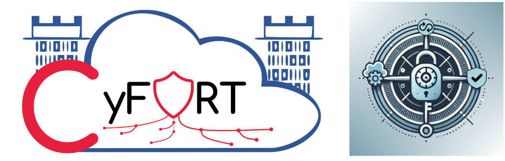

# C5-DEC

C5-DEC, short for "Common Criteria for Cybersecurity, Cryptography, Clouds – Design, Evaluation and Certification", is a sub-project of the [CyFORT](https://abstractionslab.com/index.php/research-and-development/cyfort/) project, which in turn stands for "Cloud Cybersecurity Fortress of Open Resources and Tools for Resilience", carried out in the context of the [IPCEI-CIS](https://ec.europa.eu/commission/presscorner/detail/en/ip_23_6246) project.




## Table of contents

- [Overview](#overview)
- [Features](#features)
- [User manual](#user-manual)
- [Technical specifications](#documentation-and-technical-specifications)
- [Getting started](#getting-started)
- [Usage](#usage)
- [Roadmap](#roadmap)
- [License](#license)
- [Contact](#contact)

## Overview

Descriptions goes here...

## Features

### Design

- 

### Interfaces

- 

### Feature 2

- 

### Feature 3

- 

## User manual

Please see the [CAD user manual](./docs/manual/overview.md) to learn more about the installation, setup requirements, overall usage and specific modules. A concise guide for getting quickly started is given below.

## Documentation and technical specifications

You can visit our [traceability page](https://abstractionslab.github.io/c5dec/docs/traceability/index.html) to view the technical specifications, which have been published to HTML from the source specification files via the `publish` CLI command of C5-DEC CAD, which in turn acts as a wrapper for the underlying Doorstop publish feature, offering some enhancements.

## Getting Started

This project can be deployed using any of the following methods:

1. 

2. 

For more details on the installation options, please see the [installation](./docs/manual/installation.md) page of the user manual.

### Installing option 1

1. 
1. 

### Installation option 2

1. 
2. 

```sh
git clone https://github.com/AbstractionsLab/c5dec.git 
```

3. 

## Usage

To start 

### Interface 1


### Interface 2


## Roadmap

For details on our roadmap and features planned for future releases, please see the [Wiki]() section of this repository.

## License

Copyright (c) company-name. All rights reserved.

Licensed under the [GNU Affero General Public License (AGPL) v3.0](LICENSE) license.

## Acknowledgment

....

## Contact

If you wish to learn more about the project, feel free to contact us at: