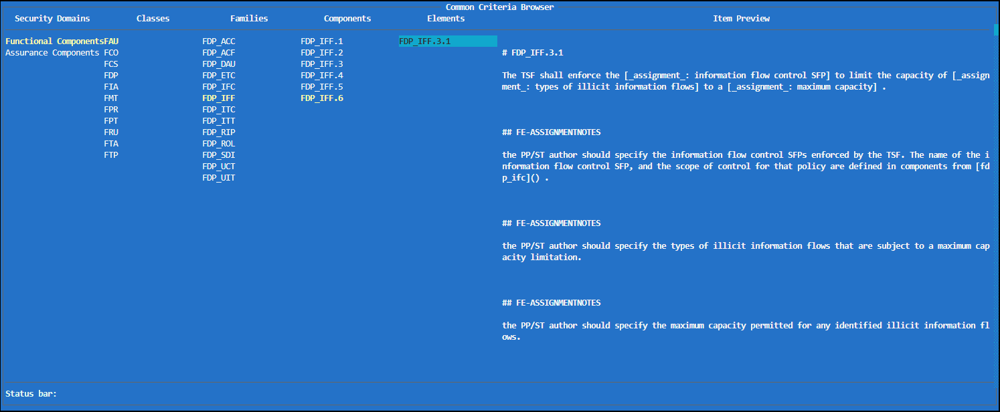

# Common Criteria Toolbox

The Common Criteria Toolbox (CCT) submodule serves as another integrated mini-app within C5-DEC, encompassing a comprehensive suite of functionalities designed to streamline the Common Criteria certification process for both developers and evaluators. Central to the CCT's functionality is the CC database (CC-DB), a dedicated database housing the CC in a structured format that is parsed and deserialized from the XML files sourced from the [Common Criteria portal](https://commoncriteriaportal.org/). Complementing the CCT and its CC database, the CC Knowledge Base stands as another valuable resource, offering users with guidance and support in understanding the Common Criteria and its various concepts. 

## Quick start guide

The CCT can be accessed via the C5-DEC CAD command line interface (CLI), textual user interface (TUI) and graphical user interface (GUI).

### GUI

Once the GUI has been launched using the command `c5dec -g`, you can access the "CCT browser" feature by visiting `127.0.0.1:5432` or `localhost:5432` on your browser.


#### Browsing the CC database

The GUI browser allows you to navigate the CC database by using filters to select the requirement type (`SFR` vs `SAR`), CC classes (e.g., `FCS` or `ALC`), CC families (e.g., `ALC_CMC`, `FCS_RNG`), CC components (e.g., `FCS_RNG.1`) and finally elements (e.g., `FCS_RNG.1.1`). Upon selection of a filter, subsequent dropdown lists are updated automatically. In addition, the requested CC data is automatically converted from the original XML CC dataset into Markdown and displayed in the text area.


Note that for every new filter selection or change, the content gets updated immediately upon changing the selected filter value, i.e., the displayed content corresponds to the last user selection such that if a family is selected, the content of the said choice is shown and if the last choice happens to be a component, then the content of the selected component is shown. As can be seen in the screenshot above, the currently selected CC item is always indicated below the display text area showing the content in Markdown. 

You can either use the `Copy` button to copy the content to the clipboard and paste it elsewhere or press the `Expand selection` button to get the full content of the current selection, which will result in populating the text area above with the full content (all descendants) of the currently selected item (in Markdown), e.g, if the latest selection is a CC family, all its corresponding components and elements will be fetched and displayed.

Finally, a nicely formatted view of the Markdown content can be previewed by using the `Toggle preview` button, as displayed in the screenshots below.

The `FCS` class from the `SFR` type has been selected by the user.


The component `FCS_RNG.1.2` element has been selected by the user.


#### Common Criteria evaluation laboratory

Another CCT feature currently exposed in the CC evaluation laboratory grouping of the GUI allows the user to create evaluation checklists in the form of a spreadsheet. You can select between the two releases `CCv3.1R5` and `CC2022R1` and then either choose a given assurance class (`SAR`) such as `ALC` or opt for the `ALL-CLASSES` option. The former will result in the creation of a spreadsheet capturing only work units from the `ALC` class, while the latter will include the entire set of CC work units.

Currently, this functionality extracts all the work units in the selected assurance class. You can create an evaluation checklist for a specific evaluation assurance level (EAL) [using the TUI](#create-an-evaluation-checklist) of C5DEC CAD.


The screenshot below shows an example of such an evaluation checklist viewed using LibreOffice Spreadsheet.


The generated spreadsheet has two sheets. `WU` contains the work units selected in the GUI; `AWI`is aimed at allowing the analyst/evaluator to break down each work unit (WU) into what we refer to as atomic work items (AWI). Each WU can have several AWIs and they are correlated through the `header` column in both sheets.

The other columns in the AWI tab should contain:

- `AWI-ID`: an id assigned to the AWI. A numerical sequence is suggested.
- `AWI-Cat`: a category assigned to the AWI; this could be thought as the evaluation topic of the AWI.
- `AWI-EvalObj`: the object of evaluation of the AWI.
- `AWI-Descr`: the description of the atomic action for the evaluator.
- `RequiredInput`: possible assets that the developer can provide as evidence.
- `DevInput`: the evidence that the developer has provided.
- `Analysis`: the evaluator notes regarding the analysis of the evidence as per the evaluation action.
- `Verdict`: one of 'pass', 'fail' or 'inconclusive'. Note that, with minor edits in the spreadsheet, you can compute the verdict of each WU based on the corresponding AWI verdicts.

The created evaluation checklist spreadsheet comes with an AWI as an example.

The format of the evaluation checklist is based on the template available at `assets/etr/etr-eval-checklist.xlsx` (picture below\), where the 'EvalOverview' sheet provides a verdict overview table that the user can automatically parse and convert into a Markdown table via the [`etr` subcommand](#make-etr-document-parts-from-an-evaluation-checklist-spreadsheet) of the CLI. This table can then be easily included in the final report using the C5-DEC DocEngine suite.


### TUI

In the main menu of the TUI navigate to the 'Common Criteria Toolbox' module. The TUI can be navigated either using the arrow keys and enter or the mouse and double left-click.


#### Browse the Common Criteria

The Common Criteria Browser provides a tree-based viewing experience to browse the hierarchically structured Security Components of the Common Criteria. Select between Functional and Assurance Components to display all respective Classes. Selecting a Class will display the Class description in the 'Item Preview' as well as load all its Families. The same applies to Components and Elements.  



#### Create an Evaluation Checklist

If you want to create an Evaluation Checklist navigate to 'Create Evaluation Checklist' in the CCT's submenu. Once in the 'Evaluation Checklist - Creation' function menu you can select the set of assurance components for which an evaluation checklist shall be created. You can either select a Package under 'Packages' or create a custom set by selecting individual components under 'Select Item/s'. 

Your current selection is displayed under 'Current Selection' and it is automatically validated to ensure that all the hierarchical and dependency relationships are satisfied within the set of selected components.
The validation status is always displayed in the 'Status bar'. 

The description of the item currently selected is displayed in the 'Item Preview' section.


**Search**

In the _Common Criteria Browser_ and in the _Evaluation checklist-Creation_ views, you can search for Components using the 'Search Bar'. The search is case insensitive and allows you to match entire Classes or Families, as well as individual components.

Individual Components are searched when a perfect match is found, e.g., ADV_INT.1. Classes or Families are searched when partial matches are found, e.g., searching for 'ACO' will match all the components belonging to the 'Composition' class; similarly, searching for 'ACO_DEV' will match all components belonging to the 'Composition Development Evidence' family. 

You will be prompted to accept or decline the automatic selection of components in case of class/family matches.

**Package augmentation**

Augmenting a package is easily done by selecting the desired package and additional components under 'Select Item/s'. The selection will be automatically validated. 

**Auto complete selection** 

The 'Auto Complete Selection' feature provides a potential valid set that includes the current selection. 

**Deselect**

Components can be deselected from the 'Current Selection' using the 'Deselect' button underneath. 

**Creating the Evaluation Checklist**

Upon selection of a valid set you can create an Evaluation Checklist. The 'Create Evaluation Checklist' button will prompt a screen asking for information to uniquely identify the checklist: 
- Evaluation Identifier (`<eid>`): a folder with this name is be created to store the selected evaluation items. A file per evaluation item is created and named with the format `<eid>-<num>`, where `num` denotes a sequential number. These files contain the description of the evaluation item and are used to track the evaluation verdicts.
- Creator
- Creation Date.

After submission, a doorstop document will be created. Each item (a markdown file with yaml front matter) of this document corresponds to a selected evaluation item and contains the Work Units that correspond to the selected components. As an example, Work Unit ADV_ARC.1-1 is displayed below. After successfully creating the Evaluation Checklist the system will ask you to proceed to the Evaluation Checklist.


#### Evaluation Checklist

When navigating to the 'Evaluation Checklist' functional menu you first have to load the Evaluation Checklist(s) using the button 'Load Evaluation Checklist/s' on the bottom left. 

Afterwards, you can select a checklist to start or proceed with your evaluation. All evaluation items are listed under 'Evaluation Item/s'. Selecting an item will display the corresponding Work Unit on the very right and the evidence (if already provided) under 'Evaluation Evidence'. 

With the buttons underneath the 'Evaluation evidence' section, a verdict (*pass*, *fail*, or *inconclusive*) can be set for the Work Unit. The changes are persisted. 

On the bottom right your progress is tracked for the current Evaluation Checklist.


*_Note - Please enter your evidence in Markdown format._*


### CLI

In the following examples, we assume C5-DEC CAD to be installed via pipx using the Wheel (.whl) distribution file, but in case C5-DEC CAD is deployed and launched with the containerized environment shipped with the GitHub repository, the commands must be preceded with `poetry run` due to our use of Poetry for dependency management and packaging. Note also that the Docker Desktop Engine must be running prior to opening the project in the containerized environment via VS Code. An example below for the usage:

Running the CLI for a pipx-based installation, i.e., C5-DEC CAD installed as an application using pipx, the following command can be used to get the help menu for the CLI:

```sh
c5dec -h
```

which then becomes

```sh
poetry run c5dec -h
```

in the containerized environment.

Similarly, `poetry run c5dec` simply becomes `c5dec` when the tool is [installed via pipx](./installation.md).

The following commands are exposed to the CLI:

**view** 
```sh
$ c5dec view <ID>
$ c5dec view <ID> > <filename>.md
```
This command prints the selected CC item's content and hierarchical tree to the console in Markdown format. Output redirection can be used to save the output as a Markdown file. 

The '--version' flag allows to specify the CC version. Currently supported versions are 3R1, 3R2, 3R3, 3R4, 3R5 with 3R5 being the default version.

**validate**

```sh
$ c5dec validate -d <IDs>
```

The 'validate' command currently supports only the validation/verification of the dependencies for a provided set of components both functional and/or assurance. 

In the case of an invalid selection a potential valid selection is provided. Note that the provided valid selection can be just one of many valid selections. This is particularly true for a set of functional components since these often define *or-dependencies*, i.e., the dependency is fulfilled when one of the components listed as an *or-dependency* is included in the set. 

In future releases you'll be able to blacklist *or-dependencies* you do not want to include in your project such that you'll be able to iteratively explore all the available valid options.

**checklist**

The Evaluation Checklist as described above can also be created via the CLI with

```sh
$ c5dec checklist -c <prefix> --id <IDs> --info <info> 
```
This will automatically validate the provided set of components and create the checklist if and only if it is a valid selection. 

The 'prefix' corresponds to the Evaluation Identifier mentioned earlier, and the 'info' is the general information that uniquely identifies the project/TOE for which the Evaluation Checklist is created. The 'info' can be a json file.

Once an Evaluation Checklist is created you can run the following to list all created checklists, you can list all evaluation items of an Evaluation Checklist with

```sh
$ c5dec checklist <prefix> -l/--list 
```

The most efficient approach to edit an Evaluation Item is using the TUI, but in case you want to edit it manually you can run the following command:
```sh
$ c5dec checklist <prefix> --edit <ID> [--editor <editor>] 
```
If no 'editor' is specified if defaults to 'vim'.

After you're finished with editing the Evaluation Checklist run 
```sh
$ c5dec checklist <prefix> -u/--update
```
to update the index that keeps track of the current evaluation progress. Retrieve the status of an evaluation with 
```sh
$ c5dec checklist <prefix> -s/--status
```

#### Exporting evaluation checklists to spreadsheet format

The user can create and export an evaluation checklist as a spreadsheet using the `export` subcommand of the `c5dec` CLI:


For instance, 

```sh
c5dec export checklist 3R5 -p ALC_CMC.1
```

creates a spreadsheet including work units from the `ALC_CMC.1` component, named following the format `checklist-<yyyymmdd>-<hhmmss>`, where the last two placeholders encode the date and timestamp at the time of command execution.

Here is another example using the `-c` flag used for selecting CC classes.

```sh
c5dec export checklist 3R5 -c ALC AVA
```

This will create an evaluation checklist spreadsheet including work units from both the `ALC` and the `AVA` classes.

#### Make ETR document parts from an evaluation checklist spreadsheet

The `etr` subcommand of the C5-DEC CLI generates parts of an Evaluation Technical Report (ETR) in Markdown format, documenting work units of selected assurance families. The work units included in the report are read from a predefined evaluation checklist in the format of the output produced by the `export` subcommand.


If CC family choices are provided, the ETR part generation algorithm exports only the content corresponding to the selected families. Note that the family names are not prefixed by the parent class. For example,

```sh
c5dec etr -f CMC -t DocStruct Acronyms Glossary
```
1. picks up the default evaluation checklist included at `c5dec/assets/etr/etr-eval-checklist.xlsx`. This checklist contains work units for the components ALC_CMC.1, ALC_CMC.4, ALC_DVS.1 and AVA_VAN.4. The predefined evaluation checklist can be changed as explained [below](#customize-the-checklist-combining-the-export-and-etr-commands).
2. parses and processes the selected spreadsheet to generate ETR document parts capturing content both at the level of work units as well as their corresponding atomic work items (AWI), if any are provided by the user in the AWI sheet. In this example, only work units of the CMC family are filtered.
3. generates Markdown encodings of the tables specified in each sheet of the `tables.xlsx` spreadsheet, included in the same `c5dec/assets/etr` folder. The user can choose to parse only selected tables using the `-t` flag.
4. the generated outcomes are stored in the `c5dec/assets/etr/output` folder in separate and dedicated Markdown files.

Note that if the checklist does not contain data regarding the selected family, an empty file is still created.

The Markdown output files of the `etr` subcommand can be directly included into the C5-DEC DocEngine template found at `assets/etr/etr_template`. This template, based on Quarto, serves to create a full ETR document as explained in [C5-DEC DocEngine for ETR generation](#c5-dec-docengine-for-etr-generation).

##### Customizing the predefined evaluation checklist 

The previously described `export` and `etr` subcommands are complementary as `export` can be used to create a custom evaluation checklist that `etr` can then process to generate parts of an ETR.

The steps are as follows:

  1. Run the `export` subcommand to create an evaluation checklist spreadsheet with your choices. E.g.,
  ```sh
  c5dec export etrInput 3R5 -c ALC ADV
  ```
  2. Copy the output spreadsheet from `c5dec/export` to the `c5dec/assets/etr/` folder.
  3. Run the `etr` command with your choices using the flag `-n` to give the name of your checklist. E.g.,
  ```sh
  c5dec etr -n etrInput-20240719-102817 -f DVS
  ```
The ETR parts are created as described in the previous section.

Alternatively, the default evaluation checklist can be replaced with your custom evaluation checklist by modifying the value of the `eval-file-name` parameter in the configuration file `c5dec/assets/c5dec_params.yml`.
      
  ```
	etr:
		eval-wu-id: "WU-ID"
		eval-file-name: <your-checklist-file>
		eval-wu-sheet: "WU"
		eval-awi-sheet: "AWI"
  ```

### C5-DEC DocEngine for ETR generation

A new feature made available as part of the beta release deals with the creation of evaluation technical reports (ETR). To this end, we have provided a complete Quarto template (found at `assets/etr/etr_template`), which additionally includes boilerplate content specifically tailored to `ALC`-centric evaluations. In future iterations, we may update the repository with such template content for other assurance classes. 

However, the ETR template itself is reusable for any choice of evaluation class. Out of the box, our template provides a series of LaTeX customizations enhancing the fully Markdown-based experience, hiding away all such technical changes in a dedicated `tex` subfolder, which includes all the `.tex` files we use to customize our report template. We also group raw document content in a dedicated `chapters` folder, which in turn can and in our case does include sub-folders for a better separation of specifics subparts such as `ALC`-specific content generated using the C5-DEC `etr` command of the CLI.


Moreover, we provide pre-rendering and post-rendering code (`etr_template/scripts`) that provides various types of automation in the form of an easy-to-understand pipeline. In particular, our pre-render scripts allow the user to define all the meta data used in the cover page, as well as the headers and footers of the output report, via a dedicated YAML configuration file `c5dec_config.yml` found at the root of the `etr_template` folder.

Using the same input format, the user can easily compile the report to several well-known and widely-used formats such as PDF, docx, and HTML, available at `assets/etr/etr_template/_output`. Our main enhancements focus on the PDF version as some of the specific features of Quarto itself are also better supported in this format, e.g., text call-outs.

This can be done either via the dedicated VS Code extension for Quarto, accessible using the VS Code Command Palette (Cmd/Ctr+Shift+P) and selecting the `Quarto: Render Document` option or simply via the command line, e.g.,

```sh
$ quarto render ./c5dec/assets/etr/etr_template/chapters/intro.qmd --to pdf
```

This would then generate a PDF document stored under the `_output` folder, with an example shown below:


For exporting to `docx`, we have also provided a reference template document that Quarto uses to adjust various aspects of the generated report such as heading and table styles, but the user can and is encouraged to update this reference template or replace it with their own version. Note that most features of the conversion to `docx` work rather well out of the box, but the user needs to manually copy their cover page into the automatically generated report.