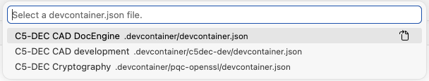
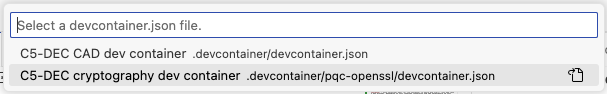

# Installation and workspace setup {#sec-installation}

This chapter provides full installation procedures for all supported deployment models.

Use this decision order:

1. Docker + C5-DEC runner scripts (fastest for CLI/TUI/GUI use).
2. VS Code dev container workflow (recommended for advanced SSDLC, DocEngine, and integrated development).
3. Legacy pipx wheel installation (deprecated, use only when containerized workflows are not viable).

## Prerequisites for all paths

- Python 3 installed.
- Git installed.
- Local copy of C5-DEC repository or release package.

## Procedure A: Docker + runner scripts

This is the quickest path to launch C5-DEC in an isolated environment without manual dependency management.

### Steps

1. Install Docker engine or Docker Desktop and ensure it is running.
2. Open a terminal in the project directory.
3. Ensure scripts are executable:

```bash
chmod +x build-c5dec.sh
chmod +x c5dec.sh
```

4. Build images:

```bash
./build-c5dec.sh
```

5. Launch C5-DEC:

```bash
./c5dec.sh
./c5dec.sh help
```

### Common execution modes

```bash
./c5dec.sh            # default help/entrypoint
./c5dec.sh session    # interactive container session
./c5dec.sh pqc        # post-quantum crypto entrypoint
```

### Expected outcome

- C5-DEC starts in containerized mode with CLI/TUI/GUI entrypoints available.

### Checkpoints (if something fails)

- Docker daemon unreachable: see [Troubleshooting](05-troubleshooting.qmd) and the section on container build failures.
- Build fails on package/network step: see [Troubleshooting](05-troubleshooting.qmd).

## Procedure B: VS Code dev container (recommended)

Use this path for full development workflows and integrated tooling (Poetry, Quarto, SpecEngine, notebook workflows).

### Required tools

1. Docker Desktop (or Docker engine).
2. Visual Studio Code.
3. Dev Containers extension for VS Code.

### Steps

1. Clone repository:

```bash
git clone https://github.com/AbstractionsLab/c5dec.git
```

2. Start Docker Desktop/engine.
3. Open the repository folder in VS Code.
4. Run `Dev Containers: Reopen in Container`.
5. Select `C5-DEC CAD dev container`.
6. Wait for build/start completion.
7. Open terminal in container and validate:

```bash
c5dec -h
c5dec -t
c5dec -g
```

### Optional Poetry recovery

If dependencies are missing in the container shell:

```bash
poetry install
poetry shell
```

### Expected outcome

- Local filesystem is mounted in container.
- `c5dec` commands run directly in integrated terminal.
- Full C5-DEC feature set available.

### Checkpoints

- No `Reopen in Container` prompt: see [Troubleshooting](05-troubleshooting.qmd) section on Dev Container detection.
- `c5dec: command not found`: see [Troubleshooting](05-troubleshooting.qmd) section on Poetry environment activation.



## Procedure C: choose a devcontainer variant

### Variant 1: C5-DEC CAD dev container (default)

Use for:
- full module coverage,
- SSDLC and Doorstop operations,
- most cryptography, transformer, and PM workflows.

### Variant 2: C5-DEC CAD cryptography dev container (PQC)

Use for post-quantum OpenSSL/OQS operations.

Steps:
1. Reopen in container.
2. Select `C5-DEC CAD cryptography dev container`.
3. Validate available PQC algorithms:

```bash
openssl list -signature-algorithms -provider oqsprovider
openssl list -kem-algorithms -provider oqsprovider
```

Expected outcome:
- OQS-enabled OpenSSL commands available in container shell.



### Variant 3: DocEngine-focused container

A dedicated `docEngine.Dockerfile` is available for document-generation-focused workflows.

Use for:
- Quarto rendering,
- SpecEngine publish pipeline,
- DocEngine-centric CI/CD or lightweight publishing environments.

Build/run:

```bash
docker build -f docEngine.Dockerfile -t c5dec-docengine .
docker run --rm -it -v "$(pwd)":/workspace c5dec-docengine bash
```

Expected outcome:
- Quarto and publication toolchain ready for rendering and spec publication tasks.

## Procedure D: workspace setup after installation

Run these once per workspace (regardless of deployment path).

1. Unpack and rename project folder as needed.
2. Ensure git repository exists:

```bash
git init .
```

3. Ensure Poetry environment is active in container sessions when needed:

```bash
poetry shell
```

4. Run quick launch checks:

```bash
c5dec -h
c5dec -t
c5dec -g
```

### Checkpoints

- Import warnings in editor: select Poetry interpreter (see [Troubleshooting](05-troubleshooting.qmd)).
- GUI not reachable or port conflict: see [Troubleshooting](05-troubleshooting.qmd) GUI sections.


## Procedure E: legacy pipx installation (deprecated)

Use only if Docker/containers are unavailable.

### Global steps

1. Install pipx:

```bash
python3 -m pip install --user pipx
python3 -m pipx ensurepath
```

2. Optional Doorstop installation:

```bash
pipx install doorstop==3.0b10
```

3. Install C5-DEC wheel from unpacked release directory:

```bash
pipx install ./c5dec-<version>-py3-none-any.whl
```

### Platform notes

#### GNU/Linux

- Python 3.8+ typically available.
- Install with same pipx commands above.
- Launch:

```bash
c5dec
```

#### macOS

- Ensure Python 3.8+ available.
- Install and launch exactly as GNU/Linux.

#### Windows

1. Install Python via Microsoft Store.
2. Install pipx with:

```bash
python3 -m pip install --user pipx
python3 -m pipx ensurepath
```

3. Install wheel:

```bash
pipx install .\c5dec-<version>-py3-none-any.whl
```

4. Launch with `c5dec` in terminal.

### Legacy usage quick checks

```bash
c5dec -h
c5dec -t
c5dec -g
```

## Installation verification checklist

Use this as final pass/fail validation:

1. `c5dec -h` returns help without command-not-found errors.
2. TUI opens using `c5dec -t`.
3. GUI starts and can be reached on expected port.
4. For dev container workflows, Poetry environment is active and dependencies resolve.
5. For DocEngine workflows, Quarto render commands execute successfully in selected environment.

