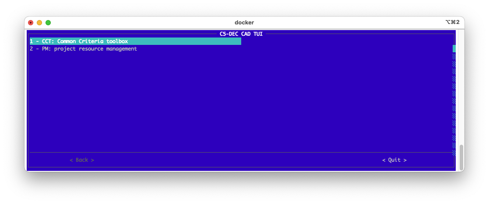
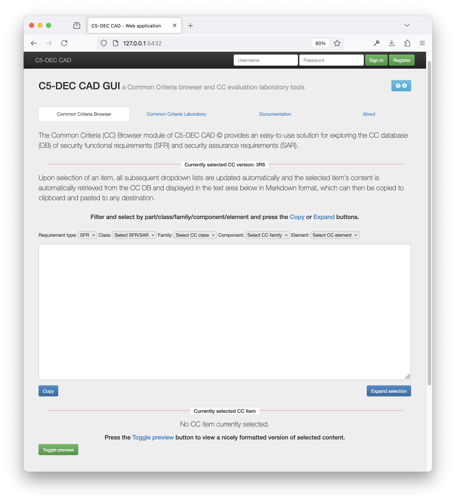

# Quick start and interfaces {#sec-quick-start}

This chapter consolidates launch and interface usage from the quick start guide.

## Launch modes

C5-DEC supports three primary launch modes:

- CLI for direct commands and automation.
- TUI for menu-driven operation in terminal.
- GUI for browser-based interaction.

## Start commands

```bash
c5dec -h
c5dec -t
c5dec -g
```

## TUI usage pattern

The TUI is optimized for keyboard navigation and module-first workflows. Use it when you want to operate without browser context and keep actions in one terminal session.



## GUI usage pattern

The GUI provides browser pages for CC browsing and evaluation lab operations. It is useful for interactive selection and formatted preview of selected CC content.



## Third-party GUI integration

The manual includes practical usage with:

- Visual Studio Code,
- Zettlr,
- Firefox.

These integrations are useful for editing, previewing, and publishing report-oriented artifacts.
