# Module guides {#sec-modules}

This chapter expands each module into actionable procedures.

All steps are reorganized from the source manual pages and keep the same operational scope.

## Common Criteria Toolbox (CCT)

Use CCT to browse Common Criteria content, validate component selections, create evaluation checklists, and generate ETR inputs.

Primary use:

- browse CC classes, families, components, and elements,
- create evaluation checklists,
- export checklist data,
- generate ETR input parts.

Key commands:

```bash
c5dec view <ID>
c5dec validate -d <IDs>
c5dec checklist -c <prefix> --id <IDs> --info <info>
c5dec export myChecklist 3R5 -p ALC_CMC.1
c5dec etr -f CMC -t DocStruct Acronyms Glossary
```

### Procedure A: browse CC content via GUI

1. Launch the GUI:

```bash
c5dec -g
```

2. Open `127.0.0.1:5432` (or `localhost:5432`) in a browser.
3. In the CCT browser, select filters in this order:
	- Requirement type (`SFR` or `SAR`)
	- Class
	- Family
	- Component
	- Element
4. Use `Copy` to copy the current markdown content, or `Expand selection` to include descendants.
5. Use `Toggle preview` to inspect formatted content.

Expected outcome:
- CC text appears in markdown, updates automatically on each filter change, and can be copied/exported to downstream documentation.


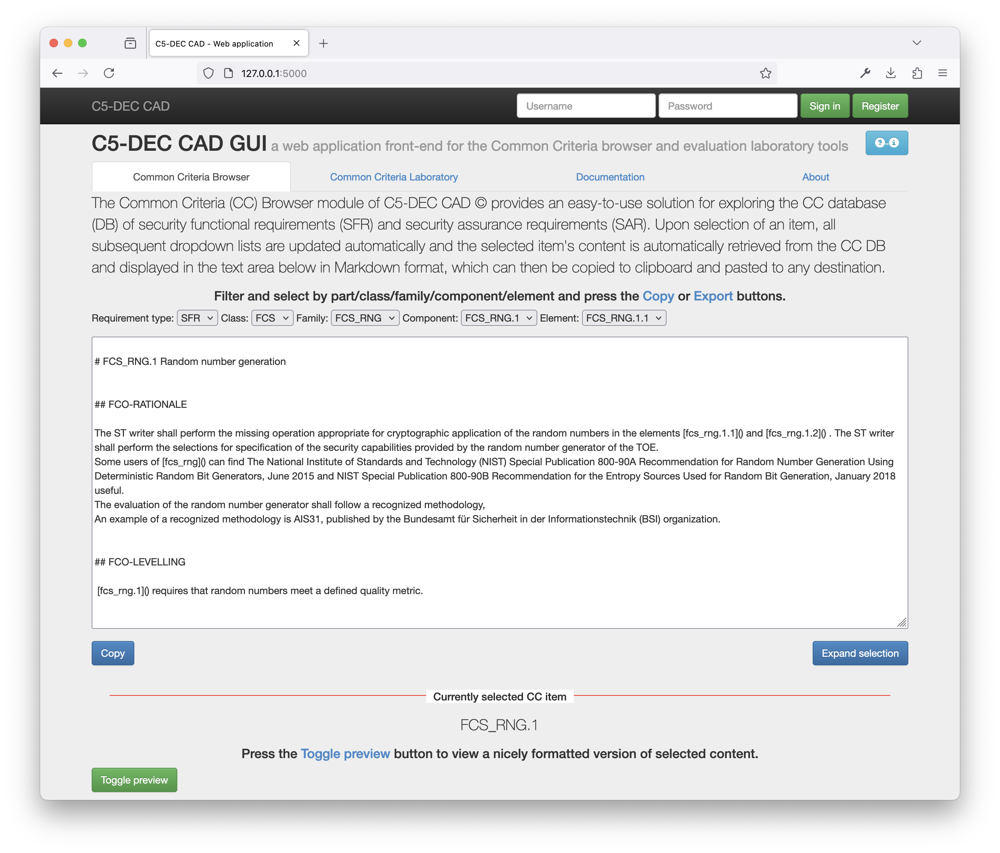

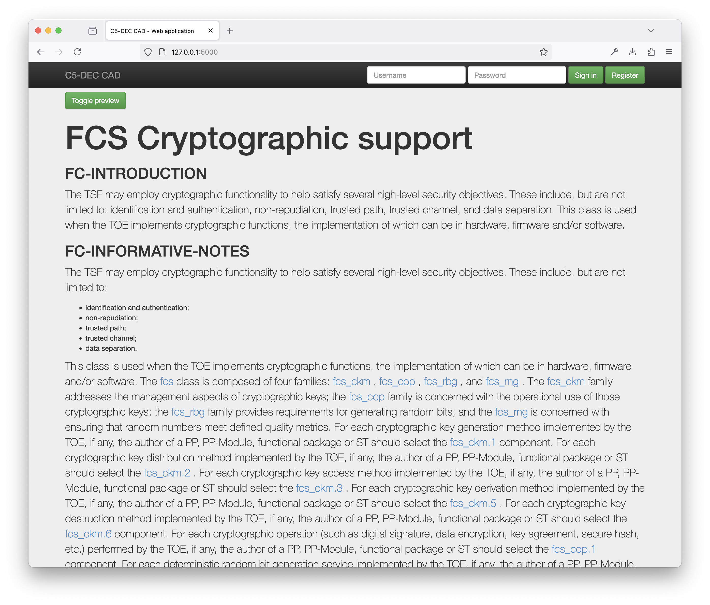

### Procedure B: create checklist via TUI

1. Launch TUI and navigate to Common Criteria Toolbox.
2. Open `Create Evaluation Checklist`.
3. Select either:
	- an assurance package under `Packages`, or
	- a custom component set under `Select Item/s`.
4. Confirm status bar shows a valid selection.
5. Provide checklist identity when prompted:
	- Evaluation Identifier (`<eid>`)
	- Creator
	- Creation Date
6. Proceed to `Evaluation Checklist` to review work units and enter evidence/verdicts (`pass`, `fail`, `inconclusive`).

Expected outcome:
- A Doorstop checklist document is created with one item per selected evaluation work unit.

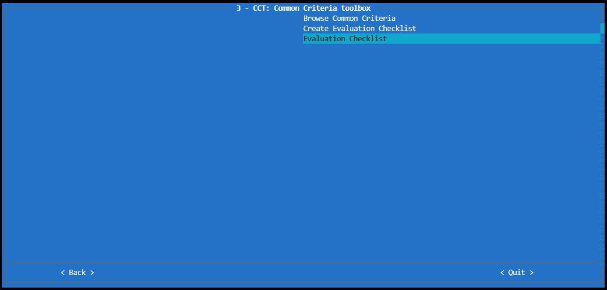

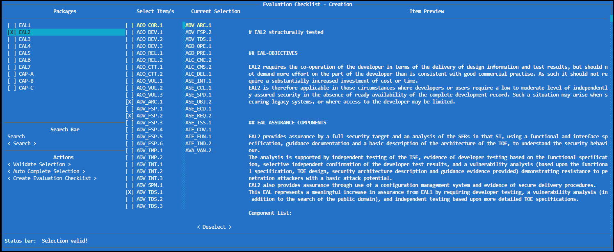

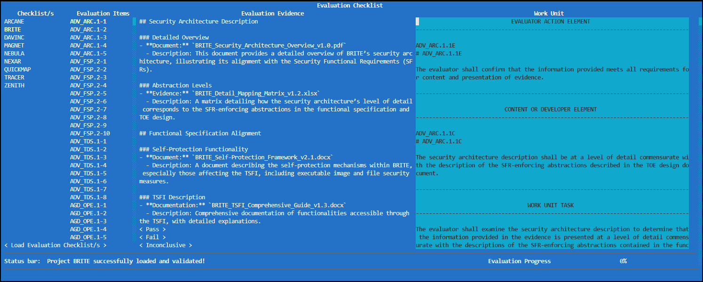

### Procedure C: run checklist and export flow via CLI

1. Inspect CLI help:

```bash
c5dec -h
```

2. Browse and validate CC choices:

```bash
c5dec view <ID>
c5dec validate -d <IDs>
```

3. Create a checklist with metadata:

```bash
c5dec checklist -c <prefix> --id <IDs> --info project=MyTOE date=2026-03-01
```

4. Maintain checklist state:

```bash
c5dec checklist <prefix> --list
c5dec checklist <prefix> --edit <ID>
c5dec checklist <prefix> --update
c5dec checklist <prefix> --status
c5dec checklist <prefix> --validate
c5dec checklist <prefix> --publish <path>
```

5. Export spreadsheet from selected components/classes:

```bash
c5dec export myChecklist 3R5 -p ALC_CMC.1
c5dec export myChecklist 3R5 -c ALC AVA
```

6. Generate ETR markdown parts from checklist spreadsheet:

```bash
c5dec etr -f CMC -t DocStruct Acronyms Glossary
```

Expected outcome:
- Checklist artifacts and spreadsheet exports are created.
- ETR markdown fragments are generated for DocEngine inclusion.

## Secure software development life cycle (SSDLC)

Use SSDLC to create project scaffolding, manage Doorstop artifacts, maintain links, and publish traceable technical specifications.

Primary use:

- manage repositories and artifact items,
- define and maintain item relations,
- publish technical specifications and traceability outputs,
- use SpecEngine utilities for browser, statistics, and graph generation.

Key commands:

```bash
c5dec new -p <project_name> -u <user_directory>
poetry run doorstop
cd docs/specs && ./publish.sh
```

### Procedure A: bootstrap a new C5-DEC SSDLC project

1. Create project bundle:

```bash
./c5dec.sh new
```

Or with explicit project/user:

```bash
./c5dec.sh new -p "newproject" -u "username"
```

2. Initialize git repository in the resulting project folder:

```bash
git init .
```

3. Open project in VS Code dev container and activate Poetry environment.

Expected outcome:
- Project contains `.devcontainer`, `docs/specs`, `docs/manual`, `docs/traceability`, tests, and pre-configured DocEngine assets ready for use with the DocEngine module.

### Procedure B: maintain artifact lifecycle

1. Use SSDLC menus (TUI) or Doorstop commands to:
	- create/update artifact items,
	- manage links,
	- review status and suspect links.
2. Keep artifact naming/prefixes aligned (`MRS`, `SRS`, `ARC`, `SWD`, `TCS`, `TRP`).

Expected outcome:
- Traceability graph remains consistent from requirements through test evidence.

### Procedure C: publish technical specs and reports

1. Go to specs folder:

```bash
cd /home/<username>/<projectname>/docs/specs
```

2. Run enhanced publication pipeline:

```bash
./publish.sh
```

3. Optionally run SpecEngine utilities directly:

```bash
python docs/specs/SpecEngine/c5publish.py
python docs/specs/SpecEngine/c5browser.py
python docs/specs/SpecEngine/c5traceability.py --html
python docs/specs/SpecEngine/c5graph.py
python docs/specs/SpecEngine/c5mermaid.py
python docs/specs/SpecEngine/c5fingerprint.py
```

Expected outcome:
- Published HTML specs, browser tables, traceability stats, graphs, and updated keyword rendering.

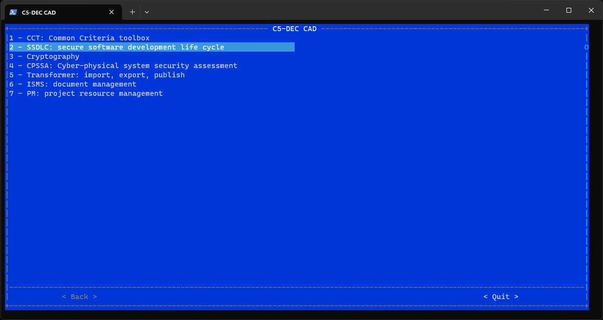


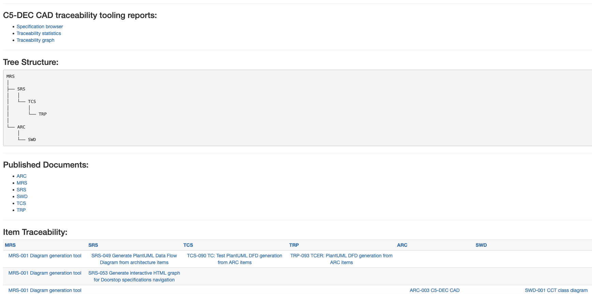

## DocEngine

DocEngine is C5-DEC CAD's Quarto-based document publishing module. It is an independent component that scaffolds production-ready templates for generating technical documents — PDF reports, slide decks, and CRA Annex VII compliance documentation — from Markdown source files, with integrated Python pre/post-render scripts and extensive LaTeX customizations.

DocEngine requires the **C5-DEC DocEngine dev container**, which ships Quarto, TeX Live, Kryptor, and Cryptomator CLI on top of the base CAD container.

Primary use:

- scaffold report, presentation, and CRA technical documentation templates,
- configure document metadata (cover page, headers, footers, changelog),
- write content in Markdown chapters or slides,
- render to PDF, DOCX, and HTML from a single source,
- generate ETR documents through the CCT integration pipeline.

Key commands:

```bash
c5dec docengine report -n <name>
c5dec docengine presentation -n <name>
c5dec docengine cra-tech-doc -n <name>
c5dec docengine <type> -n <name> --standalone
c5dec docengine <type> -n <name> -d /path/to/destination
```

### Procedure A: create and configure a template

1. Activate the Poetry environment inside the DocEngine dev container:

```sh
poetry shell
```

2. Scaffold the desired template type:

```sh
# Technical report
c5dec docengine report -n my-report

# Presentation
c5dec docengine presentation -n my-presentation

# CRA Annex VII technical documentation
c5dec docengine cra-tech-doc -n my-cra-doc
```

   The template is created under `./docengine/<name>/` and a ZIP archive is placed alongside it.
   To change the destination directory:

```sh
c5dec docengine report -n my-report -d /path/to/output
```

3. Open `c5dec_config_v2.yml` at the root of the template folder and set document metadata:

```yaml
document:
  title: "My Technical Report"
  subtitle: "Engineering study"
  version: "1.0"
  date: "2026-03-23"

changelog:
  - version: "1.0"
    date: "2026-03-23"
    changes:
      - "Initial release"
```

   Use `c5dec_config.yml` (v1) for plain-string changelog entries. Use `c5dec_config_v2.yml` (v2, recommended) for structured changelog entries and automatic LaTeX escaping of special characters.

4. For a self-contained portable template that includes the full DocEngine dev container setup:

```sh
c5dec docengine report -n my-report --standalone
```

   The recipient can open the resulting folder in VS Code and select "Reopen in Container" to get a fully configured environment.

Expected outcome:
- Template folder created at `./docengine/<name>/` with pre-configured `_quarto.yml`, config files, chapter stubs, pre/post-render scripts, and LaTeX customization layer.


### Procedure B: write content and render

1. Add report chapters as `.qmd` files inside the `chapters/` folder. For presentations, add slide sections to the `slides/` folder.

2. Register new chapters in `_quarto.yml` under `book.chapters`:

```yaml
book:
  chapters:
    - index.qmd
    - chapters/intro.qmd
    - chapters/my-chapter.qmd
    - chapters/summary.qmd
    - chapters/references.qmd
```

3. Use `_variables.yml` for reusable values referenced in `.qmd` content with ``:

```yaml
project:
  name: "CyFORT"
  version: "1.3"
document:
  reference: "TR-007-2026"
```

   In a chapter:

```markdown
This is  version .
Document reference: ****
```

4. Render to the desired format:

```sh
# PDF (via LuaLaTeX — full cover page, headers, footers)
quarto render ./docengine/<name>/index.qmd --to pdf

# HTML (Bootstrap Cosmo theme by default)
quarto render ./docengine/<name>/index.qmd --to html

# DOCX (uses custom-docx-format-ref.docx for styles)
quarto render ./docengine/<name>/index.qmd --to docx
```

   Output is placed in `./docengine/<name>/_output/`.

5. If Quarto picks up a different Python than the Poetry environment, set:

```sh
export QUARTO_PYTHON=$(which python)
```

   Alternatively, use the Quarto VS Code extension (Command Palette → `Quarto: Render Document`) while inside the dev container.

Expected outcome:
- PDF, HTML, and/or DOCX documents generated in `_output/`, with cover page, running headers/footers, and changelog from `c5dec_config_v2.yml` automatically applied.

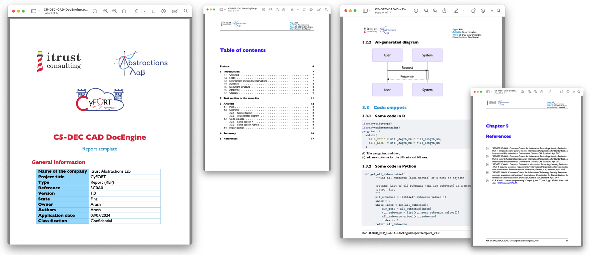

### Procedure C: ETR generation pipeline

DocEngine integrates with the Common Criteria Toolbox (CCT) to produce Evaluation Technical Reports (ETR).

1. Generate structured Markdown ETR parts from a completed evaluation checklist spreadsheet using the CCT `etr` subcommand:

```bash
c5dec etr -f CMC -t DocStruct Acronyms Glossary
```

2. Copy or move the generated Markdown parts into the `chapters/` folder of a DocEngine `report` template.

3. Register the parts in `_quarto.yml` under `book.chapters`.

4. Render to the final ETR format:

```sh
quarto render ./docengine/<name>/index.qmd --to pdf
```

Expected outcome:
- A fully formatted ETR document compiled from CCT-generated Markdown parts via LaTeX.


---

## Project resource management (PM)

Use PM to convert OpenProject exports, consolidate timesheets, and compute cost reports.

Primary use:

- convert OpenProject time reports,
- consolidate time reports,
- compute cost reports.

Key commands:

```bash
c5dec timerep <openproject-export.xlsx>
c5dec consolidate <folder>
c5dec costrep <timesheet.xlsx>
```

### Procedure A: convert OpenProject time report

1. Open PM module and select OpenProject time report assistant.
2. Provide absolute path to exported OpenProject file.
3. Trigger conversion.

CLI equivalent:

```bash
c5dec timerep <name>
```

Expected outcome:
- Converted timesheet is written to current working directory using configured schema.

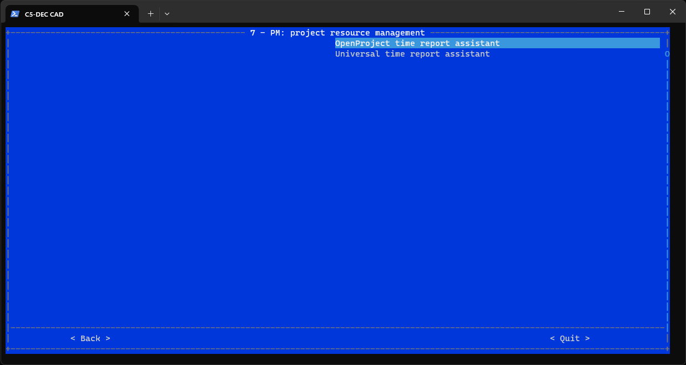

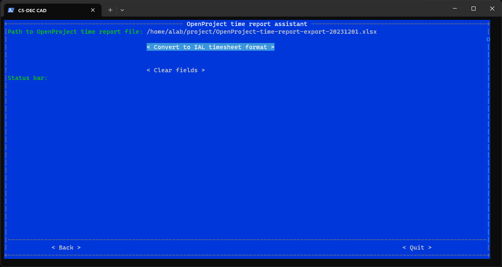

### Procedure B: consolidate and filter reports

1. Open PM > Time report assistant.
2. Set path to folder containing report files.
3. Optionally enable filters and set:
	- from date,
	- to date,
	- field and field value.
4. Trigger consolidation.

CLI equivalent:

```bash
c5dec consolidate <name> [-l] [-f FROMDATE] [-t TO] [-d FIELD] [-v VALUE]
```

Expected outcome:
- A consolidated file named `consolidated-TSH-<date>-<timestamp>.xlsx` is created.

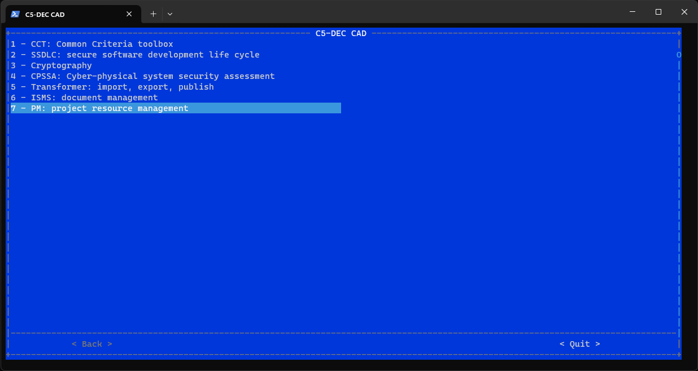

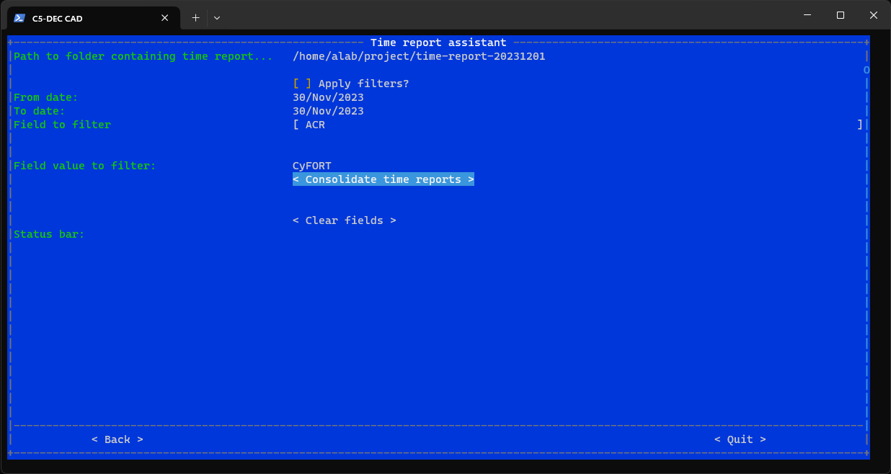

### Procedure C: compute cost report and analyze

1. Run cost report on consolidated timesheet:

```bash
c5dec costrep <name>
```

2. Review output sheets:
	- `CostReport`
	- `VerificationSheet`
3. Optionally copy into analysis template and refresh pivot tables for VAT view.

Expected outcome:
- Cost outputs include computed daily rates, per-row costs, and verification trace columns.

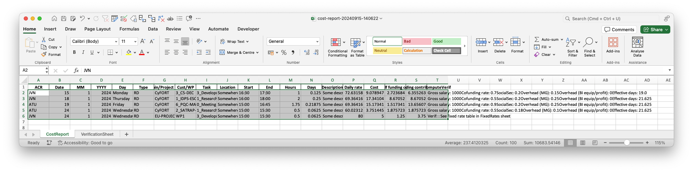

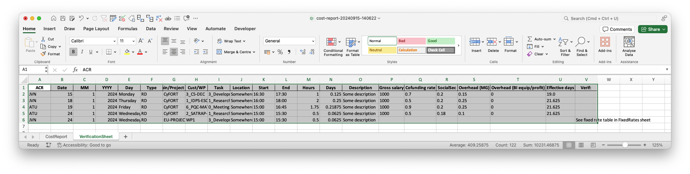

## Cyber-physical system security assessment (CPSSA)

Use CPSSA for threat-model generation, DFD generation, report drafting, and FAIR-based quantitative risk analysis.

Primary use:

- create threat models from architecture artifacts,
- generate reports and DFD diagrams,
- run FAIR risk analysis.

Key commands:

```bash
c5dec cpssa create-threat-model --project /path/to/project -o threat-model.yml
c5dec cpssa generate-report --model threat-model.yml -o cpssa-report.md
c5dec cpssa generate-dfd --project /path/to/project -o cpssa-dfd.puml
c5dec cpssa fair-input --model threat-model.yml -o fair-params.yml
c5dec cpssa risk-analysis --model threat-model.yml --fair-params fair-params.yml
```

### Procedure A: create a threat model template

1. Generate Threagile YAML (default):

```bash
c5dec cpssa create-threat-model --project /path/to/project -o threat-model.yml
```

2. Optional format alternatives:

```bash
c5dec cpssa create-threat-model --project /path/to/project --format pytm-python
c5dec cpssa create-threat-model --project /path/to/project --format pytm-json
```

3. If auto-discovery is not enough, pass `--arc-folder` explicitly.

Expected outcome:
- Threat-model scaffold generated from ARC/HARC/LARC items, including assets, boundaries, and baseline scenario structure.

### Procedure B: generate report and DFD

1. Generate markdown CPSSA report:

```bash
c5dec cpssa generate-report --model threat-model.yml -o cpssa-report.md
```

2. Generate PlantUML DFD:

```bash
c5dec cpssa generate-dfd --project /path/to/project -o cpssa-dfd.puml
```

Expected outcome:
- Report and DFD artifacts aligned to architecture item semantics and zone boundaries.

### Procedure C: FAIR calibration and quantitative risk analysis

1. Create FAIR parameter template:

```bash
c5dec cpssa fair-input --model threat-model.yml -o fair-params.yml
```

2. Calibrate scenario values in `fair-params.yml`.
3. Execute risk simulation:

```bash
c5dec cpssa risk-analysis --model threat-model.yml --fair-params fair-params.yml -o results/
```

Expected outcome:
- Scenario-level ALE summaries, CSV simulation output, and HTML risk views.

## Cryptography

Use cryptography module for integrity, signatures, encryption/decryption, secret sharing, and Ed25519 signing.

Primary use:

- SHA-256 integrity checks,
- GnuPG signing and encryption,
- Shamir secret splitting and recovery,
- NaCl Ed25519 signing and verification.

Key commands:

```bash
c5dec crypto hash <file>
c5dec crypto verify-hash <file> <hash>
c5dec crypto sign <file> -o <signature>
c5dec crypto encrypt <file> -r <recipient>
c5dec crypto shamir-split <secret_hex> -n 5 -k 3
c5dec crypto nacl-keygen
```

### Procedure A: integrity and signature workflow

1. Hash and verify file integrity:

```bash
c5dec crypto hash path/to/file.pdf
c5dec crypto verify-hash path/to/file.pdf <expected_sha256>
```

2. Create and verify detached signature:

```bash
c5dec crypto sign report.pdf -o report.pdf.sig
c5dec crypto verify-sig report.pdf report.pdf.sig
```

Expected outcome:
- Integrity digest and signature-verification pass/fail status.

### Procedure B: encryption and decryption workflow

1. Encrypt for recipients:

```bash
c5dec crypto encrypt sensitive.docx -r alice@example.com bob@example.com
```

2. Decrypt asymmetric file:

```bash
c5dec crypto decrypt sensitive.docx.gpg -o sensitive.docx
```

3. Decrypt symmetric file with passphrase:

```bash
c5dec crypto decrypt symmetric-file.gpg -o output.txt --passphrase "my-passphrase"
```

Expected outcome:
- Encrypted artifact and successful plaintext recovery.

### Procedure C: secret sharing and NaCl signing

1. Split hex secret:

```bash
c5dec crypto shamir-split deadbeef -n 5 -k 3
```

2. Recover from threshold shares:

```bash
c5dec crypto shamir-recover "1:..." "3:..." "5:..."
```

3. Generate NaCl keypair and sign/verify message:

```bash
c5dec crypto nacl-keygen
c5dec crypto nacl-sign "approved by alice" <signing_key_hex>
c5dec crypto nacl-verify <signed_hex> <verify_key_hex>
```

Expected outcome:
- Recovered secret and verified Ed25519-style signed message.

## Information security management system (ISMS)

Use ISMS Python APIs to verify document inventories, build activity reports, and convert Word tags to hyperlinks.

Primary use:

- verify ISMS folder/document list consistency,
- generate activity logs,
- process Word tags into links.

### Procedure A: verify ISMS folder against reference list

1. Run DocListAssistant in Python/Poetry shell:

```python
from c5dec.core.isms import DocListAssistant

assistant = DocListAssistant()
assistant.set_path("/path/to/isms-folder")
assistant.set_reference("/path/to/reference-doc-list.csv")
assistant.scandir()
assistant.save_to_csv("isms-verification-report.csv")
```

Expected outcome:
- Present/missing/unlisted documents are reported and exported to CSV.

### Procedure B: generate activity report CSV

1. Ensure activity folder follows expected dated/user hierarchy.
2. Run ActivityReport:

```python
from c5dec.core.isms import ActivityReport

report = ActivityReport()
report.set_path("/path/to/activities")
report.scandir()
report.save_to_csv("activity-report.csv")
```

Expected outcome:
- CSV contains date/user/event-level activity rows suitable for ISMS audit and PM reuse.

### Procedure C: convert Word tags to hyperlinks

1. Prepare CSV mapping (`tag,url,display_text`).
2. Run processor:

```python
from c5dec.core.isms import WordTagProcessor

processor = WordTagProcessor()
processor.set_params(
	 doc_path="report-template.docx",
	 csv_path="tag-mapping.csv",
	 regex_text=r"\{REF:[A-Z]+-\d+\}",
	 ignore_missing_tag=True,
)
processor.convert_tags_to_hyperlinks(keep_style=False)
```

Expected outcome:
- `.docx` is updated in place with hyperlink fields.

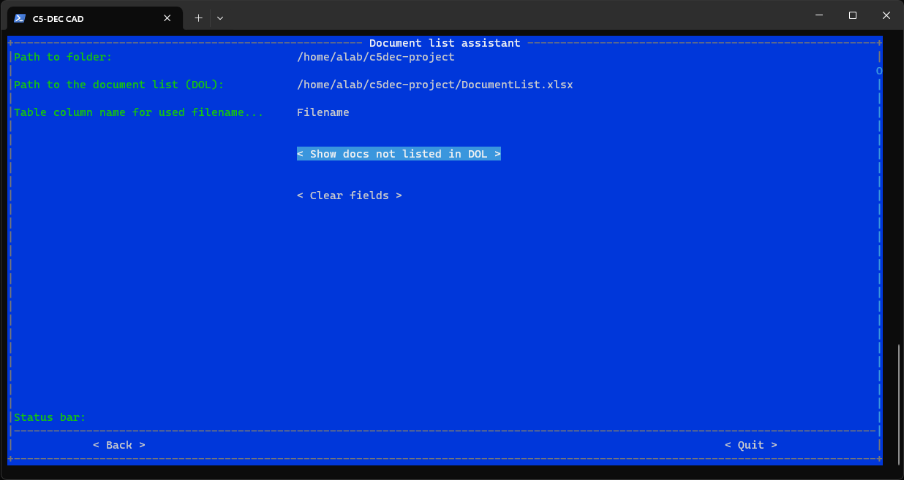

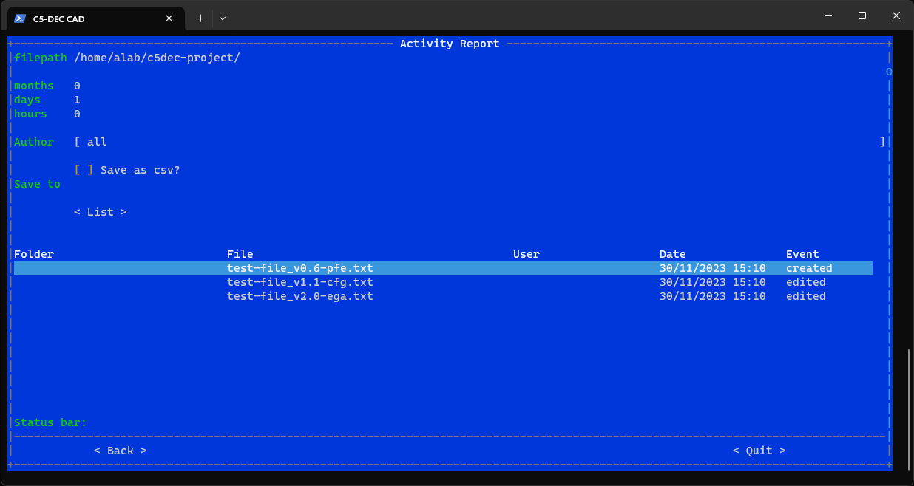

## Software bill of materials (SBOM)

Use SBOM module to generate component inventories, import to Doorstop, diff versions, and validate basic CRA transparency criteria.

Primary use:

- generate SBOMs in CycloneDX or SPDX format,
- import SBOM into Doorstop,
- diff versions and validate compliance.

Key commands:

```bash
c5dec sbom generate /path/to/source -o sbom_v1.0.json -f cyclonedx
c5dec sbom import sbom_v1.0.json --prefix SBOM-v1.0 --version "1.0"
c5dec sbom diff SBOM-v1.0 SBOM-v2.0 -o sbom_diff_report.md
c5dec sbom validate SBOM-v1.0
```

### Procedure A: generate and import SBOM

1. Verify Syft availability:

```bash
syft version
```

2. Generate SBOM:

```bash
c5dec sbom generate /path/to/project -f cyclonedx -o sbom-v1.0.json
```

3. Import into Doorstop:

```bash
c5dec sbom import sbom-v1.0.json --prefix SBOM-v1.0 --version "1.0"
```

Expected outcome:
- Doorstop SBOM document is created with one item per component.

### Procedure B: diff and validate SBOM

1. Compare two imported SBOM versions:

```bash
c5dec sbom diff SBOM-v1.0 SBOM-v2.0 -o sbom-changes.md
```

2. Validate imported SBOM:

```bash
c5dec sbom validate SBOM-v1.0
```

Expected outcome:
- Added/removed/changed component report and compliance-oriented structural checks.

## CRA compliance

Use CRA module to create Annex-I checklist artifacts, integrate SBOM evidence, export compliance tables, and generate Annex-VII technical documentation.

Primary use:

- create CRA requirement checklist,
- verify CRA checklist and SBOM coverage,
- export compliance report,
- generate CRA technical documentation.

Key commands:

```bash
c5dec cra --create --prefix CRAC
c5dec cra --verify
c5dec cra --export cra_compliance_report.xlsx
c5dec docengine cra-tech-doc -n cra-tech-doc
```

### Procedure A: create and complete CRA checklist

1. Create checklist for product class:

```bash
c5dec cra --create --prefix CRAC
c5dec cra --create --prefix CRAC --category class_i
```

2. Edit requirement item verdict/evidence fields in generated `docs/specs/CRAC` files.

Expected outcome:
- Structured Doorstop checklist with CRA requirement mapping and review evidence.

### Procedure B: integrate SBOM and export compliance report

1. Generate/import SBOM:

```bash
c5dec sbom generate /path/to/source -o sbom_v1.0.json -f cyclonedx
c5dec sbom import sbom_v1.0.json --prefix SBOM-v1.0 --version "1.0"
```

2. Run auto-verification and export:

```bash
c5dec cra --verify
c5dec cra --export cra_compliance_report.xlsx
```

Expected outcome:
- CRA checklist includes SBOM compliance evidence and exported Excel compliance summary.

### Procedure C: build CRA technical documentation

1. Create CRA DocEngine template:

```bash
c5dec docengine cra-tech-doc -n cra-tech-doc
```

2. Configure product metadata in `c5dec_config.yml`.
3. Review and adjust chapter content.
4. Render outputs:

```bash
quarto render --to pdf
quarto render --to html
quarto render --to docx
```

Expected outcome:
- Annex-VII style CRA technical documentation generated in PDF/HTML/DOCX.

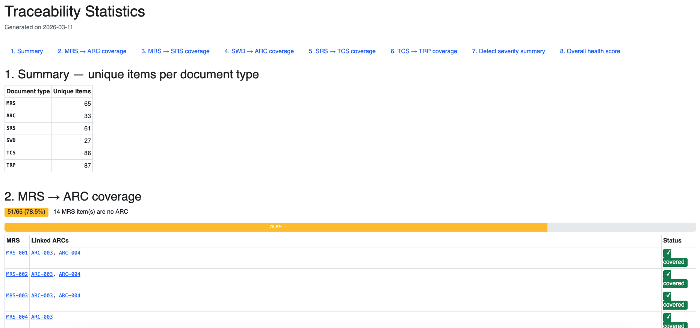

