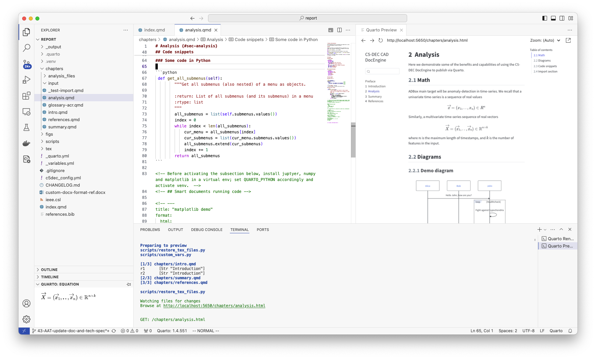
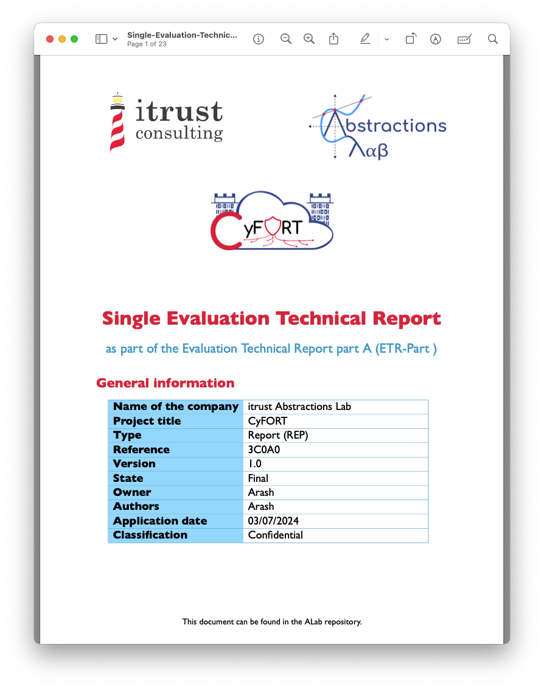

# DocEngine

DocEngine is C5-DEC CAD's document publishing module. It scaffolds production-ready [Quarto](https://quarto.org/) templates for generating technical documents — PDF reports, slide decks, and CRA compliance documentation — from Markdown source files, with integrated Python pre/post-render scripts and extensive LaTeX customizations. The rendered outputs are suitable for engineering project reports, Common Criteria Evaluation Technical Reports (ETR), CRA Annex VII technical documentation, and internal or external presentations.

DocEngine is accessed through the `c5dec docengine` CLI command and requires the **C5-DEC DocEngine dev container** (which ships Quarto, TeX Live, Kryptor, and Cryptomator CLI on top of the base CAD container).

## Table of contents

- [Template types](#template-types)
- [Quick start](#quick-start)
- [Standalone mode](#standalone-mode)
- [Template structure](#template-structure)
    - [Report template layout](#report-template-layout)
    - [Presentation template layout](#presentation-template-layout)
    - [CRA technical documentation layout](#cra-technical-documentation-layout)
- [Configuration](#configuration)
    - [c5dec_config.yml (v1)](#c5dec_configyml-v1)
    - [c5dec_config_v2.yml (v2)](#c5dec_config_v2yml-v2)
    - [Choosing a format version](#choosing-a-format-version)
- [Writing content](#writing-content)
    - [Report chapters](#report-chapters)
    - [Presentation slides](#presentation-slides)
    - [Custom variables](#custom-variables)
- [Rendering](#rendering)
    - [Rendering to PDF](#rendering-to-pdf)
    - [Rendering to HTML](#rendering-to-html)
    - [Rendering to DOCX](#rendering-to-docx)
    - [Quarto Python environment](#quarto-python-environment)
- [ETR generation pipeline](#etr-generation-pipeline)
- [CRA technical documentation](#cra-technical-documentation)
- [Pre/post-render scripts](#prepost-render-scripts)
- [Troubleshooting](#troubleshooting)

---

## Template types

Three template types are available:

| Type | CLI argument | Primary outputs | Description |
|------|-------------|-----------------|-------------|
| Technical report | `report` | PDF, DOCX, HTML | Full report with LaTeX cover page, chapter structure, headers, footers, and bibliography |
| Presentation | `presentation` | Reveal.js HTML, PowerPoint | Slide deck with ALab branding using Reveal.js (HTML) and PowerPoint output |
| CRA technical documentation | `cra-tech-doc` | PDF, DOCX, HTML | CRA Annex VII seven-chapter structure; also available via `c5dec cra tech-doc` |

All three share the same underlying Quarto/LaTeX/Python pipeline architecture and follow the same configuration conventions.

---

## Quick start

Before using DocEngine, ensure you are running inside the **C5-DEC DocEngine dev container** with the Poetry environment activated:

```sh
poetry shell
```

Create a template using the `c5dec docengine` command and the `-n` flag to provide a name:

```sh
# Technical report
c5dec docengine report -n my-report

# Presentation
c5dec docengine presentation -n my-presentation

# CRA technical documentation
c5dec docengine cra-tech-doc -n my-cra-doc
```

By default the template is created under `./docengine/<name>/` inside the current working directory, and a ZIP archive of the same content is placed alongside it. To override the destination directory, use the `-d` flag:

```sh
c5dec docengine report -n my-report -d /path/to/output
```

Once created, the typical workflow is:

1. Edit `c5dec_config.yml` (or `c5dec_config_v2.yml`) to set the document title, authors, version, date, and header/footer texts.
2. Add your content to the `chapters/` folder (for reports) or `slides/` folder (for presentations).
3. Render the document with `quarto render`.

A view of the DocEngine report template open in VS Code:



---

## Standalone mode

The `--standalone` flag copies the full DocEngine dev container setup — the `.devcontainer` folder, `docEngine.Dockerfile`, `poetry.lock`, and `pyproject.toml` — into the generated template destination. This lets users open and use DocEngine directly in VS Code as a self-contained project, without needing the rest of the C5-DEC CAD repository:

```sh
c5dec docengine report -n my-report --standalone
c5dec docengine presentation -n my-presentation --standalone
c5dec docengine cra-tech-doc -n my-cra-doc --standalone
```

When standalone mode is used, the recipient can open the template folder directly in VS Code and select "Reopen in Container" to get a fully configured DocEngine environment.

---

## Template structure

### Report template layout

```
docengine/<name>/
├── index.qmd                   # Quarto book entry point (title page, front matter)
├── _quarto.yml                 # Quarto project configuration
├── c5dec_config.yml            # C5-DEC document metadata (v1 format)
├── c5dec_config_v2.yml         # C5-DEC document metadata (v2 format, recommended)
├── _variables.yml              # Custom Quarto variables
├── references.bib              # BibTeX bibliography
├── ieee.csl                    # Citation style (IEEE)
├── custom-docx-format-ref.docx # Reference styles for DOCX output
├── chapters/                   # Report chapter .qmd files
│   ├── intro.qmd
│   ├── analysis.qmd
│   ├── summary.qmd
│   └── references.qmd
├── figs/                       # Figures and images
├── scripts/                    # Python pre/post-render scripts
│   ├── custom_vars.py          # Metadata injection (v1)
│   ├── custom_vars_v2.py       # Metadata injection (v2, recommended)
│   ├── tables.py               # Auto-generated tables from Doorstop
│   └── restore_tex_files.py    # LaTeX file lifecycle management
├── tex/                        # LaTeX customization layer
│   ├── include-in-header.tex   # Custom packages, commands, page style
│   ├── before-body.tex         # Cover page template
│   ├── pandoc.tex              # Pandoc LaTeX integration
│   ├── tables.tex              # Table formatting enhancements
│   └── toc.tex                 # Table of contents styling
└── _output/                    # Generated documents (PDF, DOCX, HTML)
```

### Presentation template layout

The presentation template follows the same root-level conventions but replaces the `chapters/` folder with a `slides/` folder. Each `.qmd` file in `slides/` becomes a section of the deck. Reveal.js (HTML) and PowerPoint (PPTX) outputs are both supported.

### CRA technical documentation layout

The `cra-tech-doc` template mirrors the report structure but ships with pre-filled chapter stubs for all seven Annex VII chapters:

1. General description of the product with digital elements
2. Intended purpose, cybersecurity properties, and categories
3. Cybersecurity risks
4. List of applied standards and technical specifications
5. Cybersecurity measures taken
6. Vulnerability handling policies and procedures
7. Relevant information for the notified body (where applicable)

A `_variables.yml` in this template includes CRA-specific fields (product name, manufacturer details, risk class, versions). The same content can also be generated through `c5dec cra tech-doc`.

---

## Configuration

### `c5dec_config.yml` (v1)

The v1 configuration file controls cover page metadata, running headers and footers, and the document changelog. Changelog entries are plain strings:

```yaml
document:
  title: "My Technical Report"
  subtitle: "Engineering study"
  version: "1.0"
  date: "2026-03-23"
  classification: "Internal"
  reference: "REP-001-2026"

changelog:
  - "1.0 | 2026-03-23 | Initial release"
  - "0.9 | 2026-02-10 | Draft for review"
```

### `c5dec_config_v2.yml` (v2)

Version 2 introduces richer changelog entries (strings, lists, or structured dicts) and automatic LaTeX escaping of special characters, so you do not need to escape `_`, `&`, `%`, `#`, `$` etc. manually in these fields. It uses a dedicated pre-render script (`custom_vars_v2.py`):

```yaml
document:
  title: "My Technical Report"
  subtitle: "Engineering study (v2 format)"
  version: "1.0"
  date: "2026-03-23"

authors:
  - name: "Alice Developer"
    role: "Lead Engineer"

changelog:
  - version: "1.0"
    date: "2026-03-23"
    changes:
      - "Initial release"
      - "Added executive summary"
  - version: "0.9"
    date: "2026-02-10"
    changes: "Draft for internal review"
```

### Choosing a format version

| Feature | v1 (`c5dec_config.yml`) | v2 (`c5dec_config_v2.yml`) |
|---------|------------------------|---------------------------|
| Changelog entries | Strings only | Strings, lists, or dicts |
| LaTeX special-char escaping | Manual | Automatic |
| Pre-render script | `custom_vars.py` | `custom_vars_v2.py` |

New projects created by `c5dec docengine` include both files. **v2 is recommended for new work.** Existing templates using `c5dec_config.yml` + `custom_vars.py` continue to work without changes.

---

## Writing content

### Report chapters

Content lives in `.qmd` files inside the `chapters/` folder. Quarto Markdown (`.qmd`) is standard Markdown with optional executable code cells. For pure documentation work, no code cells are required — write Markdown as you normally would.

To add a new chapter, create a `.qmd` file and register it in `_quarto.yml` under the `book.chapters` list:

```yaml
book:
  chapters:
    - index.qmd
    - chapters/intro.qmd
    - chapters/my-new-chapter.qmd
    - chapters/summary.qmd
    - chapters/references.qmd
```

Sub-folders inside `chapters/` are supported and encouraged for large documents. Place figures in the `figs/` folder and reference them with standard Markdown image syntax or Quarto cross-references.

### Presentation slides

In the presentation template, each `.qmd` file in `slides/` becomes a slide section. Top-level headings (`## ...`) create new slides. Reveal.js features — speaker notes, fragments, background images — are all available through Quarto's standard YAML cell attributes.

### Custom variables

The `_variables.yml` file provides reusable variables that can be referenced anywhere in `.qmd` content using the Quarto `` shortcode:

```yaml
project:
  name: "CyFORT"
  version: "1.3"

document:
  classification: "Confidential"
  reference: "TR-007-2026"
```

Usage in a `.qmd` file:

```markdown
This is  version .

Document reference: ****
Classification: 
```

---

## Rendering

Once the Poetry environment is active and content is ready, render with Quarto:

### Rendering to PDF

```sh
quarto render ./docengine/<name>/index.qmd --to pdf
```

Output is placed in `./docengine/<name>/_output/`. The PDF is generated via LuaLaTeX with the full LaTeX customization layer applied (cover page, headers, footers, table styling).

Example of a compiled report:


### Rendering to HTML

```sh
quarto render ./docengine/<name>/index.qmd --to html
```

HTML output uses a Bootstrap-based Cosmo theme by default. Themes can be changed in `_quarto.yml` under `format.html.theme`.

### Rendering to DOCX

```sh
quarto render ./docengine/<name>/index.qmd --to docx
```

A reference template (`custom-docx-format-ref.docx`) controls heading and paragraph styles. Replace it with your own branded template if needed. Most formatting works automatically, but the cover page must be inserted manually into the generated `.docx` file since Word does not support programmatic cover pages through pandoc.

### Quarto Python environment

Quarto must use the same Python interpreter as the active Poetry environment. If you encounter errors such as `ModuleNotFoundError` during pre-render scripts, set the `QUARTO_PYTHON` environment variable before rendering:

```sh
export QUARTO_PYTHON=$(which python)
quarto render ./docengine/<name>/index.qmd --to pdf
```

Alternatively, you can render directly from the VS Code Quarto extension (Command Palette → `Quarto: Render Document`) while inside the dev container, where the environment is pre-configured.

---

## ETR generation pipeline

DocEngine integrates with the Common Criteria Toolbox (CCT) to produce **Evaluation Technical Reports (ETR)**. The pipeline works as follows:

1. Use the CCT `etr` CLI command to generate structured Markdown document parts from a completed evaluation checklist spreadsheet.
2. Place the generated Markdown parts into the `chapters/` folder of a DocEngine `report` template.
3. Render the template with Quarto to produce a final PDF or DOCX ETR.

An example of ETR output rendered by DocEngine:



See the [CCT manual](./cct.md#c5-dec-docengine-for-etr-generation) for the step-by-step ETR generation workflow, including how to use the `etr-eval-checklist.xlsx` template and the `c5dec cct etr` subcommand.

---

## CRA technical documentation

The `cra-tech-doc` template generates documentation conforming to **CRA Annex VII** (EU Regulation 2024/2847). It is available both as:

- `c5dec docengine cra-tech-doc -n <name>` — standalone DocEngine template creation
- `c5dec cra tech-doc` — integrated CRA workflow that also populates metadata from the CRA checklist

The template ships with chapter stubs for all seven Annex VII sections, a pre-filled `_variables.yml` with CRA-specific fields, and a changelog structure aligned with the product version lifecycle.

See the [CRA manual](./cra.md#2-cra-technical-documentation-generator) for the full CRA technical documentation workflow, including the EU Declaration of Conformity (Annex V) generator.

---

## Pre/post-render scripts

DocEngine templates include Python scripts in the `scripts/` folder that run automatically before and after Quarto rendering, as declared in `_quarto.yml` under `project.pre-render` and `project.post-render`.

### `custom_vars.py` / `custom_vars_v2.py`

Reads `c5dec_config.yml` (v1) or `c5dec_config_v2.yml` (v2) and injects cover page metadata, header/footer text, version, date, and changelog content into the LaTeX templates before rendering. The v2 variant also applies automatic LaTeX escaping.

### `tables.py`

Optionally generates Markdown or CSV tables from Doorstop specification items (requirements, test cases) and places them in the `chapters/` folder for inclusion in the rendered document. Useful for automatically embedding up-to-date traceability tables in reports.

### `restore_tex_files.py`

Backs up the `tex/` directory before rendering and restores it afterwards. This ensures that pre-render modifications made to LaTeX templates by `custom_vars.py` do not persist between renders and that a clean baseline is always restored.

---

## Troubleshooting

**LuaLaTeX font errors**

If rendering fails with a font-not-found error (e.g., Ubuntu font), ensure TeX Live is fully installed inside the DocEngine container. The font is pre-bundled in the `C5-DEC DocEngine dev container`. If running outside the container, install the `ttf-ubuntu-font-family` package or change `mainfont` in `_quarto.yml` to a font available on your system (e.g., `Latin Modern Roman`).

**ModuleNotFoundError in pre-render scripts**

Set `QUARTO_PYTHON` to the Poetry environment's Python executable before rendering:

```sh
export QUARTO_PYTHON=$(which python)
```

**Quarto not found**

Quarto is only installed in the **DocEngine dev container**, not the base CAD container. Switch to the DocEngine container by reopening the project with the `C5-DEC DocEngine dev container` configuration.

**Cover page does not appear in DOCX**

The cover page is produced via LaTeX and is only available in the PDF output. For DOCX, copy the cover page from the rendered PDF manually, or add a branded cover page using your DOCX reference template.

**ZIP archive not created**

The ZIP is produced alongside the template folder. If the destination directory (`-d`) is on a read-only or network mount, the ZIP step may fail silently; the template folder itself is still created.

**Changes to `c5dec_config.yml` not reflected**

Pre-render scripts read the config file at render time. If the output seems stale, run `quarto render` again rather than relying on incremental re-rendering — the `restore_tex_files.py` script resets LaTeX files on each run.

See also the [troubleshooting page](./troubleshooting.md) for container and environment issues.
