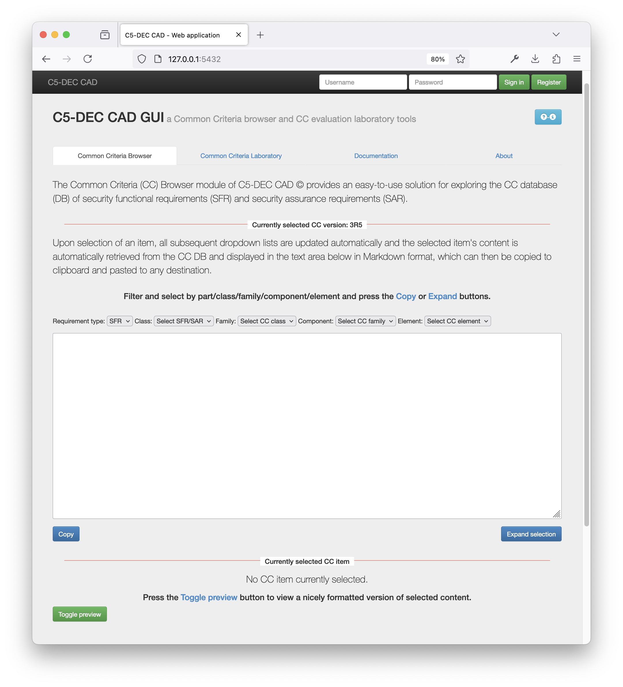

# Installation

C5-DEC CAD requires Python 3 and Git, the distributed version control system. Once Python is installed, install C5-DEC CAD using one of the following methods.

Note that in both the case of deploying within VS Code and without it, the deployment solution allows you to run the tool in a containerized environment, which is isolated from your local machine. This means that you can run C5-DEC CAD without worrying about conflicting dependencies or other issues that may arise from running it on your local machine.
The containerized environment is based on Docker, which allows you to run applications in isolated environments called containers.

Between these two options, given the nature of C5-DEC CAD and its design and development-oriented paradigm, we find the first one, i.e., using Docker and VS Code with its dev container extension, to be the most convenient and user-friendly way to use C5-DEC CAD. This is because it allows you to benefit from the full power of the containerized environment, while also providing a rich development experience with features such as code completion, debugging, dedicated extensions (e.g., `Quarto`, `spell checker`, etc.) and an integrated terminal.

That said, the second option is more lightweight and straightforward to use if the use cases involve largely the use of the Common Criteria Toolbox (CCT) and Project Management (PM) features, be it via the CLI, TUI or GUI.

C5-DEC CAD can be deployed using any of the following methods:

1. Deployment using Docker and our shell scripts: `build-c5dec.sh` and `c5dec.sh`: our runner script (`c5dec.sh`) offers a command mode tailored to the use of the Common Criteria Toolbox (CCT) and the Project Management (PM) modules, as well as an interactive session mode (`c5dec.sh session`) for using the [Transformer](./docs/manual/transformer.md) and [Cryptography](./docs/manual/cryptography.md) features and a PQC entrypoint (`c5dec.sh pqc`).
2. Deployment in a containerized development environment in VS Code (**recommended for advanced usage, development, data science**): this mode is the preferred option for effective use of the Quarto-based [DocEngine](./docs/manual/ssdlc.md#c5-dec-docengine-for-report-generation), Cryptography and Transformer modules. Note that all the features available via the CLI, TUI and GUI when using the deployment model (1) would also be available using this second approach.

## Installing C5-DEC CAD via Docker and our scripts

The fastest and most reliable way to deploy and run C5-DEC CAD is to use our already existing Docker definition file, with the build and execution scripts found in the repository. The instructions below work on GNU/Linux, MacOS and WSL.

Simply clone the repository or download a ZIP archive of the project, and then proceed as follows:

1. Install [Docker engine](https://docs.docker.com/engine/install/) and make sure it is running;
1. Unzip the archive, switch to the extracted directory (`cd foldername`) via a terminal running a shell (e.g., bash, zsh) and make the two shell scripts executable: `chmod +x script-name.sh`;
1. Build the images by running our build script: `./build-c5dec.sh`;
1. Launch C5-DEC CAD by running `./c5dec.sh`, which by default starts the CLI with no arguments and shows the help menu. Run `./c5dec.sh help` for usage instructions.

See the [usage section of the quick start](./start.md#usage) page to learn about the various runner options.

## Installation in a containerized development environment

As explained above, this deployment method is the recommended way to install C5-DEC CAD. 

The easiest and recommended way to get a local copy of the development environment up and running is described next. 

### Requirements

The following pieces of software are necessary for setting up the C5-DEC CAD containerized environment.

* A local installation of [Docker Desktop](https://www.docker.com/products/docker-desktop/)
* [Visual Studio Code](https://code.visualstudio.com/) (VS Code)
* The [Dev Containers](https://marketplace.visualstudio.com/items?itemName=ms-vscode-remote.remote-containers) extension for VS Code by Microsoft

### Installation

1. Clone this repository:

```sh
git clone https://github.com/AbstractionsLab/c5dec.git 
```

2. Start Docker Desktop if not already running;
3. Open the project folder in VS Code;
4. Select the "Reopen in Container" option in the notification that pops up in VS Code; or launch the command palette (Cmd/Ctrl+Shift+P) and select "Dev Containers: Reopen in Container" from the list of available commands. You will then be prompted to select a dev container configuration: the `C5-DEC CAD dev container` provides the bulk of the functionality, while the `C5-DEC CAD cryptography dev container` provides an environment with [OpenSSL](https://docs.openssl.org/master/man7/ossl-guide-libcrypto-introduction/) and the [OQS-OpenSSL provider](https://github.com/open-quantum-safe/oqs-provider) installed.


5. For the following sections, we assume having selected the `C5-DEC CAD dev container`. Once selected, wait for the container to build and start. This may take a few minutes, depending on your internet connection and the performance of your machine.
6. Once the container is up and running, you will see a terminal window open in VS Code, and you can start using C5-DEC CAD. If a terminal window does not open automatically, you can open a new terminal by selecting "Terminal" from the top menu and then "New Terminal". This will open a terminal window inside the container.

This will create and run the project inside a Docker container; alternatively, the same command for reopening the project in a container can be selected and invoked from the VS Code command palette;

Note that the local file system is automatically mapped to that of the GNU/Linux container.

**Hint**: to resolve warnings in the code related to missing imports, select the Python interpreter installed by poetry. This can be done by clicking on the light bulb that appears next to the warnings.

While this should no longer occur, in the event that a poetry-related error message is observed when launching `c5dec` via the VS Code terminal, use the same terminal instance and run the following command in the GNU/Linux (Ubuntu) container to install all dependencies:

```sh
poetry install
```

See the [usage via VS Code dev container](./start.md#usage-via-vs-code-dev-container) section of the quick start page to learn about the various runner options.

#### Command Line Interface (CLI)

```sh
c5dec <command>
```

To see the available commands, run:

```sh
c5dec -h
```

#### Textual User Interface (TUI)

You can launch the TUI by simply running:

```sh
c5dec -t
```

or simply using `c5dec` without any arguments as the TUI is the default mode of operation.

```sh
c5dec
```

#### Graphical user interface (GUI)

```sh
c5dec -g
```

or

```sh
c5dec --gui
```

Alternatively, the tool can be executed from Docker Desktop:

1. In the left-side menu, go to the tab "Containers";
2. Open the container associated to C5-DEC CAD (the image name starts with "vsc-cad");
3. Go to the "Exec" tab;
4. Run the same commands as above.

_**Remark:**_ For a more accessible Common Criteria browsing experience, we recommend using the TUI or the GUI for functionality related to the CCT feature.

#### C5-DEC post-quantum cryptography dev container

Going back to step 4 of the installation instructions, if you selected the `C5-DEC CAD cryptography dev container`, you will have access to the OQS-OpenSSL provider, i.e., select the "Reopen in Container" option in the notification that pops up in VS Code; or launch the command palette (Cmd/Ctrl+Shift+P) and select "Dev Containers: Reopen in Container" from the list of available commands. You can now select `C5-DEC CAD cryptography dev container`, which provides an environment with [OpenSSL](https://docs.openssl.org/master/man7/ossl-guide-libcrypto-introduction/) and the [OQS-OpenSSL provider](https://github.com/open-quantum-safe/oqs-provider) installed.


This allows you to use post-quantum cryptography algorithms while benefitting from direct access to your host file system, thanks to volume mounting. To use the OQS-OpenSSL provider, we recommend consulting the [OQS-OpenSSL usage documentation](https://github.com/open-quantum-safe/oqs-provider/blob/main/USAGE.md#sample-commands).

For instance, to get a list of the available quantum-safe signature algorithms, you can run the following command in the terminal:

```sh
openssl list -signature-algorithms -provider oqsprovider
```

Similarly, to get a list of the available quantum-safe KEM algorithms, you can run:

```sh
openssl list -kem-algorithms -provider oqsprovider
```

## **Deprecated** installation and deployment method

### Installing via pipx and C5-DEC distribution package

While starting from the beta release we strongly recommend the previously described installation method relying on Docker and our scripts, the alternative installation using `pipx` and our distribution package containing a `wheel` file along with dependency assets remains possible. Below we describe how to perform the installation using this approach covering different platforms.

##### Requirements

- [Python 3](https://www.python.org/)
- [git](https://git-scm.com/), the distributed version control system

###### Optional

- [Doorstop](https://github.com/doorstop-dev/doorstop) (recommended to install via `pipx`)

Strictly speaking, a Doorstop installation is not required; nevertheless, we strongly recommend installing Doorstop such that it can be used in combination with C5-DEC CAD. This is mainly due to the fact that the SSDLC module in the current Alpha implementation does not provide a full coverage of the Doorstop API, which is why users may find it easier to carry out certain complementary operations using Doorstop.

###### Installing Doorstop (optional)

To install Doorstop, we recommend the following method using [pipx](https://pypa.github.io/pipx/) as it is rather straightforward. On a GNU/Linux distribution, MacOS or Windows Subsystem for Linux (WSL), simply open a terminal (e.g., bash, Zsh) and execute the following commands:

1. Install `pipx` if not already installed:
```sh
python3 -m pip install --user pipx
python3 -m pipx ensurepath
```

2. Once `pipx` is installed, use it to install Doorstop:
```sh
pipx install doorstop==3.0b10
```

##### Installing C5-DEC CAD using the distribution wheel file

1. Unpack the [c5dec-cad-\<release\>.zip](https://github.com/AbstractionsLab/c5dec/releases) distribution;
1. Change working directory to the unpacked folder containing the wheel distribution file (.whl), and use pipx to install C5-DEC CAD. Considering the `<release>` where `release` can be `alpha`, `beta`, etc:

```sh
cd c5dec-cad-<release>
pipx install ./c5dec-<version>-py3-none-any.whl
```

#### GNU/Linux

On most modern GNU/Linux distributions Python 3.8 or above comes already preinstalled.

Open a terminal (e.g., bash, Zsh) and execute the following commands:

```sh
python3 -m pip install --user pipx
python3 -m pipx ensurepath
```

##### Install C5-DEC using pipx

Open a terminal and run the following command, assuming that the Wheel distribution file (.whl) is placed in the current directory:
```sh
pipx install ./c5dec-<version>-py3-none-any.whl
```

where <version> can be in the following form: X.Y[.Z], e.g., 0.1, 0.2, 1.0, 1.1.2, 2.0, 2.2.1, etc.

##### Launching C5-DEC

You can start C5-DEC CAD by simply entering “c5dec” in an open terminal, with the current directory being an unpacked copy of the C5-DEC CAD [project folder]().

#### MacOS

Install Python 3.8 or above if not already available.

Open a terminal (e.g., bash, Zsh) and execute the following commands:

```sh
python3 -m pip install --user pipx
python3 -m pipx ensurepath
```

##### Install C5-DEC using pipx

Open a terminal and run the following command, assuming that the Wheel distribution file (.whl) is placed in the current directory:

```sh
pipx install ./c5dec-<version>-py3-none-any.whl
```

where <version> can be in the following form: X.Y[.Z], e.g., 0.1, 0.2, 1.0, 1.1.2, 2.0, 2.2.1, etc.

##### Launching C5-DEC

You can start C5-DEC CAD by simply entering “c5dec” in an open terminal, with the current directory being an unpacked copy of the C5-DEC CAD [project folder]().

#### Windows

##### Install Python

1. Launch the “Microsoft Store” application from the Windows Start Menu.
1. Search for Python in the Microsoft Store search bar and select Python 3.8, or any version higher than or equal to 3.8 and smaller than Python 3.12.
1. Press the “Get” or “Install” button as shown in the screenshot below.


##### Install pipx

Open a terminal and execute the following commands:

```sh
python3 -m pip install --user pipx
python3 -m pipx ensurepath
```

##### Install C5-DEC using pipx

Open a terminal and run the following command, assuming that the Wheel distribution file (.whl) is placed in the current directory:

```sh
pipx install .\c5dec-<version>-py3-none-any.whl
```

where <version> can be in the following form: X.Y[.Z], e.g., 0.1, 0.2, 1.0, 1.1.2, 2.0, 2.2.1, etc.

You can download the latest distribution file (.whl) from the GitHub repository of C5-DEC CAD.

##### Launching C5-DEC

You can simply start C5-DEC by entering “c5dec” in an open terminal or by double-clicking the “run-c5dec” batch file found in the C5-DEC distribution folder.

#### Usage via the pipx installation method

To start C5-DEC CAD through your GNU/Linux/MacOS/WSL terminal, first change your current working directory to the one containing an unpacked copy of the [c5dec-cad-release.zip](https://github.com/AbstractionsLab/c5dec/releases) distribution file. For the sake of this example, we assume that the zip archive is unpacked at the following path `/home/user/c5dec-cad-release`:
```sh
$ cd /home/user/c5dec-cad-release
```
Then, simply enter one command from the options below and press return.
##### Launching C5-DEC CAD command line interface (CLI)

```sh
c5dec -h
```
This would then display the help menu of the CLI, as shown below. You can then choose one of the available subcommands to execute the desired operation.


##### Launching C5-DEC CAD textual user interface (TUI)

```sh
c5dec
```
This would launch the TUI by default, as shown below.


Alternatively, you can also launch the TUI using the `-t` parameter.

```sh
c5dec -t
```

##### Launching C5-DEC CAD graphical user interface (GUI)

```sh
c5dec -g
```
This would launch the GUI by default, as shown below.

