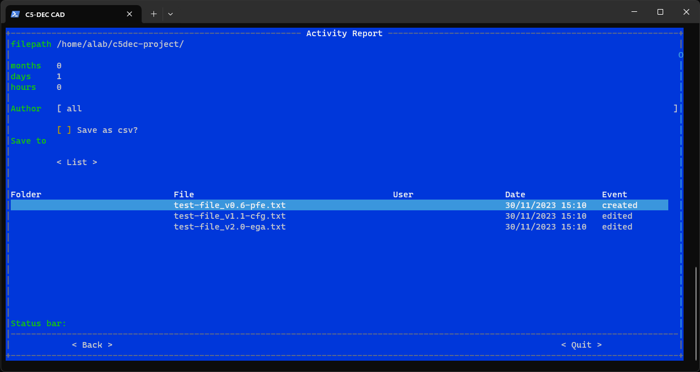
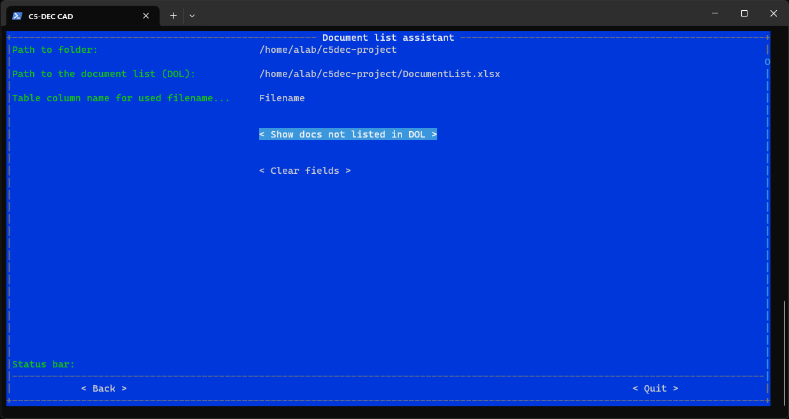
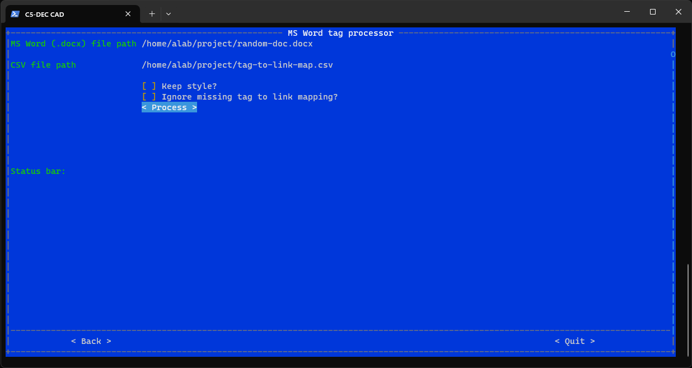

# Information Security Management System (ISMS)

Roughly speaking, this module is aimed at providing functionality that enhances activities related to the ISO/IEC 27000 series of standards for organizationals security, often referred to as an Information Security Management System as a whole.

## Activity report

The activity report function allows the user to get an overview of all files that have been created or modified during a certain time period. To achieve this, the user is expected to specify the number of past hours, days and months, along with an absolute path to a folder, which are then taken as input to scan the indicated folder recursively and compile a list of all modified files for the indicated duration in the past.

The user can also specify the name of a specific user to filter the returned results for that specific user; the convention used in the current version relies on a three-letter acronym for names, e.g., Evariste Galois (ega), Pierre de Fermat (pfe) and Carl Friedrich Gauss (cfg) shown in the example below. This means that for the tool to be able to retrieve and filter results, the file names are expected to have the user acryonm appended to the end of the file name.



## Document list assistant

The document list assistant allows the user to check whether or not all documents stored in a given folder (or within any of its subfolders) are tracked in a given document list spreadsheet. It requires the column header storing the file name to be provided as input, as shown below.



### Assumptions

This function assumes the presence of a sheet in the referenced spreadsheet named "DocList"; this hardcoded requirement will be removed in a future release.

## MS Word tag processor

This, rather specific feature allows the user to replace all tags in an MS Word document with hyperlinks pointing to a URL specified in an auxiliary CSV input file, that maps tags to URLs (see the example provided in the zipped archive).



### Assumptions

The expected tag format simply requires the tags to start with the "#" symbol, e.g., "tag-to-link-mapping.csv":

```sh
#S-1-24, https://github.com
#S-61-21, https://scholar.google.com
```

## Universal file/folder management automation

This function is currently unavailable and planned for a future release. In the meantime, we recommend the open-source solution called [organize](https://github.com/tfeldmann/organize), a CLI program implemented fully in Python that can be easily installed using pipx and used as a CLI; see its [official documentation](https://organize.readthedocs.io/en/latest/) for more details.