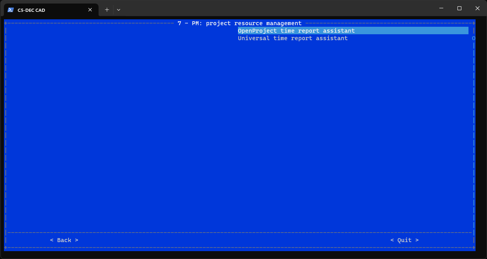
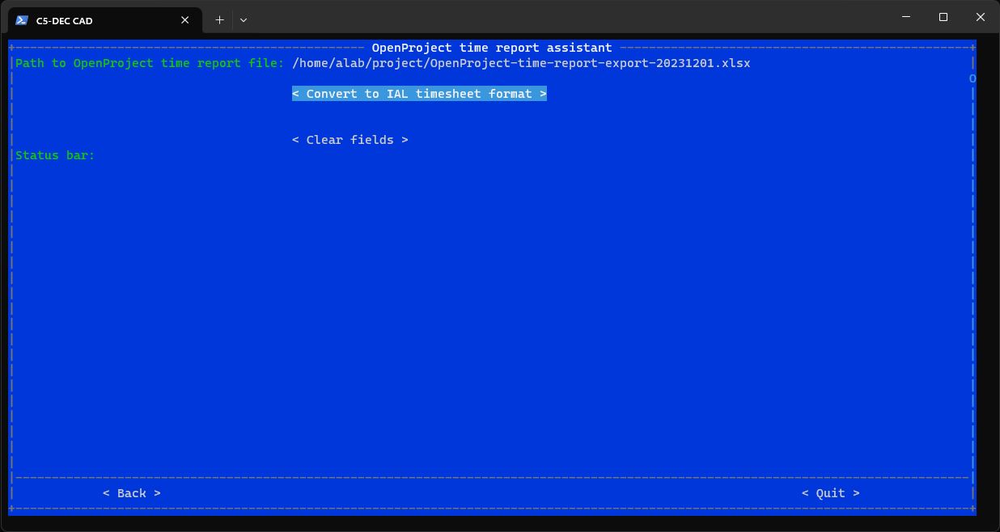
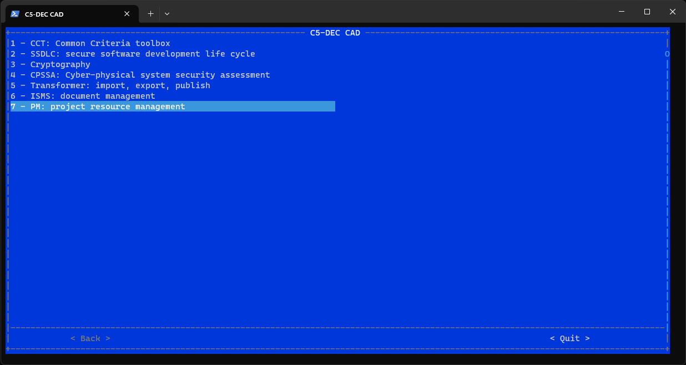
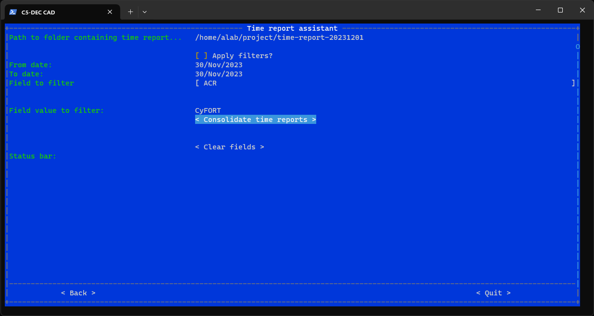

# Project resource management

## OpenProject time report assistant

The OpenProject time report assistant mini app enables the user to convert OpenProject time report exports to a user-defined format.

It suffices to point the tool to the absolute path where the to-be-formatted OpenProject exported file is stored. Upon conversion, C5-DEC CAD stores the modified copy in the current folder.

Also, note that the algorithm can generate starte and end timestamps and store them in the output file. To make use of this feature, the user would have to enter the start time (enclosed in curly braces) in the Comment field of the time logging pop-up window of OpenProject, e.g., for an input "\{14:00\}" and a logged duration of 1 hour, the converter will populate the start time field with "14:00" and the end time filed with "15:00".

### Auxiliary configuration files

- Note that the algorithm makes use of a JSON configuration file providing a mapping between full names and their corresponding algorithms, which can be found under the `assets` folder, in the `persons.json` file under "acronyms".

- A second configuration file in the form of a comma-separated value (CSV) file, called `openproject_params.csv`, is used to define, among other things, the mapping of project names extracted from OpenProject, tracked via the "WP" column, for work package. The mapping is resolved according to user-defined "Type" and "Domain" entries per project. The data schema determining the final output format can be found in the `tshformat.json` file. Both these configuration files are stored in the `./assets/tshparams` folder.

Note that in the current version, the consolidation algorithm takes the "ALab-TSH-params" entry from the `tshformat.json` file; the various column titles can be changed, but the schema cannot as the algorithm relies on this specific structure. In a future release, we intend to update this functionality and allow for custom-defined layouts specified by the user.

## Time report consolidation assistant

The time report assistant submodule is a mini app that deals with consolidating/merging, filtering, and cleaning raw time report data, the format of which can be defined in the TSH schema configuration file. The default schema is that of IAL (i.e., itrust + Abstractions Lab).
The instructions below describe how to use this mini app.

First, navigate to the “PM: project management” module, depicted in the figure below, by selecting the corresponding menu item, either using the keyboard arrow keys and pressing enter or by simply left clicking using the mouse.

Next, select the “Time report assistant” menu item once you have entered the PM menu, as shown below.

Finally, once you have entered the “Time report assistant” mini app interface, shown above, provide the following input parameters and press the “< Consolidate time reports >” button to trigger the consolidation algorithm.

- **Path to folder containing time reports**: simply copy-paste the file system path to the folder in which you have added copies of all the time reports/sheets that you wish to consolidate. Note that if you use the “Copy as path” option on Windows, accessed by pressing shift + right click on a folder or file, the surrounding quotes (i.e., “”) must be removed.
- **Apply filters?** If you select this menu item, the consolidation algorithm will consider the filtering options specified below, e.g., date range, field and filed value to apply filtering for. If this choice is not selected, all filtering options are disabled, and the algorithm consolidates all the input timesheet files in their entirety into a single file.
- **From date**: specifies the start date indicating the beginning of the date interval that is to be extracted by the consolidation (in the current version only the month value is considered).
- **To date**: specifies the date indicating the end of the date interval that is to be extracted by the consolidation (in the current version only the month value is considered).
- **Field to filter + field value to filter**: specified the column/field that is to be filtered for, e.g., if “Domain/Project name” is selected, the consolidated time report will only contain entries that have a “Domain/Project name” value specified in the “Field value to filter” option.
- **Clear fields**: the < clear fields > button simply clears/deletes the folder path specified in the first text field.

Once the consolidation is finished, if executed successfully, the resulting output Excel file can be found in the same “C5-DEC” folder containing the assets folder, from which C5-DEC is executed, automatically named as follows:

- “consolidated-TSH-<current-date>-<current-timestamp>.xlsx”, with an example provided below:
    - consolidated-TSH-20230930-131452.xlsx

## Auxiliary configuration files for consolidation

See [the previous configuration files section](#auxiliary-configuration-files).