# Secure Software Development Life Cycle

Here we describe how to enforce various parts of the C5-DEC SSDLC method published in our [SSDLC report](https://github.com/AbstractionsLab/c5dec?tab=readme-ov-file#overview) using the CAD (computer-aided design) software component of C5-DEC. This largely consists of using the already integrated version of `Doorstop` in the C5-DEC [containerized development environment](./installation.md#installation-in-a-containerized-development-environment), together with our custom templates and helper scripts.

We strongly recommend consulting the official [Doorstop documentation](https://doorstop.readthedocs.io/en/latest/index.html) as a complementary guide to this user manual.

We will be mostly making use of the following features:

- [C5-DEC new project creation (batteries included)](#c5-dec-project-creation): to create new project repositories based on C5-DEC providing a fresh development repository with containerized development artifacts, all dependencies installed, templates, DocEngine, source code and technical specification processing software for enhancing SSDLC and enforcing the C5-DEC method
- [Document creation](https://doorstop.readthedocs.io/en/latest/cli/creation.html)
    - Modifying [Document](https://doorstop.readthedocs.io/en/latest/reference/document.html) and [Item](https://doorstop.readthedocs.io/en/latest/reference/item.html) content
- [Import and export](https://doorstop.readthedocs.io/en/latest/cli/interchange.html): see also suggestions for [batch updates](#suggestions-for-batch-updates) below.
- [Publishing](#publishing-technical-specifications)

## Conventions

We fix the following prefixes for naming the various artifact documents:

- `MRS`: Mission Requirements Specification
- `SRS`: System/Software Requirements Specification
- `ARC`: Architecture
- `HARC`: High-level Architecture
- `LARC`: Low-level architecture
- `SWD`: Software Design
- `TST`: software validation Test Case specification
- `TRA`, `TRB`, `TRS`, etc.: Test Report (Alpha, Beta, Stable, etc.)

For existing projects, it may be easier to simply use the specific templates of each `Doorstop` document, e.g., `MRS`, `SRS`, `SWD`, `TST`, and `TRA` under the [specs folder](https://github.com/AbstractionsLab/c5dec/tree/main/docs/specs).

## General recommendations

### Doorstop item format

We recommend the use of the Markdown with YAML front matter format as the default `Doorstop` item encoding format for the test case specification (`TST`) and test report (e.g., `TRA`) documents, i.e., setting the key value pair `itemformat: markdown` in the document `.doorstop.yml` configuration file, e.g., the [TST template](https://github.com/AbstractionsLab/satrap-dl/blob/main/docs/specs/TST/.doorstop.yml) for SATRAP.

### YAML key-value character limit and Markdown specification

We recommend fixing a 40-character limit for the values stored in the key-value pairs specified in the artifact items stored in files named `<prefix>-<digits>.md/yml`. This is both due to presentation-level concerns once these values are compiled into tabular form, but also to circumvent a `Doorstop` behavior that adds a new line to HTML table rows when its character limit is exceeded.

For any values requiring more content, specify the said mapping in the body of the Markdown item in Markdown syntax, e.g., see the [TST-008.md](https://raw.githubusercontent.com/AbstractionsLab/satrap-dl/refs/heads/main/docs/specs/TST/TST-008.md) for SATRAP.

Key-value pairs are best used for parameters specified in a few characters, e.g., verification method, priority, type, release, etc. such that they can be easily filtered for and manipulated once exported to spreadsheet format using `Doorstop`.

### Use of templates

We provide templates for all the design artifacts developed with project CyFORT, i.e., not just limited to C5-DEC, but also IDPS-ESCAPE and SATRAP-DL.

Newly created projects come with all our customized templates, along with a pre-defined artifact hierarchy in terms of mission/system requirements, architecture and software design, validation test case specification (per release phase: alpha, beta and stable) and validation test reports.

We provide links to the parent folder of the (source) design artifacts for each of the above-mentioned projects for quick access:

- [C5-DEC technical specification artifacts](https://github.com/AbstractionsLab/c5dec/tree/main/docs/specs)
- [IDPS-ESCAPE technical specification artifacts](https://github.com/AbstractionsLab/idps-escape/tree/main/docs/specs)
- [SATRAP-DL technical specification artifacts](https://github.com/AbstractionsLab/satrap-dl/tree/main/docs/specs)

## C5-DEC project creation

You can create a fresh project repository based on C5-DEC populated with containerized development artifacts, all dependencies needed for development based on the C5-DEC method installed in the Docker dev container, together with templates, DocEngine, source code and technical specification processing software for enhancing SSDLC and enforcing the C5-DEC method.

### Running the command: new

You can run this command via the CLI using the runner script:

```sh
./c5dec.sh new
```

You can also define a project name and username for the Dockerized GNU/Linux environment specified by the produced `dev.Dockerfile`: the project name can be defined using `-p` and the username `-u`:

```sh
./c5dec.sh new -p "newproject" -u "username"
```

**Note**: C5-DEC automatically converts the project name to lowercase as the same name is used for the creation of the Dockerfile specifications and the resulting Docker images: the Docker syntax does not allow uppercase letters in image names.

If you connect to an interactive session by using the runner with the `session` argument, i.e., `./c5dec.sh session`, once you have activated the Poetry environment, and changed directory to `/home/alab/c5dec`, you can use `c5dec` directly in the session terminal:

```sh
c5dec new
```

Finally, you can also run this CLI command in our VS Code dev container; see the corresponding [usage section](./start.md#usage-via-vs-code-dev-container). 

**Note**: remember to create a git repository in the project folder as it is a Doorstop requirement. Simply change directory to that of the new project and initialize a git repository:

```sh
git init .
```

To then use the environment effectively, please see the [usage guide](./start.md#usage) for C5-DEC as the environment and dependencies created by the `new` command are based on that of C5-DEC.

### Produced outcome

Running the `new` command will produce a ZIP bundle, by default called `myproject.zip` and stored at the root of the `c5dec` project folder. If the user provides a project name and username, all the relevant produced artifacts (configuration files, Dockerfiles, project definition file, script names, etc) will be named accordingly. The produced ZIP bundle will include the following items:

- `.devcontainer`: a folder containing a VS Code `devcontainer.json` configuration file, enabling containerized development in VS Code.
- `docs`: a folder aimed at technical specifications and documentation containing 4 subfolders:
    - `assets`: Doorstop-related files needed for publishing specifications to HTML
    - `manual`: basic templates for writing up a user manual
    - `specs`: prepared Doorstop templates for technical specifications following the C5-CEC design artifact breakdown (explained below), together with a shell script for enhanced publishing (`publish.sh`) making use of a keyword replacement (`c5-keyword.py`) feature for verdict processing in test reports and customized doorstop publish `c5publish.py`
    - `traceability`: an empty folder aimed at storing the outcome of the published technical specification in HTML
- `<projectname>`: a folder containing an `assets` folder providing a copy of the [DocEngine](#c5-dec-docengine-for-report-generation) report and an empty Jupyter notebook that can be used out of the box thanks to all dependencies coming preinstalled with the containerized deployment
- `tests`: an empty Python package for storing unit tests (by default as a Python package, but can be tailored)
- `build-<projectname>.sh`: a shell script for building the new project containers
- `<projectname>.sh`: a runner shell script for launching the built containers
- `CHANGELOG.md`: a change log prepopulated with the expected outline
- `dev.Dockerfile`: a Dockerfile providing instructions for building a dev container.
- `Dockerfile`: a Dockerfile providing instructions for building a more lightweight container that does not include all the dependencies of the `dev.Dockerfile`, e.g., LaTeX, doorstop, Quarto, cryptographic software, etc.
- `LICENSE`: an AGPL v3.0 license
- `poetry.lock`: a Poetry lock file reflecting the latest snapshot of the C5-DEC Python dependencies
- `pyproject.toml`: the Poetry project definition file specifying all C5-DEC Python package dependencies
- `README.md`: a README template providing an outline.
- `run_tests.sh`: a minimal shell script for running unit tests (by default as a Python package, but can be tailored)

### Use with existing projects

In case the C5-DEC method and project structure is to be adopted by an already existing project, we recommend creating a new project and integrating your existing one into the created repository.

Alternatively, you can selectively migrate certain artifacts either from a freshly created project or the C5-DEC project itself to your own existing project, e.g., the `dev.Dockerfile` and the `.devcontainer` folder with its `devcontainer.json` configuration file to gain access to just enough dependencies for enforcing the C5-DEC method.

In order to use the templates in an existing project, simply copy the `.doorstop.yml` files inside each artifact document folder (e.g., `arc`, `tst`, `swd`) to your respective Doorstop document folder, or copy all or parts of the content of the said file into your destination file.

## Mission and system requirements

Mission requirements specifications (MRS) and the system/software requirements specifications (SRS) tracing back to the former are managed by `doorstop` in documents [MRS](https://github.com/AbstractionsLab/c5dec/tree/main/docs/specs/mrs) and [SRS](https://github.com/AbstractionsLab/c5dec/tree/main/docs/specs/srs), respectively. The template defining the specific structure of the individual items within each document is provided in `.doorstop.yml` file at the root of each folder.

For a published version of the latest iteration on the C5-DEC templates for `MRS` and `SRS`, please see the [artifacts for the Alpha release of SATRAP-DL](https://github.com/AbstractionsLab/satrap-dl/tree/main/docs/specs/MRS), which are published using the C5DEC `publish` CLI command and made available on the corresponding [SATRAP MRS traceability page](https://abstractionslab.github.io/satrap-dl/docs/traceability/MRS.html).

**Note**: The CLI `new` command produces the the latest version of the technical specification artifact templates for all document types.

## Architecture design

System architecture design artifacts, by default recommended to trace back to the `MRS`, are stored in the [ARC](https://github.com/AbstractionsLab/c5dec/tree/main/docs/specs/arc) document and published on the [ARC traceability page](https://abstractionslab.github.io/c5dec/docs/traceability/ARC.html), with its own `.doorstop.yml` file defining the template.

Note that depending on the choice of SRS format as per the C5-DEC options, `ARC` can also be traced to `SRS`, e.g., as done in another CyFORT project, namely [SATRAP-DL](https://abstractionslab.github.io/satrap-dl/docs/traceability/index.html), with the individual `ARC` items [tracing back](https://abstractionslab.github.io/satrap-dl/docs/traceability/ARC.html) to `SRS` elements, i.e., the latter forming parent links.

### High-level and low-level architecture

Depending on the level of detail and granularity, the design can be broken down into separate views covering different layers of abstraction, e.g., in terms of low-level (`LARC`) and high-level (`HARC`) architecture design.

For a published version of the latest iteration on such artifacts, please see the technical specifications for the Alpha release of IDPS-ESCAPE, in particular the [HARC](https://github.com/AbstractionsLab/idps-escape/tree/main/docs/specs/harc) and [LARC](https://github.com/AbstractionsLab/idps-escape/tree/main/docs/specs/larc) specifications, published on the corresponding IDPS-ESCAPE [HARC traceability page](https://abstractionslab.github.io/idps-escape/docs/traceability/HARC.html) and [LARC traceability page](https://abstractionslab.github.io/idps-escape/docs/traceability/LARC.html).

## Software design

Software design artifacts are stored in the [SWD](https://github.com/AbstractionsLab/c5dec/tree/main/docs/specs/swd) document and published on the [SWD traceability page](https://abstractionslab.github.io/c5dec/docs/traceability/SWD.html). The `SWD` items trace back to `ARC` items via `Doorstop` parent links.

For a published version of the **latest iteration** on the C5-DEC templates for `SWD`, please see the [artifacts for the Alpha release of SATRAP-DL](https://github.com/AbstractionsLab/satrap-dl/tree/main/docs/specs/SWD), published on the corresponding [SATRAP SWD traceability page](https://abstractionslab.github.io/satrap-dl/docs/traceability/SWD.html).

### Tracing to two-level ARC breakdown

`SWD` items are to be traced to `LARC` items if a two-level `ARC` breakdown is implemented (see the previous section), e.g., in the case of IDPS-ESCAPE: [link to IDPS-ESCAPE SWD specs](https://github.com/AbstractionsLab/idps-escape/tree/main/docs/specs/swd) and [IDPS-ESCAPE SWD published page](https://abstractionslab.github.io/idps-escape/docs/traceability/SWD.html).

### Advanced traceability

We recommend the use of the `keyword` feature to dynamically link to specific parts of software artifacts. For instance, to link an `SWD` item to a code snippet (at the function or class level), e.g., [SWD-001](https://github.com/AbstractionsLab/satrap-dl/blob/main/docs/specs/SWD/SWD-001.yml) for SATRAP.

## Software validation test cases

Software validation test cases are stored in the [TST](https://github.com/AbstractionsLab/c5dec/tree/main/docs/specs/tst) document and published on the [TST traceability page](https://abstractionslab.github.io/c5dec/docs/traceability/TST.html). `TST` items trace back to `SRS` items via `Doorstop` parent links.

For the **latest iteration** on the C5-DEC templates for `TST`, please see the [artifacts for the Alpha release of SATRAP-DL](https://github.com/AbstractionsLab/satrap-dl/tree/main/docs/specs/TST), published on the corresponding [SATRAP TST traceability page](https://abstractionslab.github.io/satrap-dl/docs/traceability/TST.html).

## Software validation test report

Software validation test reports are stored in the `TRA`, `TRB`, `TRS` documents, reflecting the test reports for the Alpha, Beta, and Stable releases, respectively. 

For the **latest iteration** on the C5-DEC templates for `TRA`, please see the [artifacts for the Alpha release of SATRAP-DL](https://github.com/AbstractionsLab/satrap-dl/tree/main/docs/specs/TRA), published on the corresponding [SATRAP TRA traceability page](https://abstractionslab.github.io/satrap-dl/docs/traceability/TRA.html).

## Publishing technical specifications

The figure below gives an example of the published version of technical specifications following the instructions detailed above.

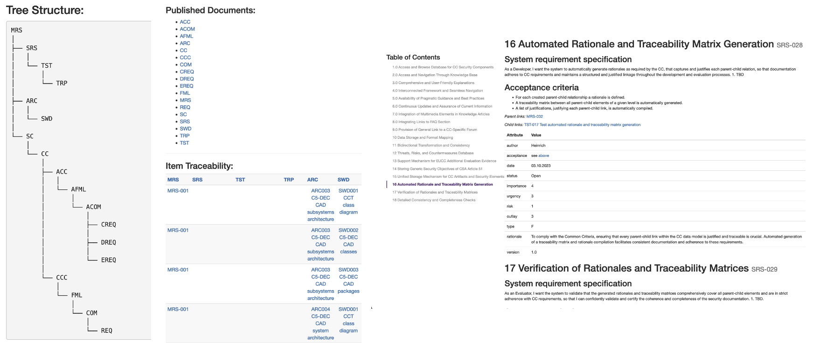

Note that in order to benefit from the enhancements made to the Doorstop-based publishing solution, run the `publish.sh` shell script stored in the `docs/specs` folder.

Change directory to the `docs/spec` folder:

```sh
cd /home/<username>/<projectname>/docs/specs
```

Make the script executable if not already the case using `chmod +x publish.sh` and then:

```sh
./publish.sh
```

This will first run the keyword replacement routine to replace verdicts expressed using C5-DEC keywords with formatted HTML content, e.g., `?c5-defect-0` replaced with green text reading "**0 = flawless**". Then, it will use the C5-DEC publish function implemented in `c5publish.py` that acts as a wrapper for the Doorbase publish function to provide some adjustments and improvements. Once published, the publish script will roll back the replaced keywords to their original form, i.e., C5-DEC keywords. An example from [SATRAP-DL](https://github.com/AbstractionsLab/satrap-dl) is given below:

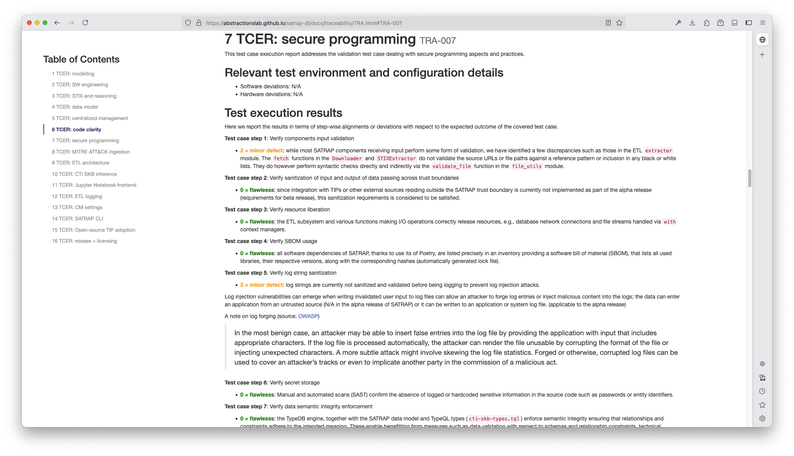

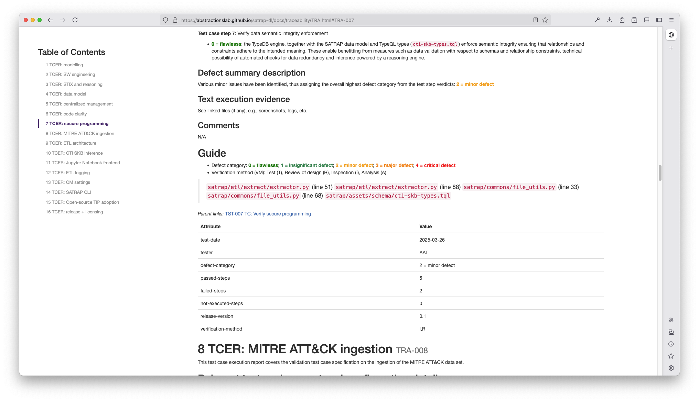

### C5-DEC keyword replacement

Note that you can use our [c5-keyword.py](../specs/tra/c5-keyword.py) script to process all `TRA` items and automatically replace the C5-DEC keywords denoting defect levels, i.e., `?c5-defect-0` to `?c5-defect-5` with HTML code for pretty printing in the final published version.

For a more efficient approach during the development phase, we recommend using the `c5proc-doorstop-pub.sh` shell script at the root of the [specs](https://github.com/AbstractionsLab/c5dec/tree/main/docs/specs) folder to automatically run the replacement code on all test report documents, publishing the entire technical specifications folder to HTML and undoing all keyword replacements in the source files.

### Traceability matrix

Note that the publish function also produces a traceability matrix called `traceability.csv`, which can be used for quick coverage verifications and calculations.

#### Verifying requirement coverage

Using the built-in Doorstop export function, you can export any part of the specification tree to a spreadsheet (xlsx) format that you can then either programmatically process to verify coverage, etc. or to quickly implement checks in the resulting spreadsheet, e.g., combining vertical lookups with vectors of (mission/systems) requirements containing unique values to quickly check for unlinked items.

### Suggestions for batch updates

The same export-to-spreadsheet feature described in the previous discussion can be used to make updates in batch on various properties, e.g., filtering some mission requirement rows according to specific criteria respected by a column and applying batch changes to the filtered selection such as changing verification methods, release attributes or version numbers, to name a few.

Quick value combinations can also be performed in a similar fashion, e.g., merging the values of multiple columns into a single one when performing layout/template restructuring at the level of Doorstop document and item format specifications.

## C5-DEC DocEngine for report generation

A new feature made available as part of the beta release deals with the creation of reports, based on a robust publishing solution, namely Quarto. To this end, we have provided a complete Quarto template (found at `assets/report`).

This baseline report template can be used out of the box without any adjustments other than including your content. Our template provides a series of LaTeX customizations enhancing the fully Markdown-based experience, hiding away all such technical changes in a dedicated `tex` subfolder, which includes all the `.tex` files we use to customize our report template. We also group raw document content in a dedicated `chapters` folder, which in turn can and in our case does include sub-folders for a better separation of specifics subparts.

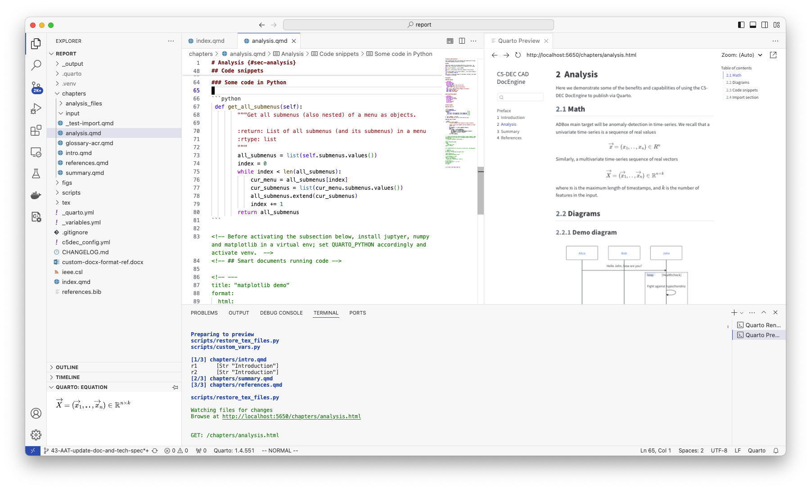

Moreover, we provide pre-rendering and post-rendering code (`etr_template/scripts`) that provides various types of automation in the form of an easy-to-understand pipeline. In particular, our pre-render scripts allow the user to define all the meta data used in the cover page, as well as the headers and footers of the output report, via a dedicated YAML configuration file `c5dec_config.yml` found at the root of the `report` folder.

Using the same input format, the user can easily compile the report to several well-known and widely-used formats such as PDF, docx, and HTML, available at `assets/report/_output`. Our main enhancements focus on the PDF version as some of the specific features of Quarto itself are also better supported in this format, e.g., text call-outs.

To use the built-in and enhanced Quarto-based technical writing system, first ensure you have run `poetry shell` to activate the environment, you can then either invoke the Quarto compiler/renderer via the dedicated VS Code extension for Quarto, accessible using the VS Code Command Palette (Cmd/Ctr+Shift+P) and selecting the `Quarto: Render Document` option or simply via the command line, e.g.,

```sh
$ quarto render ./c5dec/assets/report/index.qmd --to pdf
```

Assuming the command is run from within the `/home/alab/c5dec/` directory, this would then generate a PDF document stored under the `_output` folder, with an example shown below:

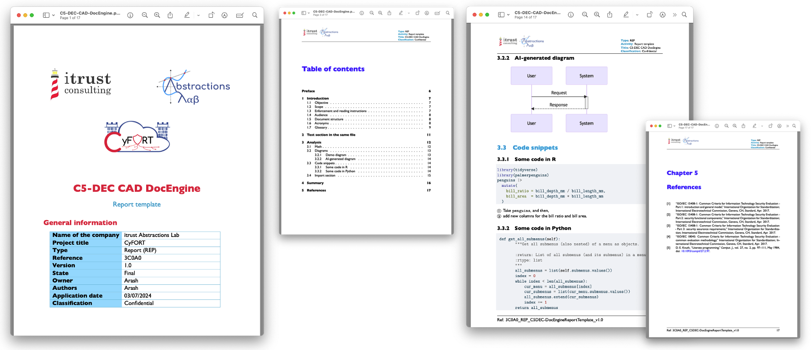

For exporting to `docx`, we have also provided a reference template document that Quarto uses to adjust various aspects of the generated report such as heading and table styles, but the user can and is encouraged to update this reference template or replace it with their own version. Note that most features of the conversion to `docx` work rather well out of the box, but the user needs to manually copy their cover page into the automatically generated report.

## Deprecated and disabled features

The SSDLC menu exposed via the TUI has been phased out as of the stable release of C5-DEC, i.e., starting from version 1.0. Instead, the recommended way to implement the C5-DEC method for development would be to directly use `doorstop`, already integrated in the C5-DEC dev container, together with our custom templates and helper scripts. The [guide above](#secure-software-development-life-cycle) details the various configurations and complementary tools.

Since the SSDLC mini app exposed via the C5-DEC CAD TUI makes use of the doorstop API, it is strongly recommended to consult the official [doorstop documentation](https://doorstop.readthedocs.io/en/latest/) to gain a better understanding of the underlying concepts that the SSDLC module builds on. 

The secure software development life cycle (SSDLC) module supports three main functions by building on top of the open-source doorstop API:

- Software artifact management such as repository creation, editing, deletion, e.g., separate and dedicated doorstop documents for storing mission requirements, technical specifications, source code, test case specifications, test report items (test execution result), etc.

- Artifact item management including artifact creation, editing and deletion, e.g., for individual requirements, test case (TC) specifications and source code files in their corresponding documents

- Artifact item relation management allowing the creation and removal of links between arbitrary items (e.g., TC to requirement, TC to source code), as well as browsing linked items and their content, for a selected artifact item

- Managing artifact repository structure such as suspect link resolution, and review status updates

### SSDLC TUI quick start guide

Once you have installed C5-DEC, the SSDLC module can be accessed via the TUI, i.e., by simplifying entering `c5dec` via the terminal, without any additional parameters.

In order to access the SSDLC functionality, navigate to the corresponding menu item shown on the landing page of C5-DEC CAD, namely "2 - SSDLC: secure software development life cycle", as shown in the screenshot below.

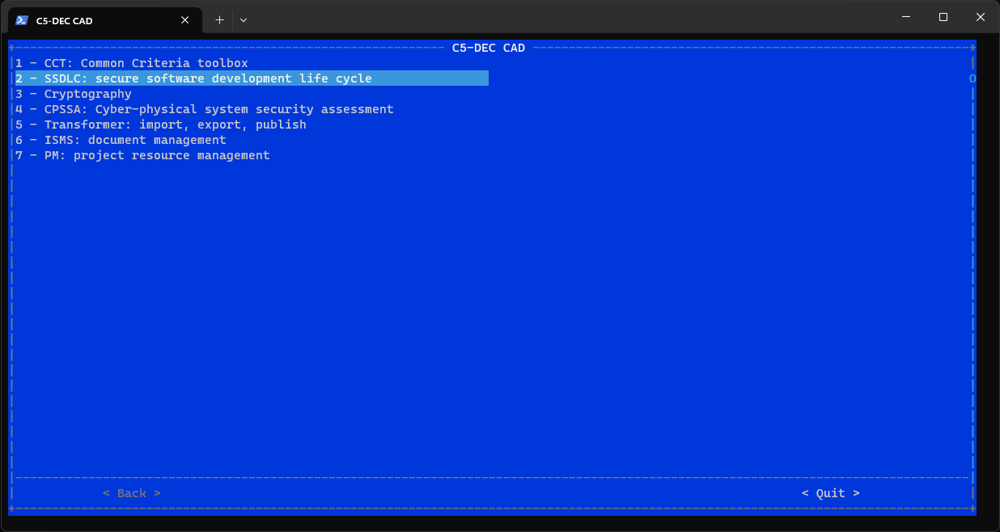

### Managing artifact collections

Select the "Manage artifact repositories" submenu to access its artifact collection/repository creation and deletion features, shown below.

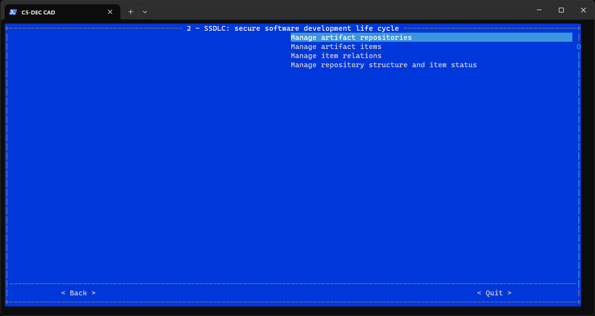

Once the artifact management submenu is loaded, you can enter a prefix for the document/repository and also specify a parent prefix in case the document you are about to create should be considered a child node in the artifact document tree.

In the example shown below, we specify `srs` for system/software requirements specification, which is a child document of `mrs`, which is short for Mission Requirements Specifications. This means that the artifact items added to `srs` will be linked to parent `mrs` items.

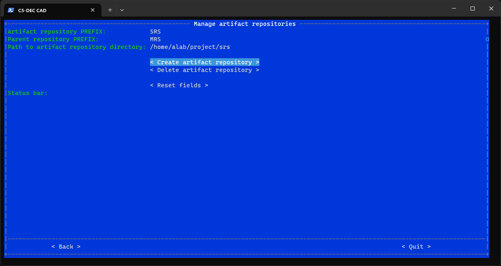

The create and delete buttons depicted in the screenshot are self-explanatory; the reset fields button acts as a shortcut for quickly clearing the content of the text fields.

### Managing artifact items

Once the artifact management submenu is loaded, the user can create new artifact items and edit existing ones. Artifact items can range from requirement specifications to test cases, test report items and design diagrams.

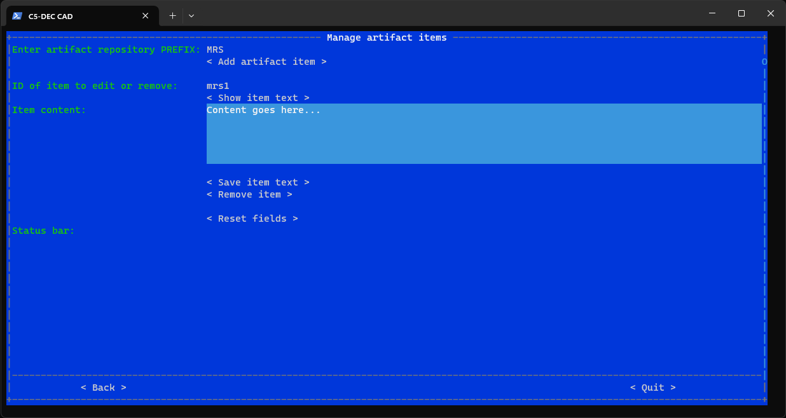

By simply entering a document prefix, e.g., `mrs` referring to mission requirements specification, new `mrs` items can be created, with an ID being generated and assigned to the created item automatically. In the example shown here, the user can edit the content of `mrs1` by entering its ID and pressing the "Show item text" button. Once the content has been modified, the user must press the "Save item text" for the change to be saved to disk.

### Managing relations

The "Manage item relations" submenu allows the user to create new relations between artifact items, e.g., linking an `mrs` item to an `srs` one, or linking a test case to its corresponding requirements. The same submenu also allows the user to remove or delete existing links. Moreover, the "Show child item links" button prints out the existing child items of a given parent artifact item.

#### Creating and removing links

To create a new link, simply enter the IDs of the child and parent item, respectively, and press the "create link" or "remove link" buttons to confirm the desired operation.

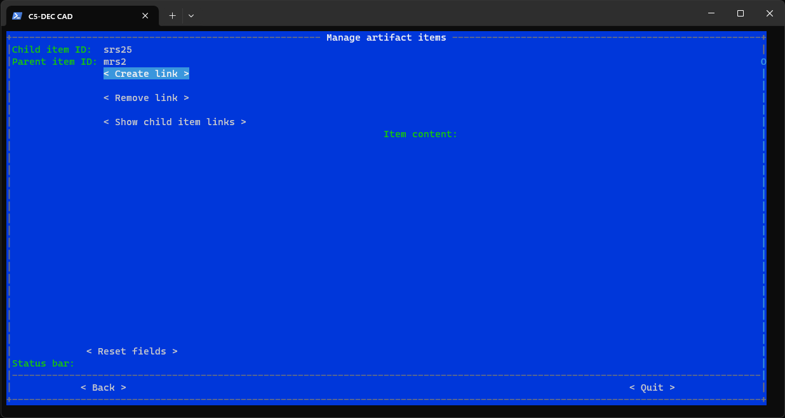

#### Viewing existing child items

Pressing the "Show child item links" button results in retrieving items linked to an item specified via its ID, as shown below. Upon selecting a linked item, its content is displayed in the right-hand side text box.

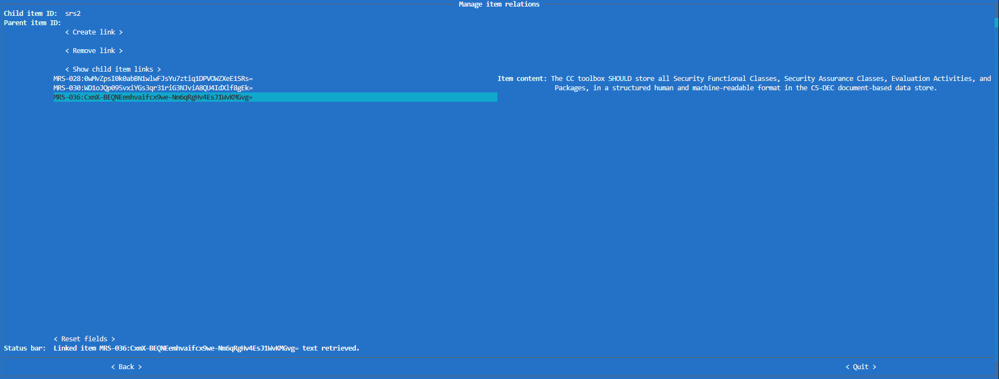

### Managing artifact document structure and item status

This submenu, shown below, allows the user to trigger the doorstop operations for reordering, clearing and reviewing; see the official doorstop documentation for its [reordering](https://doorstop.readthedocs.io/en/latest/cli/reordering/) and [validation](https://doorstop.readthedocs.io/en/latest/cli/validation/) commands.

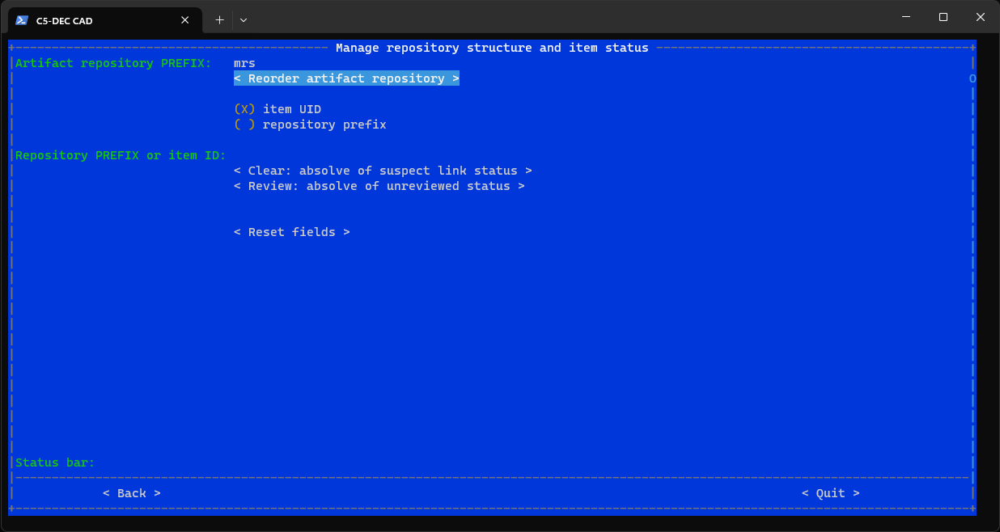