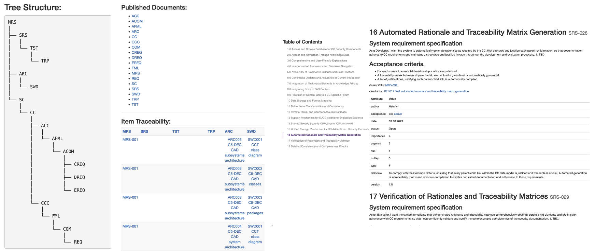
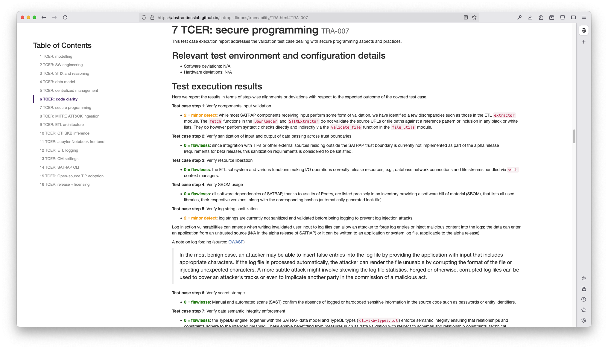
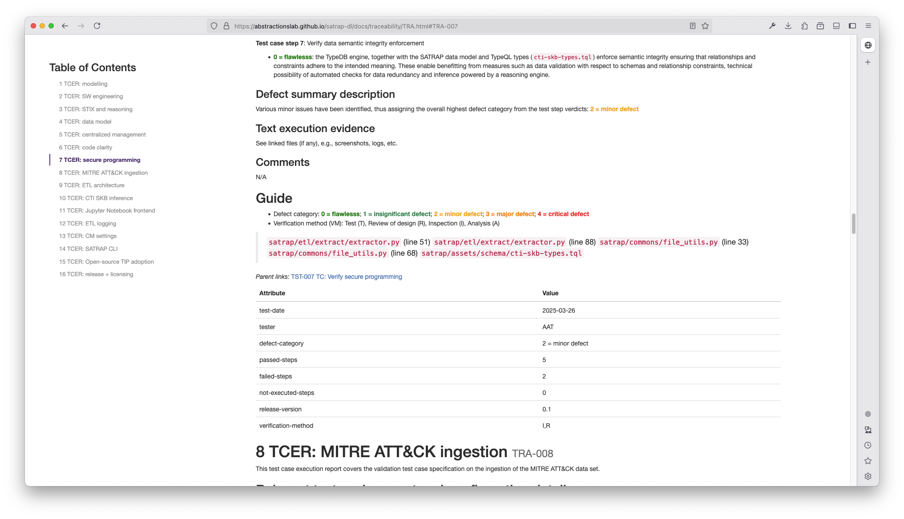
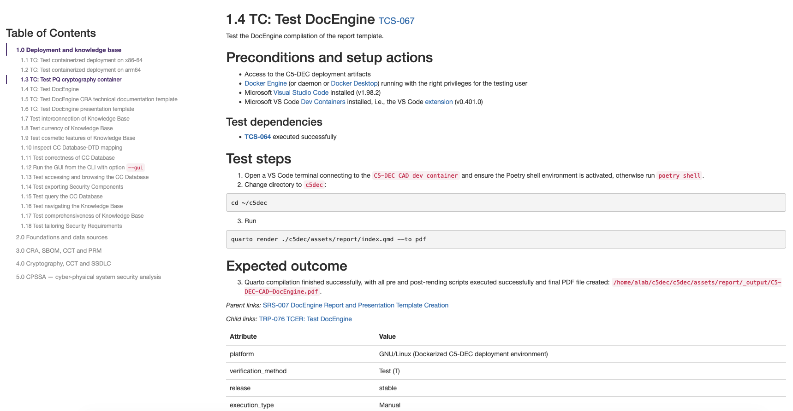
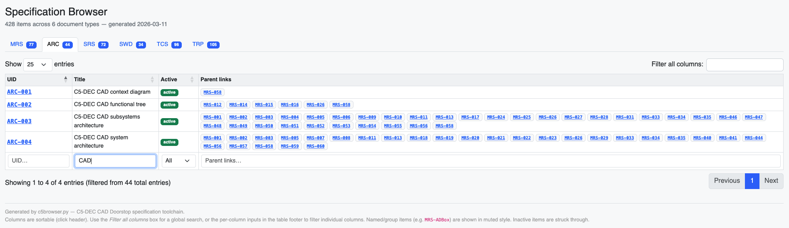
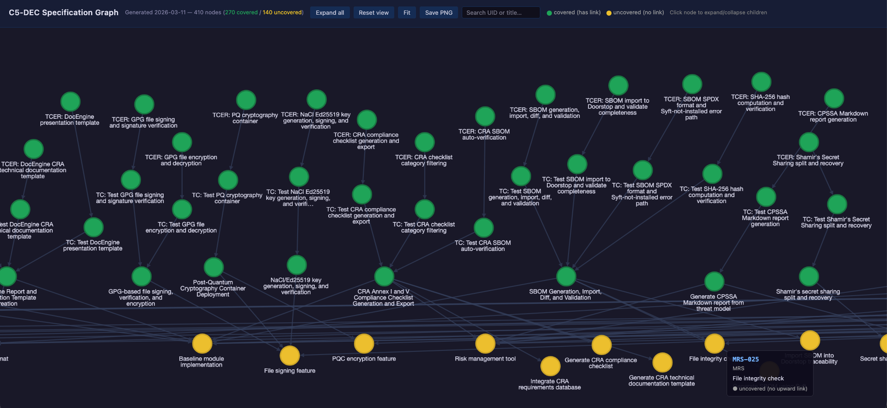

# Secure Software Development Life Cycle

Here we describe how to enforce various parts of the C5-DEC SSDLC method published in our [SSDLC report](https://github.com/AbstractionsLab/c5dec?tab=readme-ov-file#overview) using the CAD (computer-aided design) software component of C5-DEC. This largely consists of using the already integrated version of `Doorstop` in the C5-DEC [containerized development environment](./installation.md#installation-in-a-containerized-development-environment), together with our custom templates and helper scripts.

We strongly recommend consulting the official [Doorstop documentation](https://doorstop.readthedocs.io/en/latest/index.html) as a complementary guide to this user manual.

We will be mostly making use of the following features:

- [C5-DEC new project creation (batteries included)](#c5-dec-project-creation): to create new project repositories based on C5-DEC providing a fresh development repository with containerized development artifacts, all dependencies installed, templates, DocEngine, source code and technical specification processing software for enhancing SSDLC and enforcing the C5-DEC method
- [Document creation](https://doorstop.readthedocs.io/en/latest/cli/creation.html)
    - Modifying [Document](https://doorstop.readthedocs.io/en/latest/reference/document.html) and [Item](https://doorstop.readthedocs.io/en/latest/reference/item.html) content
- [Import and export](https://doorstop.readthedocs.io/en/latest/cli/interchange.html): see also suggestions for [batch updates](#suggestions-for-batch-updates) below.
- [Publishing](#publishing-technical-specifications)

Our C5-DEC CAD suite of tools makes use of various tools to enforce the C5-DEC method, among other things supporting the following features:

- Full traceability of all design and implementation artifacts in the same codebase repository, i.e., mission/system requirements, architecture, software design, source code, test case specifications and test reports;

- Software artifact management ranging from repository creation, editing and deletion to documents providing linkable excerpts for storing mission/system requirements, technical specifications, source code, test case specifications, test report items and execution execution results;

- Artifact item relation management allowing the creation and removal of links between arbitrary items (e.g., TC to requirement, TC to source code), as well as browsing linked items and their content;

- Managing artifact repository structure such as suspect link resolution, and review status updates;

- Publishing technical specifications in HTML powered by Doorstop, including a traceability matrix and keyword replacement for verdict processing in test reports and Common Criteria Evaluation Technical Reports (ETR);

- Compiling technical specifications and exporting to various formats (e.g., PDF, docx, LaTeX, Markdown) using our DocEngine module based on Quarto;

- [AI-enabled](#ai-enabled-design-and-specification) design and specification: C5-DEC's use of text-based open formats — Markdown, YAML, and Quarto — for all technical specifications and documentation enables LLMs to work directly with the full artifact corpus without any conversion step. This approach provides several concrete advantages:
    - Open-format artifact corpus accessible to LLMs without conversion
    - Domain-organized knowledge base and specialized AI roles per module
    - Workflow-oriented, step-by-step procedural structure suited to agent-mode execution
    - Machine-readable Doorstop items with stable UIDs and explicit traceability fields
    - Natural language queries across the full specification tree
    - Batch updates and automated specification refinements
    - Requirements gap analysis as a reproducible, auditable operation

## Table of Contents

- [Conventions](#conventions)
- [General recommendations](#general-recommendations)
    - [Doorstop item format](#doorstop-item-format)
    - [YAML key-value character limit and Markdown specification](#yaml-key-value-character-limit-and-markdown-specification)
    - [Use of templates](#use-of-templates)
- [C5-DEC project creation](#c5-dec-project-creation)
    - [Running the command: new](#running-the-command-new)
    - [Produced outcome](#produced-outcome)
    - [Use with existing projects](#use-with-existing-projects)
- [Mission and system requirements](#mission-and-system-requirements)
- [Architecture design](#architecture-design)
    - [High-level and low-level architecture](#high-level-and-low-level-architecture)
- [Software design](#software-design)
    - [Tracing to two-level ARC breakdown](#tracing-to-two-level-arc-breakdown)
    - [Advanced traceability](#advanced-traceability)
- [Software validation test cases](#software-validation-test-cases)
- [Software validation test report](#software-validation-test-report)
- [Publishing technical specifications](#publishing-technical-specifications)
    - [C5-DEC keyword replacement](#c5-dec-keyword-replacement)
    - [Traceability matrix](#traceability-matrix)
        - [Verifying requirement coverage](#verifying-requirement-coverage)
    - [Suggestions for batch updates](#suggestions-for-batch-updates)
- [SpecEngine utilities](#specengine-utilities)
    - [`c5publish.py` — enhanced Doorstop publisher](#c5publishpy--enhanced-doorstop-publisher)
    - [`c5browser.py` — interactive specification browser](#c5browserpy--interactive-specification-browser)
    - [`c5traceability.py` — traceability statistics and HTML report](#c5traceabilitypy--traceability-statistics-and-html-report)
    - [`c5graph.py` — interactive dependency graph](#c5graphpy--interactive-dependency-graph)
    - [`c5mermaid.py` — Mermaid diagram rendering](#c5mermaidpy--mermaid-diagram-rendering)
    - [`c5fingerprint.py` — dependency content fingerprinting](#c5fingerprintpy--dependency-content-fingerprinting)
    - [`prune_bad_links.py` — Doorstop link hygiene](#prune_bad_linkspy--doorstop-link-hygiene)
    - [`doorstop_yml_to_md.py` — item format migration](#doorstop_yml_to_mdpy--item-format-migration)
- [DocEngine](./docengine.md)
- [AI-enabled design and specification](#ai-enabled-design-specification-development-and-testing)
- [Transformer](#transformer)
    - [Design artifacts import and export](#design-artifacts-import-and-export)
    - [Universal document converter](#universal-document-converter)
    - [File/folder management automation](#filefolder-management-automation)

## Conventions

We fix the following prefixes for naming the various artifact documents:

- `MRS`: Mission Requirements Specification
- `SRS`: System/Software Requirements Specification
- `ARC`: Architecture
- `HARC`: High-level Architecture
- `LARC`: Low-level architecture
- `SWD`: Software Design
- `TCS`: Software validation Test Case Specification
- `TRP`: Test Report

For existing projects, it may be easier to simply use the specific templates of each `Doorstop` document, e.g., `MRS`, `SRS`, `SWD`, `TCS`, and `TRP` under the [specs folder](https://github.com/AbstractionsLab/c5dec/tree/main/docs/specs).


## General recommendations

### Doorstop item format

We recommend the use of the Markdown with YAML front matter format as the default `Doorstop` item encoding format for the test case specification (`TCS`) and test report (e.g., `TRP`) documents, i.e., setting the key value pair `itemformat: markdown` in the document `.doorstop.yml` configuration file, e.g., the [TCS template](https://github.com/AbstractionsLab/satrap-dl/blob/main/docs/specs/TST/.doorstop.yml) for SATRAP.

### YAML key-value character limit and Markdown specification

We recommend fixing a 40-character limit for the values stored in the key-value pairs specified in the artifact items stored in files named `<prefix>-<digits>.md/yml`. This is both due to presentation-level concerns once these values are compiled into tabular form, but also to circumvent a `Doorstop` behavior that adds a new line to HTML table rows when its character limit is exceeded.

For any values requiring more content, specify the said mapping in the body of the Markdown item in Markdown syntax, e.g., see the [TST-008.md](https://raw.githubusercontent.com/AbstractionsLab/satrap-dl/refs/heads/main/docs/specs/TST/TST-008.md) for SATRAP.

Key-value pairs are best used for parameters specified in a few characters, e.g., verification method, priority, type, release, etc. such that they can be easily filtered for and manipulated once exported to spreadsheet format using `Doorstop`.

### Use of templates

We provide templates for all the design artifacts developed with project CyFORT, i.e., not just limited to C5-DEC, but also IDPS-ESCAPE and SATRAP-DL.

Newly created projects come with all our customized templates, along with a pre-defined artifact hierarchy in terms of mission/system requirements, architecture and software design, validation test case specification (per release phase: alpha, beta and stable) and validation test reports.

We provide links to the parent folder of the (source) design artifacts for each of the above-mentioned projects for quick access:

- [C5-DEC technical specification artifacts](https://github.com/AbstractionsLab/c5dec/tree/main/docs/specs)
- [IDPS-ESCAPE technical specification artifacts](https://github.com/AbstractionsLab/idps-escape/tree/main/docs/specs)
- [SATRAP-DL technical specification artifacts](https://github.com/AbstractionsLab/satrap-dl/tree/main/docs/specs)

## C5-DEC project creation

You can create a fresh project repository based on C5-DEC populated with containerized development artifacts, all dependencies needed for development based on the C5-DEC method installed in the Docker dev container, together with templates, DocEngine, source code and technical specification processing software for enhancing SSDLC and enforcing the C5-DEC method.

### Running the command: new

You can run this command via the CLI using the runner script:

```sh
./c5dec.sh new
```

You can also define a project name and username for the Dockerized GNU/Linux environment specified by the produced `dev.Dockerfile`: the project name can be defined using `-p` and the username `-u`:

```sh
./c5dec.sh new -p "newproject" -u "username"
```

**Note**: C5-DEC automatically converts the project name to lowercase as the same name is used for the creation of the Dockerfile specifications and the resulting Docker images: the Docker syntax does not allow uppercase letters in image names.

If you connect to an interactive session by using the runner with the `session` argument, i.e., `./c5dec.sh session`, once you have activated the Poetry environment, and changed directory to `/home/alab/c5dec`, you can use `c5dec` directly in the session terminal:

```sh
c5dec new
```

Finally, you can also run this CLI command in our VS Code dev container; see the corresponding [usage section](./start.md#usage-via-vs-code-dev-container). 

**Note**: remember to create a git repository in the project folder as it is a Doorstop requirement. Simply change directory to that of the new project and initialize a git repository:

```sh
git init .
```

To then use the environment effectively, please see the [usage guide](./start.md#usage) for C5-DEC as the environment and dependencies created by the `new` command are based on that of C5-DEC.

### Produced outcome

Running the `new` command will produce a ZIP bundle, by default called `myproject.zip` and stored at the root of the `c5dec` project folder. If the user provides a project name and username, all the relevant produced artifacts (configuration files, Dockerfiles, project definition file, script names, etc) will be named accordingly. The produced ZIP bundle will include the following items:

- `.devcontainer`: a folder containing a VS Code `devcontainer.json` configuration file, enabling containerized development in VS Code.
- `docs`: a folder aimed at technical specifications and documentation containing 4 subfolders:
    - `assets`: Doorstop-related files needed for publishing specifications to HTML
    - `manual`: basic templates for writing up a user manual
    - `specs`: prepared Doorstop templates for technical specifications following the C5-CEC design artifact breakdown (explained below), together with a shell script for enhanced publishing (`publish.sh`) that orchestrates the full SpecEngine toolchain: keyword replacement (`c5-keyword.py`), Mermaid diagram rendering (`c5mermaid.py`), customised Doorstop publish with ID linkification (`c5publish.py`), traceability statistics (`c5traceability.py`), interactive browser (`c5browser.py`), dependency graph (`c5graph.py`), and dependency content fingerprinting (`c5fingerprint.py`)
    - `traceability`: an empty folder aimed at storing the outcome of the published technical specification in HTML
- `<projectname>`: a folder containing an `assets` folder providing a copy of the [DocEngine](./docengine.md) report and an empty Jupyter notebook that can be used out of the box thanks to all dependencies coming preinstalled with the containerized deployment
- `tests`: an empty Python package for storing unit tests (by default as a Python package, but can be tailored)
- `build-<projectname>.sh`: a shell script for building the new project containers
- `<projectname>.sh`: a runner shell script for launching the built containers
- `CHANGELOG.md`: a change log prepopulated with the expected outline
- `dev.Dockerfile`: a Dockerfile providing instructions for building a dev container.
- `Dockerfile`: a Dockerfile providing instructions for building a more lightweight container that does not include all the dependencies of the `dev.Dockerfile`, e.g., LaTeX, doorstop, Quarto, cryptographic software, etc.
- `LICENSE`: an AGPL v3.0 license
- `poetry.lock`: a Poetry lock file reflecting the latest snapshot of the C5-DEC Python dependencies
- `pyproject.toml`: the Poetry project definition file specifying all C5-DEC Python package dependencies
- `README.md`: a README template providing an outline.
- `run_tests.sh`: a minimal shell script for running unit tests (by default as a Python package, but can be tailored)

### Use with existing projects

In case the C5-DEC method and project structure is to be adopted by an already existing project, we recommend creating a new project and integrating your existing one into the created repository.

Alternatively, you can selectively migrate certain artifacts either from a freshly created project or the C5-DEC project itself to your own existing project, e.g., the `dev.Dockerfile` and the `.devcontainer` folder with its `devcontainer.json` configuration file to gain access to just enough dependencies for enforcing the C5-DEC method.

In order to use the templates in an existing project, simply copy the `.doorstop.yml` files inside each artifact document folder (e.g., `arc`, `tst`, `swd`) to your respective Doorstop document folder, or copy all or parts of the content of the said file into your destination file.

## Mission and system requirements

Mission requirements specifications (MRS) and the system/software requirements specifications (SRS) tracing back to the former are managed by `doorstop` in documents [MRS](https://github.com/AbstractionsLab/c5dec/tree/main/docs/specs/mrs) and [SRS](https://github.com/AbstractionsLab/c5dec/tree/main/docs/specs/srs), respectively. The template defining the specific structure of the individual items within each document is provided in `.doorstop.yml` file at the root of each folder.

For a published version of the latest iteration on the C5-DEC templates for `MRS` and `SRS`, please see the [artifacts for the Alpha release of SATRAP-DL](https://github.com/AbstractionsLab/satrap-dl/tree/main/docs/specs/MRS), which are published using the C5DEC `publish` CLI command and made available on the corresponding [SATRAP MRS traceability page](https://abstractionslab.github.io/satrap-dl/docs/traceability/MRS.html).

**Note**: The CLI `new` command produces the the latest version of the technical specification artifact templates for all document types.

## Architecture design

System architecture design artifacts, by default recommended to trace back to the `MRS`, are stored in the [ARC](https://github.com/AbstractionsLab/c5dec/tree/main/docs/specs/arc) document and published on the [ARC traceability page](https://abstractionslab.github.io/c5dec/docs/traceability/ARC.html), with its own `.doorstop.yml` file defining the template.

Note that depending on the choice of SRS format as per the C5-DEC options, `ARC` can also be traced to `SRS`, e.g., as done in another CyFORT project, namely [SATRAP-DL](https://abstractionslab.github.io/satrap-dl/docs/traceability/index.html), with the individual `ARC` items [tracing back](https://abstractionslab.github.io/satrap-dl/docs/traceability/ARC.html) to `SRS` elements, i.e., the latter forming parent links.

### High-level and low-level architecture

Depending on the level of detail and granularity, the design can be broken down into separate views covering different layers of abstraction, e.g., in terms of low-level (`LARC`) and high-level (`HARC`) architecture design.

For a published version of the latest iteration on such artifacts, please see the technical specifications for the Alpha release of IDPS-ESCAPE, in particular the [HARC](https://github.com/AbstractionsLab/idps-escape/tree/main/docs/specs/harc) and [LARC](https://github.com/AbstractionsLab/idps-escape/tree/main/docs/specs/larc) specifications, published on the corresponding IDPS-ESCAPE [HARC traceability page](https://abstractionslab.github.io/idps-escape/docs/traceability/HARC.html) and [LARC traceability page](https://abstractionslab.github.io/idps-escape/docs/traceability/LARC.html).

## Software design

Software design artifacts are stored in the [SWD](https://github.com/AbstractionsLab/c5dec/tree/main/docs/specs/swd) document and published on the [SWD traceability page](https://abstractionslab.github.io/c5dec/docs/traceability/SWD.html). The `SWD` items trace back to `ARC` items via `Doorstop` parent links.

For a published version of the **latest iteration** on the C5-DEC templates for `SWD`, please see the [artifacts for the Alpha release of SATRAP-DL](https://github.com/AbstractionsLab/satrap-dl/tree/main/docs/specs/SWD), published on the corresponding [SATRAP SWD traceability page](https://abstractionslab.github.io/satrap-dl/docs/traceability/SWD.html).

### Tracing to two-level ARC breakdown

`SWD` items are to be traced to `LARC` items if a two-level `ARC` breakdown is implemented (see the previous section), e.g., in the case of IDPS-ESCAPE: [link to IDPS-ESCAPE SWD specs](https://github.com/AbstractionsLab/idps-escape/tree/main/docs/specs/swd) and [IDPS-ESCAPE SWD published page](https://abstractionslab.github.io/idps-escape/docs/traceability/SWD.html).

### Advanced traceability

We recommend the use of the `keyword` feature to dynamically link to specific parts of software artifacts. For instance, to link an `SWD` item to a code snippet (at the function or class level), e.g., [SWD-001](https://github.com/AbstractionsLab/satrap-dl/blob/main/docs/specs/SWD/SWD-001.yml) for SATRAP.

## Software validation test cases

Software validation test cases are stored in the [TST](https://github.com/AbstractionsLab/c5dec/tree/main/docs/specs/tst) document and published on the [TST traceability page](https://abstractionslab.github.io/c5dec/docs/traceability/TST.html). `TST` items trace back to `SRS` items via `Doorstop` parent links.

For the **latest iteration** on the C5-DEC templates for `TST`, please see the [artifacts for the Alpha release of SATRAP-DL](https://github.com/AbstractionsLab/satrap-dl/tree/main/docs/specs/TST), published on the corresponding [SATRAP TST traceability page](https://abstractionslab.github.io/satrap-dl/docs/traceability/TST.html).

## Software validation test report

Software validation test reports are stored in the `TRA`, `TRB`, `TRS` documents, reflecting the test reports for the Alpha, Beta, and Stable releases, respectively. 

For the **latest iteration** on the C5-DEC templates for `TRA`, please see the [artifacts for the Alpha release of SATRAP-DL](https://github.com/AbstractionsLab/satrap-dl/tree/main/docs/specs/TRA), published on the corresponding [SATRAP TRA traceability page](https://abstractionslab.github.io/satrap-dl/docs/traceability/TRA.html).

## Publishing technical specifications

The figure below gives an example of the published version of technical specifications following the instructions detailed above.



A view of the C5-DEC CAD specification traceability home page:


Note that in order to benefit from the enhancements made to the Doorstop-based publishing solution, run the `publish.sh` shell script stored in the `docs/specs` folder.

Change directory to the `docs/spec` folder:

```sh
cd /home/<username>/<projectname>/docs/specs
```

Make the script executable if not already the case using `chmod +x publish.sh` and then:

```sh
./publish.sh
```

This will first run the keyword replacement routine to replace verdicts expressed using C5-DEC keywords with formatted HTML content, e.g., `?c5-defect-0` replaced with green text reading "**0 = flawless**". Then, it will use the C5-DEC publish function implemented in `c5publish.py` that acts as a wrapper for the Doorbase publish function to provide some adjustments and improvements. Once published, the publish script will roll back the replaced keywords to their original form, i.e., C5-DEC keywords. An example from [SATRAP-DL](https://github.com/AbstractionsLab/satrap-dl) is given below:





A view of the C5-DEC CAD test case specification:



### C5-DEC keyword replacement

Note that you can use our [c5-keyword.py](../specs/tra/c5-keyword.py) script to process all `TRA` items and automatically replace the C5-DEC keywords denoting defect levels, i.e., `?c5-defect-0` to `?c5-defect-5` with HTML code for pretty printing in the final published version.

For a more efficient approach during the development phase, we recommend using the `c5proc-doorstop-pub.sh` shell script at the root of the [specs](https://github.com/AbstractionsLab/c5dec/tree/main/docs/specs) folder to automatically run the replacement code on all test report documents, publishing the entire technical specifications folder to HTML and undoing all keyword replacements in the source files.

### Traceability matrix

Note that the publish function also produces a traceability matrix called `traceability.csv`, which can be used for quick coverage verifications and calculations.

#### Verifying requirement coverage

Using the built-in Doorstop export function, you can export any part of the specification tree to a spreadsheet (xlsx) format that you can then either programmatically process to verify coverage, etc. or to quickly implement checks in the resulting spreadsheet, e.g., combining vertical lookups with vectors of (mission/systems) requirements containing unique values to quickly check for unlinked items.

### Suggestions for batch updates

The same export-to-spreadsheet feature described in the previous discussion can be used to make updates in batch on various properties, e.g., filtering some mission requirement rows according to specific criteria respected by a column and applying batch changes to the filtered selection such as changing verification methods, release attributes or version numbers, to name a few.

Quick value combinations can also be performed in a similar fashion, e.g., merging the values of multiple columns into a single one when performing layout/template restructuring at the level of Doorstop document and item format specifications.

## SpecEngine utilities

The `docs/specs/SpecEngine/` directory contains a collection of Python utilities that extend the Doorstop publishing pipeline. They are invoked automatically by `publish.sh`, but can also be run individually.

### `c5publish.py` — enhanced Doorstop publisher

Publishes the full Doorstop specification tree to HTML and post-processes the output:

- Excludes CC database items from the published output by default.
- Applies Bootstrap styling and adds a navigation bar linking to the SpecEngine reports.
- **Linkifies bare Doorstop item IDs** — every occurrence of an item ID (e.g., `SRS-001`) in a published HTML file is automatically converted to an anchor link.

```bash
# Publish without CC database (default)
python docs/specs/SpecEngine/c5publish.py

# Re-run only the linkification pass on an already published folder
python docs/specs/SpecEngine/c5publish.py --linkify-only

# Include CC database items in the published output
python docs/specs/SpecEngine/c5publish.py --include-cc-db
```

A view of the C5-DEC CAD specification traceability home page:


### `c5browser.py` — interactive specification browser

Generates a standalone Bootstrap/DataTables HTML page (`items_browser.html`) with one sortable, filterable table per Doorstop document type. Supports **per-column filter inputs**, sortable numeric fields, and defect badge rendering for `?c5-defect-X` keywords.

```bash
poetry run python docs/specs/SpecEngine/c5browser.py
poetry run python docs/specs/SpecEngine/c5browser.py --output path/to/out.html
```

A view of the architecture design artifacts in the specification browser:



### `c5traceability.py` — traceability statistics and HTML report

Computes coverage statistics from the `traceability.csv` file produced by Doorstop and renders results to the console and/or to a self-contained Bootstrap HTML report.

```bash
# Console output with default config
python docs/specs/SpecEngine/c5traceability.py

# Console + HTML report
python docs/specs/SpecEngine/c5traceability.py --html

# Custom config file
python docs/specs/SpecEngine/c5traceability.py --config my_config.yaml

# Print auto-discovered document tree without running analysis
python docs/specs/SpecEngine/c5traceability.py --discover

# Write auto-discovered config to file, then run analysis
python docs/specs/SpecEngine/c5traceability.py --discover --discover-write
```

Configuration is read from `c5traceability_config.yaml` (or a file specified with `--config`). See `c5traceability_config_example.yaml` in the same directory for a fully commented reference.

A view of the traceability statistics page:


### `c5graph.py` — interactive dependency graph

Generates a self-contained interactive HTML graph (`specs-graph.html`) that visualises the Doorstop item dependency tree using Cytoscape.js. Nodes are colour-coded by coverage (green = linked, yellow = unlinked root). Clicking a node expands/collapses its subtree.

```bash
poetry run python docs/specs/SpecEngine/c5graph.py
poetry run python docs/specs/SpecEngine/c5graph.py --output path/to/out.html
```

A view of the specifications graph:



### `c5mermaid.py` — Mermaid diagram rendering

Renders Mermaid diagram fences in Doorstop Markdown items to inline SVG before publishing, and reverts them afterwards. Called automatically by `publish.sh` so that architecture diagrams embedded in items appear as rendered images in the published HTML.

```bash
# Render all Mermaid fences in specs directory
python docs/specs/SpecEngine/c5mermaid.py render

# Undo rendered SVG and restore original Mermaid fences
python docs/specs/SpecEngine/c5mermaid.py undo
```

### `c5fingerprint.py` — dependency content fingerprinting

Computes and stores SHA-256 content fingerprints for source files referenced by Doorstop items, enabling dependency-aware impact analysis across the full specification tree.

Any item whose `references:` list contains file paths gets a `references_content_fingerprint` block written into its YAML frontmatter. The block contains a per-file digest and a combined digest over all referenced files. When a referenced source file changes, the stored fingerprint no longer matches — the item is flagged as `[STALE]`, signalling that the corresponding requirement or test specification may need to be revisited.

This is particularly useful for TCS items that reference implementation files: a change to the implementation automatically surfaces the affected spec items without any manual tracking.

**Stored fingerprint format** (YAML frontmatter):

```yaml
references_content_fingerprint:
  combined: 4a7b9c1d2e3f4a5b
  files:
    c5dec/core/cpssa/__init__.py: 9c0d1e2f3a4b5c6d
    c5dec/core/cpssa/cpssa.py: 1a2b3c4d5e6f7a8b
```

Files that are missing at the time of the run are recorded as `"missing"` and excluded from the combined digest.

```bash
cd docs/specs

# Update stale fingerprints in-place (standard use)
poetry run python SpecEngine/c5fingerprint.py

# Dry-run: compute and report, no writes
poetry run python SpecEngine/c5fingerprint.py --dry-run

# CI gate: exit 1 if any stale items found, no writes
poetry run python SpecEngine/c5fingerprint.py --check

# Verbose: show per-item and per-file hash detail
poetry run python SpecEngine/c5fingerprint.py --verbose
```

> **Note:** `references_content_fingerprint` is a computed annotation, intentionally excluded from `attributes.reviewed` in `.doorstop.yml`. Updating it does not require re-reviewing the item itself.

`c5fingerprint.py` is called automatically as the final step of `publish.sh` (after all keyword undo/restore steps).

### `prune_bad_links.py` — Doorstop link hygiene

Removes `links:` entries that violate the Doorstop constraint that items may only link to items in their direct parent document.

```bash
# Preview what would be removed (dry run)
python docs/specs/SpecEngine/prune_bad_links.py --dry-run

# Apply removals
python docs/specs/SpecEngine/prune_bad_links.py
```

### `doorstop_yml_to_md.py` — item format migration

One-time migration script that converts legacy pure-YAML Doorstop item files (`.yml`) to the Markdown-with-YAML-frontmatter (`.md`) format and updates each document's `.doorstop.yml` to set `itemformat: markdown`.

```bash
# Preview without writing
python docs/specs/SpecEngine/doorstop_yml_to_md.py --dry-run

# Convert all default folders
python docs/specs/SpecEngine/doorstop_yml_to_md.py

# Convert specific folders
python docs/specs/SpecEngine/doorstop_yml_to_md.py docs/specs/srs docs/specs/mrs
```

> **Note on item naming**: architecture document items use a hyphenated naming convention, e.g., `ARC-001.md` (not `ARC001.yml`). Ensure any cross-document links use the hyphenated form.

### Typical workflow

```bash
# 1. Publish the specification tree to HTML
python docs/specs/SpecEngine/c5publish.py

# 2. Generate the interactive browser
poetry run python docs/specs/SpecEngine/c5browser.py

# 3. Generate traceability statistics
python docs/specs/SpecEngine/c5traceability.py --html

# 4. Generate the dependency graph
poetry run python docs/specs/SpecEngine/c5graph.py

# 5. Re-linkify all HTML files (now SpecEngine reports are available)
python docs/specs/SpecEngine/c5publish.py --linkify-only
```

All HTML outputs are written to `docs/publish/` and linked from the sidebar injected by `c5publish.py`. The complete workflow above is orchestrated by `publish.sh`.

---

## DocEngine

DocEngine is C5-DEC CAD's Quarto-based document publishing module. It scaffolds production-ready templates for PDF reports, slide decks, and CRA Annex VII technical documentation from Markdown source files. See the dedicated **[DocEngine manual page](./docengine.md)** for the full reference, including template structure, configuration format, rendering options, ETR generation, and troubleshooting.

Quick reference:

```sh
c5dec docengine report -n <name>
c5dec docengine presentation -n <name>
c5dec docengine cra-tech-doc -n <name>
c5dec docengine <type> -n <name> --standalone  # portable, self-contained template
```

## AI-enabled design, specification, development and testing

C5-DEC is designed to enable AI-assisted design, development, and evaluation as a first-class concern. Large language models (LLMs) — whether proprietary (e.g., Anthropic Claude, OpenAI GPT, Google Gemini) or open-weight (e.g., Meta Llama, Mistral, DeepSeek, Qwen) — can work with the full specification tree in both conversational and agent mode. Our deliberate use of text-based open formats — Markdown, YAML, and Quarto — for all technical specifications and documentation is a prerequisite for this integration: every artifact in the repository is human-readable and machine-parseable without any conversion step. This approach provides several concrete advantages, all of which are active in the current codebase:

1. **Open-format artifact corpus**: Every requirement, architecture element, software design entry, test case specification, test report item, and knowledge base article is stored as plain Markdown or YAML. There is no proprietary binary format to decode and no export step needed — an LLM has direct read and write access to the complete artifact set. 

2. **Domain-organized knowledge base and specialized roles**: The CC concept wiki, SSDLC methodology, SVV model, and CPSSA guidance are written as structured Markdown documents organized by module. This organization naturally supports scoping AI assistance to a specific domain — Common Criteria component selection, threat modelling, CRA compliance, DocEngine template configuration, SpecEngine pipeline operation, Doorstop item linting, test coverage auditing, or traceability auditing — enabling LLMs to take on focused, constrained roles appropriate to the task at hand.

3. **Workflow-oriented, step-by-step procedures**: C5-DEC workflows follow well-defined, repeatable procedures: new project bootstrapping, SSDLC release cycle management, CRA compliance workflows, CPSSA engagements, DocEngine template configuration, and test authoring. The procedural nature of these workflows — each decomposed into discrete, verifiable steps — makes them well-suited to multi-step AI-guided execution and allows complex operations to be carried out autonomously and reproducibly.

4. **Machine-readable specification artifacts**: Doorstop items stored as Markdown files with YAML front matter give LLMs a consistent, structured format for every requirement, architecture element, software design entry, and test case in the repository. Stable UIDs, explicit `links:` traceability fields, `status:` and `reviewed:` metadata, and the per-document `.doorstop.yml` templates ensure that an AI assistant editing or generating items can do so safely. Understanding Doorstop's child→parent link directionality, UID auto-generation commands, and the `reviewed:` hash invalidation semantics is essential to preventing the class of silent traceability errors that can arise when an LLM edits linked items without understanding the constraint model.

5. **Natural language queries over the specification tree**: Because every artifact is plain text in the repository, LLMs can be asked in natural language to retrieve or summarize information across the full specification tree — for example, "List all SRS items with status `In Progress` that are not yet linked to a TST item" or "Summarize the architecture design elements tracing to MRS-012." The `c5browser.py` interactive browser and `c5traceability.py` statistics reports provide complementary human-readable views of the same data.

6. **Batch updates and automated refinements**: The uniform Doorstop item format supports batch specification operations — creating multiple new items, correcting parent links across documents, resetting review status, reformatting YAML front matter, updating metadata fields across a document, or restructuring Markdown bodies — all expressible as agent instructions operating over a consistent item schema. The Doorstop export-to-spreadsheet pipeline provides an additional path for bulk editing outside the repository when spreadsheet tooling is preferred.

7. **Requirements gap analysis**: LLMs can perform a complete requirements maintenance cycle over the specification tree — inventorying all specification items, surveying the implementation, identifying obsolete requirements and untraced features, proposing batch updates (rewrites, new items, parent-link corrections, status fields), and validating the result with `doorstop`. This pattern makes requirements gap analysis and specification evolution reproducible and auditable operations rather than one-off manual reviews.

By combining open artifact formats with a structured, domain-organized knowledge base and well-defined procedural workflows, C5-DEC makes LLM-assisted SSDLC work reproducible, auditable, and safe with respect to the traceability constraints that underpin the Common Criteria and CPSSA methods.

## Transformer

Since our adoption of [Quarto](https://quarto.org/) for scientific and technical publishing, we have phased out our previous make-based implementation for our universal conversion solution based on [pandoc](https://pandoc.org/). 

As Quarto achieves our original objective using precisely the same ideas and technological stack in a nicely packaged and stable software, we replaced our implementation by our custom enhancements of an integrated version of Quarto, shipped with our containerized development environment, i.e., via  the [development Dockerfile](https://github.com/AbstractionsLab/c5dec/blob/main/dev.Dockerfile) along with the VS Code [devcontainer.json](https://github.com/AbstractionsLab/c5dec/blob/main/.devcontainer/devcontainer.json) file.

Please see the corresponding user manual [installation instructions](https://github.com/AbstractionsLab/c5dec/blob/main/docs/manual/installation.md#installation-in-a-containerized-development-environment) for more details.

Once the you are connected to a C5-DEC interactive session (`c5dec.sh session`) or the project is opened in VS Code using the dev container, ensure the poetry environment is activated (if not, simply run `poetry shell`) and then you can simply access Quarto by running the quarto command in the C5-DEC dev container shell, e.g.,

```sh
quarto -h
```

To use the integrated transformation-related software, you can run an interactive C5-DEC session using the `c5dec.sh` runner script, optionally providing a workspace directory path, e.g.,:

```sh
./c5dec.sh session <workspace>
```

You will then be able to manipulate content stored in the `c5dec` folder by directly using `doorstop`, `quarto` and `pandoc`. Run `doorstop import -h`, `doorstop export -h`, `quarto render -h` and `quarto pandoc -h` for more information.

Alternatively, open the the project repository in VS Code and select the "Reopen in Container" option in the notification that pops up in VS Code; or launch the command palette (Cmd/Ctrl+Shift+P) and select "Dev Containers: Reopen in Container" from the list of available commands. You will then be prompted to select a dev container configuration: select the `C5-DEC CAD dev container`.

### Design artifacts import and export

Thanks to our use of [Doorstop](https://doorstop.readthedocs.io/en/latest/) and its direct integration into the `C5-DEC CAD dev container` (see [CAD dev container installation](./installation.md#installation-in-a-containerized-development-environment)), you can easily export any of your design artifacts using the built-in `doorstop export` command. Similarly, once exported, you can use the `doorstop import` command to bring back data that you may have updated in batch in another application, e.g., requirements exported to `.xlsx`, modified in batch using formulas and reintegrated into your repository.

Please see the official [Doorstop interchange page](https://doorstop.readthedocs.io/en/latest/cli/interchange.html) for further details or simply run the `doorstop import -h` and `doorstop export -h` in the C5-DEC CAD dev container terminal.

### Universal document converter

For universal document conversions, you can access the embedded `pandoc` tool through our already shipped copy of Quarto, i.e.,

```sh
quarto pandoc -h
```

We recommend consulting the official [pandoc user manual](https://pandoc.org/MANUAL.html) and its [quick guide file conversion example](https://pandoc.org/getting-started.html#step-6-converting-a-file).

### File/folder management automation

Our deployment solutions integrates the open-source solution called [organize](https://github.com/tfeldmann/organize), i.e., the `organize` program is preinstalled in the C5-DEC containerized environment and can be used out of the box, either when opening the `C5-DEC dev container` in VS Code or when running the `session` command to open an interactive session in the container, e.g.,

```sh
./c5dec.sh session
organize -h
```

The `organize` program is a highly configurable command-line tool that helps you organize your files and folders based on rules you define. It can automatically move, copy, rename, or delete files and folders based on their names, extensions, or other criteria. This can be particularly useful for managing large collections of files or for automating repetitive tasks. The program can also create directories and move files into them based on the defined rules.

See the [official documentation](https://organize.readthedocs.io/en/latest/) for more details on usage and examples. 