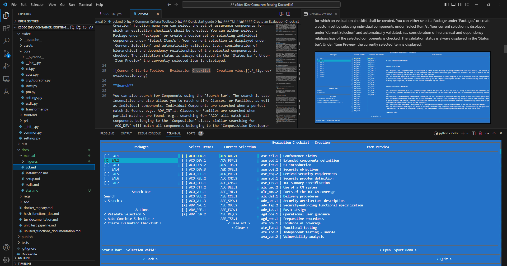
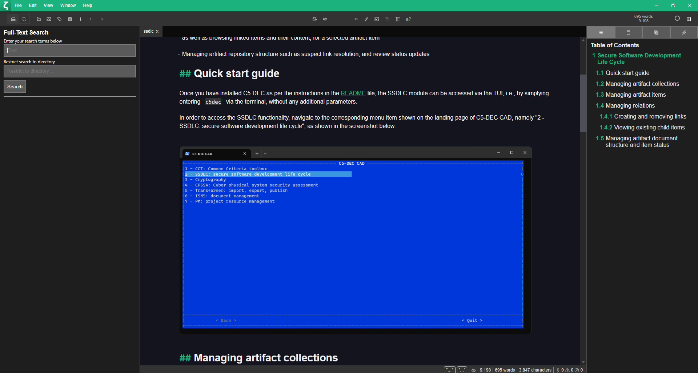

# Quick start

Users can interact with C5-DEC CAD through three different interfaces, namely a command line interface (CLI), a native textual user interface (TUI), a native web-based graphical user interface (GUI) provided by C5-DEC CAD, along with various graphical user interfaces (GUI) such as those provided by VS Code, any web browser (Mozilla Firefox, Google Chrome, etc.) or Zettlr.

By design, C5-DEC CAD uses open data formats and specifications, thereby allowing the use of a wide range of already existing open-source tools. For instance, by building on top of open-source solutions such as doorstop and pandoc and non-proprietary data storage formats such as YAML, Markdown, LaTeX, PlantUML, JSON, csv, etc. project files maintained and processed using C5-DEC CAD can be also edited, formatted, exported and viewed using existing tools such as web browsers and VS Code.

## Usage

To start C5-DEC CAD through your GNU/Linux/MacOS/WSL terminal, first change your current working directory to the one containing an unpacked copy of the [c5dec-main.zip](https://github.com/AbstractionsLab/c5dec/archive/refs/heads/main.zip) archive. For the sake of this example, we assume that the zip archive is unpacked at the following path `/home/user/c5dec`:

```sh
cd /home/user/c5dec
```

To access the command line interface (CLI), simply run `./c5dec.sh`, which by default shows the help menu if no arguments are provided, i.e., similar to the behavior resulting from the use of the `-h` flag. You can access the TUI and the GUI by using the `-t` and `-g` flags, respectively. The following subsections cover the three interfaces; see the [user manual](./overview.md) for a more detailed breakdown of features.

Note that for the TUI and the GUI, you can change the CC database prior to launching the software by modifying the selected DB in the `c5dec_params.yml` YAML file found in the `c5dec/assets` folder within the project folder.

A summary of the `c5dec.sh` runner options are provided below:

- To open the C5-DEC CLI help menu:

```sh
./c5dec.sh
```

- To run a C5-DEC CLI command:

```sh
./c5dec.sh <command>
```

- To get help for a C5-DEC CLI command:

```sh
./c5dec.sh <command> -h
```

- To start an interactive C5-DEC session for using the [Transformer](./docs/manual/transformer.md) and [Cryptography](./docs/manual/cryptography.md) features:

```sh
./c5dec.sh session
```

- To use the [OQS-OpenSSL](./docs/manual/cryptography.md#post-quantum-cryptography-pqc) provider for post-quantum cryptography:

```sh
./c5dec.sh pqc
```

## Usage via VS Code dev container

Once installed, the C5-DEC CAD tool can be launched from the VS Code terminal in any of the three modes of operation (CLI, TUI, GUI).

Select the "Reopen in Container" option in the notification that pops up in VS Code upon opening the project (assuming [Docker Desktop](https://www.docker.com/products/docker-desktop/) and the [Dev Containers](https://marketplace.visualstudio.com/items?itemName=ms-vscode-remote.remote-containers) extension are installed).

You can then open the command palette (Cmd/Ctrl+Shift+P) and select "Dev Containers: Reopen in Container" from the list of available commands. You will then be prompted to select a dev container configuration: the `C5-DEC CAD dev container` provides the bulk of the functionality, while the `C5-DEC CAD cryptography dev container` provides an environment with [OpenSSL](https://docs.openssl.org/master/man7/ossl-guide-libcrypto-introduction/) and the [OQS-OpenSSL provider](https://github.com/open-quantum-safe/oqs-provider) installed.

Upon opening a VS Code terminal, the currently selected directory will be the project root folder, i.e., `/home/alab/c5dec`. Change to the `c5dec` folder inside the former:

```sh
cd /home/alab/c5dec/c5dec
```

such that the currently working directory reads `/home/alab/c5dec/c5dec`:

```sh
$ pwd
/home/alab/c5dec/c5dec
```

If you wish to avoid having to precede the commands with `poetry run` each time, we recommend running `poetry shell` to activate the virtual environment. You can then run the commands directly by invoking `c5dec`, i.e., to avoid the use of `poetry run` each time, e.g.,

```sh
$ poetry run c5dec <command>
```

activate the virtual environment:

```sh
poetry shell
```

and you can then drop the use of `poetry run`:

```sh
c5dec -h
```

In the following, we describe the three modes of operation available for C5-DEC CAD; in each case, the command should be run from the `/home/alab/c5dec/c5dec` folder and we assume that the virtual environment is activated using `poetry shell`.

## TUI: Textual User Interface

Most of the features of C5-DEC CAD are currently exposed via its TUI. To launch the TUI, simply either run the `c5dec` command from the terminal or if you are using Windows, double-click the “run-c5dec” batch file.

This would launch the TUI front-end, shown below.


### Navigating the TUI

You can navigate the TUI and move between menus and submenus using the mouse or the keyboard as follows:

- Arrow keys (left, down, up, right): to change the current selection, i.e., for menus, buttons, text fields, etc.
- Tab key: to hop from one widget or visual object to another, e.g., in the CCT browser, to move the focus from the explorer to other buttons
- Enter key: press enter/return to confirm the current selection

## CLI: Command Line Interface

To run the CLI, simply append the command (and subcommands) to the C5-DEC launch command. You can access the help/manual of the CLI by using the -h parameter.

```sh
c5dec -h
```

This would print out a help menu similar to the one shown below.


## GUI: Graphical User Interface

To run the GUI, simply use the `-g` flag as follows.

```sh
$ c5dec -g
```

This would then start a local web server and you can access the web application's interface by pointing your browser of choice to the following localhost URL: `127.0.0.1:5432`.


## 3rd-party GUIs

While there may be many GUI candidates, we recommend the following options:

### Visual Studio Code

The popular, open-source and lightweight source code editor [Visual Studio (VS) Code](https://code.visualstudio.com/) by Microsoft is a natural candidate when it comes to choosing a graphical front-end. This is largely motivated by the following observations:

- Highly extensible: The VS Code Extensions feature allows it to provide dedicated support for several features of C5-DEC CAD, e.g., Markdown and YAML editing, linters, diagramming plugins
- Built-in source control support for git
- Built-in Markdown viewers
- Official extension by Microsoft for containerized development, making further development of C5-DEC CAD quite straightforward given the already existing configuration files provided by the C5-DEC CAD repository

The screenshot below provides an example of how VS Code can be used to enhance the C5-DEC experience: the project files processed using C5-DEC CAD are easily accessible and can be navigated via the VS Code explorer, documentation in Markdown previewed by the viewer on the right and an instance of C5-DEC CAD itself executed and running through the VS Code terminal, allowing the user to make changes using VS Code tools and extensions together with C5-DEC CAD.



### Zettlr

While there are many knowledge-base management and note taking tools using Markdown as the underlying storage format, we recommend [Zettlr](https://www.zettlr.com/) due to its being entirely open source and integration with other technologies and formats being central to C5-DEC, namely its integration of pandoc powering its import and export features and support for LaTeX and linking capabilities.




Thanks to its native usage of pandoc, Zettlr can provide a more accessible interface for converting and exporting to various formats such as LaTeX, docx,etc.

### Firefox

While any web browser can be used to view the published outcomes of C5-DEC CAD, which in turn invokes the native publishing command of doorstop, we recommend Mozilla Firefox.