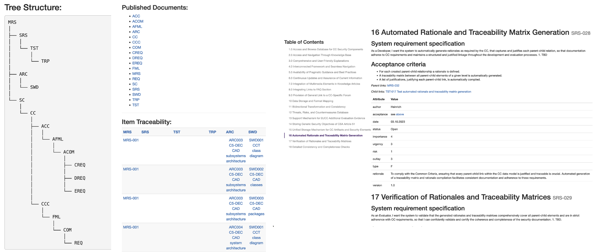

# Transformer

Since our adoption of [Quarto](https://quarto.org/) for scientific and technical publishing, we have phased out our previous make-based implementation for our universal conversion solution based on [pandoc](https://pandoc.org/). 

As Quarto achieves our original objective using precisely the same ideas and technological stack in a nicely packaged and stable software, we replaced our implementation by our custom enhancements of an integrated version of Quarto, shipped with our containerized development environment, i.e., via  the [development Dockerfile](https://github.com/AbstractionsLab/c5dec/blob/main/dev.Dockerfile) along with the VS Code [devcontainer.json](https://github.com/AbstractionsLab/c5dec/blob/main/.devcontainer/devcontainer.json) file.

Please see the corresponding user manual [installation instructions](https://github.com/AbstractionsLab/c5dec/blob/main/docs/manual/installation.md#installation-in-a-containerized-development-environment) for more details.

Once the you are connected to a C5-DEC interactive session or the project is opened in VS Code using the dev container, ensure the poetry environment is activated (if not, simply run `poetry shell`) and then you can simply access Quarto by running the quarto command in the C5-DEC dev container shell, e.g.,

```sh
quarto -h
```

To use the integrated transformation-related software, you can run an interactive C5-DEC session using the `c5dec.sh` runner script:

```sh
./c5dec.sh session
```

You will then be able to manipulate content stored in the `c5dec` folder by directly using `doorstop`, `quarto` and `pandoc`. Run `doorstop import -h`, `doorstop export -h`, `quarto render -h` and `quarto pandoc -h` for more information.

Alternatively, open the the project repository in VS Code and select the "Reopen in Container" option in the notification that pops up in VS Code; or launch the command palette (Cmd/Ctrl+Shift+P) and select "Dev Containers: Reopen in Container" from the list of available commands. You will then be prompted to select a dev container configuration: select the `C5-DEC CAD dev container`.

## Design artifacts import and export

Thanks to our use of [Doorstop](https://doorstop.readthedocs.io/en/latest/) and its direct integration into the `C5-DEC CAD dev container` (see [CAD dev container installation](./installation.md#installation-in-a-containerized-development-environment)), you can easily export any of your design artifacts using the built-in `doorstop export` command. Similarly, once exported, you can use the `doorstop import` command to bring back data that you may have updated in batch in another application, e.g., requirements exported to `.xlsx`, modified in batch using formulas and reintegrated into your repository.

Please see the official [Doorstop interchange page](https://doorstop.readthedocs.io/en/latest/cli/interchange.html) for further details or simply run the `doorstop import -h` and `doorstop export -h` in the C5-DEC CAD dev container terminal.

## Universal document converter

For universal document conversions, you can access the embedded `pandoc` tool through our already shipped copy of Quarto, i.e.,

```sh
quarto pandoc -h
```

We recommend consulting the official [pandoc user manual](https://pandoc.org/MANUAL.html) and its [quick guide file conversion example](https://pandoc.org/getting-started.html#step-6-converting-a-file).

## CLI

### Publishing documentation and technical specifications

The user can publish all the documentation and technical specification encoded using the open-source Doorstop software used as a key building block of C5-DEC CAD by using the `publish` subcommand of the `c5dec` CLI:


For instance, 

```sh
$ c5dec publish -f .html
```

acts as a wrapper around the underlying Doorstop publish function, complementing it and providing fixes and enhancements, e.g., creating web assets such as CSS and JavaScript dependencies at the required paths and post-processing features correcting errors in the used CSS file, generated by Doorstop. The resulting HTML output is stored at `docs/publish` and the user can access and navigate the entire documentation and technical specification by opening the `index.html` page at `docs/publish/index.html`.

An example of such a publication produced using the specifications of C5-DEC CAD itself is given below.



It is also possible to export the entire documentation and specifications to plain Markdown, which can then for instance be easily and almost immediately migrated to our C5-DEC DocEngine report template.

```sh
$ c5dec publish -f .md
```

## Deprecated and disabled features

The Transformer menu exposed via the TUI has been phased out as of the stable release of C5-DEC, i.e., starting from version 1.0. Instead, the recommended way would be to use our C5-DEC DocEngine module powered by [Quarto](https://quarto.org/), in turn built on top of [pandoc](https://pandoc.org/).

The [guide above](#transformer) details the various configurations and complementary tools.

The transformer module is currently aimed at importing, exporting and publishing content managed via the SSDLC module, which in turn builds on doorstop. Therefore, the three currently implemented functions, i.e., import, export and publish, act as a front-end to doorstop.

### Import SSDLC data

The import function can be used not only to import new content into a project repository managed by C5-DEC CAD, but it can also be used to temporarily move content out of the doorstop data store, modify it and have it imported back into the data store, thereby overwriting the content, e.g., exporting requirements to xlsx so they can be edited in MS Excel and then migrated back to the project repository. This is a front-end for invoking the [doorstop import](https://doorstop.readthedocs.io/en/latest/cli/interchange/) function.


### Export SSDLC data

The export function follows the same logic as above, just in reverse.


### Publish SSDLC data

The publish function can be used for viewing purposes and end-user analysis, navigation, etc. it can export to HTML, plain text (.txt), Markdown and LaTeX; it acts as a front-end to [doorstop publishing](https://doorstop.readthedocs.io/en/latest/cli/publishing/).


### Convert data

The convert data function is currently not implemented, but it is on the roadmap and part of the backlog candidates. The TUI component is however implemented, showcasing the currently planned feature. In the meantime, a similar functionality can be achieved by using Zettlr or pandoc directly. Users can also use the C5-DEC documentation engine (DocEngine), which is still under development; further details can be found in the corresponding entry on the Abstractions Lab GitHub page.

