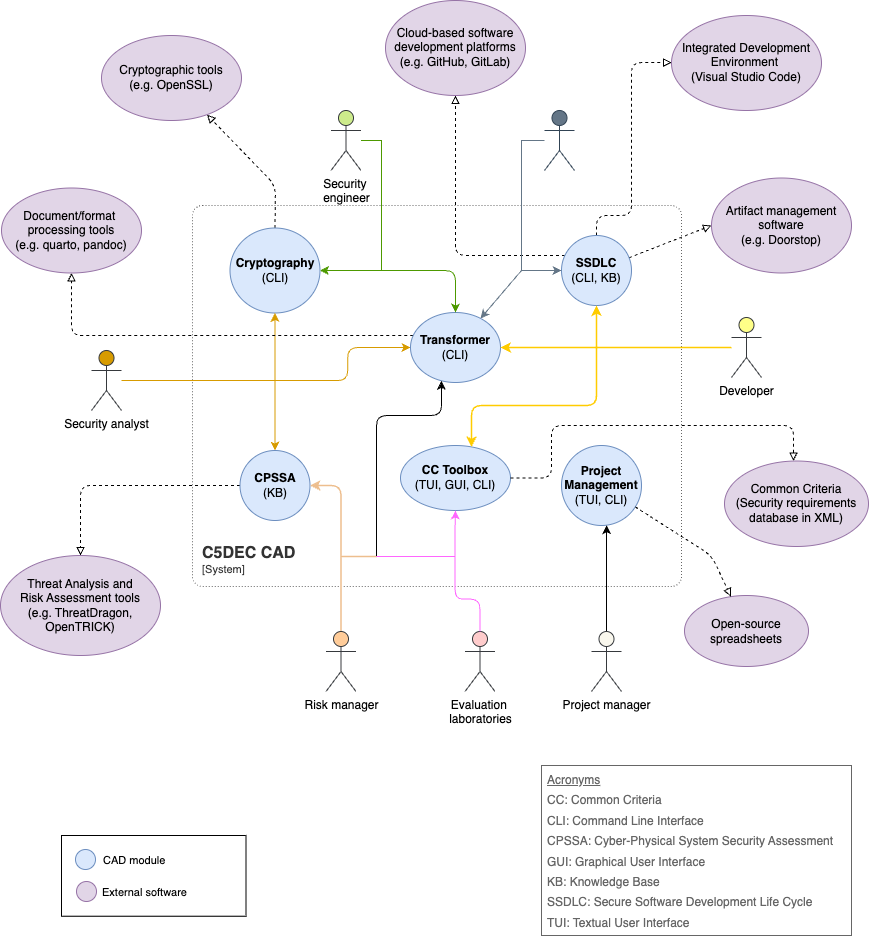

# C5-DEC CAD context diagram

## Diagram

The C5-DEC CAD system is divided into five modules providing diverse functionality for different kinds of users. These modules interact with and/or build upon external open-source tools to provide an integrated CAD solution.

{: width="80%"}