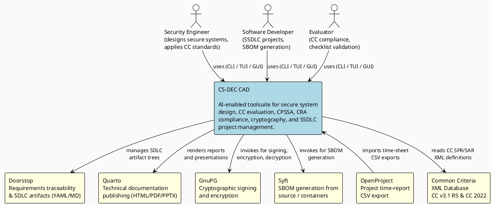

# System context diagram (C4 level 1)

## Description

The system context diagram places C5-DEC CAD in its operational environment. It identifies the three primary user roles and the external software systems that C5-DEC CAD integrates with or depends upon.

## Diagram

