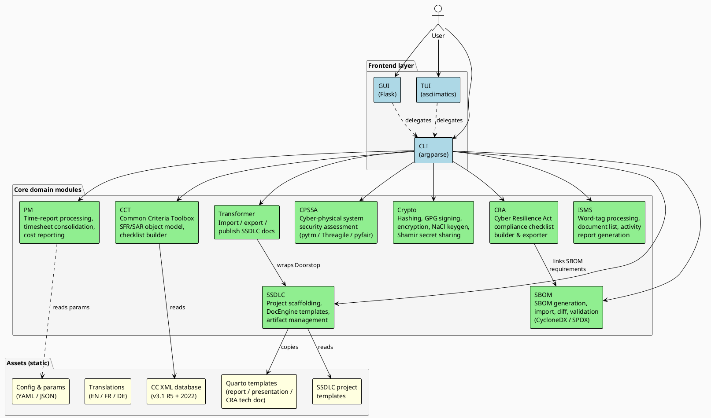

# Container diagram (C4 level 2)

## Description

The container diagram decomposes C5-DEC CAD into its major runtime and logical containers. Three frontend layers expose all functionality to users; they delegate operations to eight core domain modules that in turn share a static assets store.

## Diagram

