# CCT module – class hierarchy

## Description

The Common Criteria Toolbox (`c5dec/core/cct.py`) implements an object-oriented model of every CC construct defined in CC v3.1 R5 and CC 2022. Abstract base classes provide a shared interface; concrete domain classes mirror the CC document hierarchy from `CCDocument` down to individual `FElement` / `AElement` leaves. Paired `*Builder` classes parse the CC XML database into the corresponding model objects. The `ChecklistBuilder` and `CLIChecklistHandler` classes bridge the CC model to Doorstop-managed evaluation checklists.

## Diagram

```plantuml
@startuml
!theme plain
skinparam classBackgroundColor #FAFAFA
skinparam classBorderColor #888888
skinparam packageBorderColor #AAAAAA
hide empty members

package "Base infrastructure" {
    abstract class BaseClass
    abstract class BaseBuilder
    abstract class BaseExporter
    class Index
    class UniqueIDManager
}

package "Text & document primitives" {
    class Text
    class Italic
    class Bold
    class Math
    class XRef
    class URL
    class Item
    class List
    class Example
    class TEntry
    class TRow
    class TGroup
    class Table
    class Para
    class ParaSequence
    class SubClause
    class Clause
}

package "CC Functional Requirements (SFR)" #DDEEFF {
    class Operation
    class FEItem
    class FEList
    class FElement
    class FCoAudit
    class FCoManagement
    class FComponent
    class FFamily
    class FClass

    class OperationBuilder
    class FEItemBuilder
    class FEListBuilder
    class FElementBuilder
    class FCoAuditBuilder
    class FCoManagementBuilder
    class FComponentBuilder
    class FFamilyBuilder
    class FClassBuilder
}

package "CC Assurance Requirements (SAR)" #DDEEDD {
    class DCElement
    class WorkUnit
    class AElement
    class AComponent
    class AFamily
    class AClass

    class WorkUnitBuilder
    class AElementBuilder
    class AComponentBuilder
    class AFamilyBuilder
    class AClassBuilder
}

package "CC document level" #EEDDEE {
    class Package
    class CCDocument

    class PackageBuilder
    class CCDocumentBuilder
}

package "Checklist management" #FFEEDD {
    class ChecklistBuilder
    class CLIChecklistHandler
}

' Base hierarchy
BaseClass <|-- Text
Text <|-- Italic
Text <|-- Bold
Text <|-- Math
BaseClass <|-- XRef
BaseClass <|-- URL
BaseClass <|-- Item
BaseClass <|-- List
BaseClass <|-- Example
BaseClass <|-- TEntry
BaseClass <|-- TRow
BaseClass <|-- TGroup
BaseClass <|-- Table
BaseClass <|-- Para
BaseClass <|-- ParaSequence
ParaSequence <|-- SubClause
ParaSequence <|-- Clause

' SFR hierarchy
BaseClass <|-- Operation
BaseClass <|-- FEItem
BaseClass <|-- FEList
BaseClass <|-- FElement
BaseClass <|-- FCoAudit
BaseClass <|-- FCoManagement
BaseClass <|-- FComponent
BaseClass <|-- FFamily
BaseClass <|-- FClass
BaseBuilder <|-- OperationBuilder
BaseBuilder <|-- FEItemBuilder
BaseBuilder <|-- FEListBuilder
BaseBuilder <|-- FElementBuilder
BaseBuilder <|-- FCoAuditBuilder
BaseBuilder <|-- FCoManagementBuilder
BaseBuilder <|-- FComponentBuilder
BaseBuilder <|-- FFamilyBuilder
BaseBuilder <|-- FClassBuilder

' SAR hierarchy
BaseClass <|-- WorkUnit
BaseClass <|-- AElement
BaseClass <|-- AComponent
BaseClass <|-- AFamily
BaseClass <|-- AClass
BaseBuilder <|-- WorkUnitBuilder
BaseBuilder <|-- AElementBuilder
BaseBuilder <|-- AComponentBuilder
BaseBuilder <|-- AFamilyBuilder
BaseBuilder <|-- AClassBuilder

' Document level
BaseClass <|-- Package
BaseClass <|-- CCDocument
BaseBuilder <|-- PackageBuilder
BaseBuilder <|-- CCDocumentBuilder

' Composition
CCDocument "1" *-- "1..*" Package
Package "1" *-- "0..*" FClass
Package "1" *-- "0..*" AClass
FClass "1" *-- "1..*" FFamily
FFamily "1" *-- "1..*" FComponent
FComponent "1" *-- "1..*" FElement
FElement "1" *-- "0..*" FEList
FComponent "1" *-- "0..*" FCoAudit
FComponent "1" *-- "0..*" FCoManagement
AClass "1" *-- "1..*" AFamily
AFamily "1" *-- "1..*" AComponent
AComponent "1" *-- "1..*" AElement
AComponent "1" *-- "1..*" WorkUnit

' Builder associations
CCDocumentBuilder ..> CCDocument : «creates»
PackageBuilder ..> Package : «creates»
FClassBuilder ..> FClass : «creates»
FFamilyBuilder ..> FFamily : «creates»
FComponentBuilder ..> FComponent : «creates»
FElementBuilder ..> FElement : «creates»
AClassBuilder ..> AClass : «creates»
AFamilyBuilder ..> AFamily : «creates»
AComponentBuilder ..> AComponent : «creates»
AElementBuilder ..> AElement : «creates»
WorkUnitBuilder ..> WorkUnit : «creates»

ChecklistBuilder ..> CCDocument : «reads»
CLIChecklistHandler ..> ChecklistBuilder : «uses»

@enduml
```

