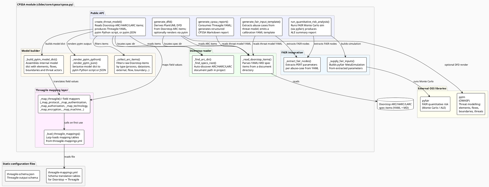

# CPSSA subsystem – component diagram

## Description

The Cyber-Physical System Security Assessment (CPSSA) module (`c5dec/core/cpssa/cpssa.py`) is a single-module integration layer that bridges Doorstop architecture artifacts with three external OSS tools: OWASP pytm (threat modelling), Threagile (threat model YAML schema), and pyfair (FAIR-based quantitative risk analysis). The module reads Doorstop ARC/HARC/LARC items from a project's specs tree and produces threat models, DFDs, and risk analysis reports. A YAML mapping file (`threagile-mappings.yml`) translates Doorstop field values to Threagile schema terms; a JSON schema file (`threagile-schema.json`) validates Threagile export output. The module exposes five public functions that are invoked from the CLI via `run_cpssa()` in `cli/commands.py`.

## Diagram

