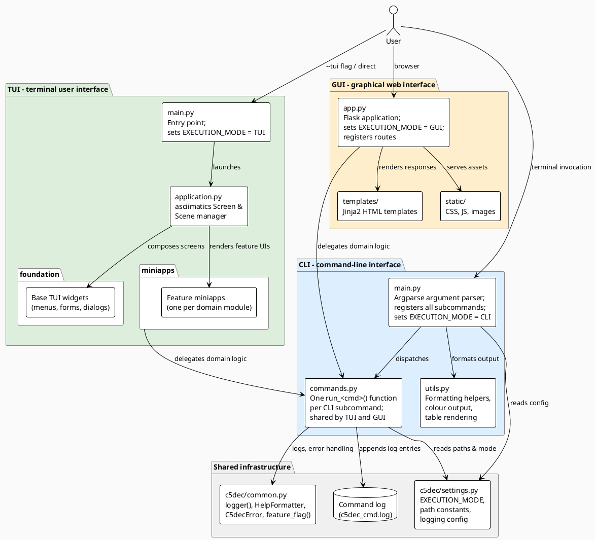

# Frontend layer – component diagram

## Description

C5-DEC CAD exposes three user-facing front-ends that share a single command dispatch layer (`commands.py`). The CLI is the primary interface; the TUI and GUI are alternative shells that delegate their business logic to the same command functions. All three front-ends write to a common command log file.

`settings.EXECUTION_MODE` is set at startup to `"CLI"`, `"TUI"`, or `"GUI"` so that core modules can adapt their output formatting accordingly.

## Diagram

