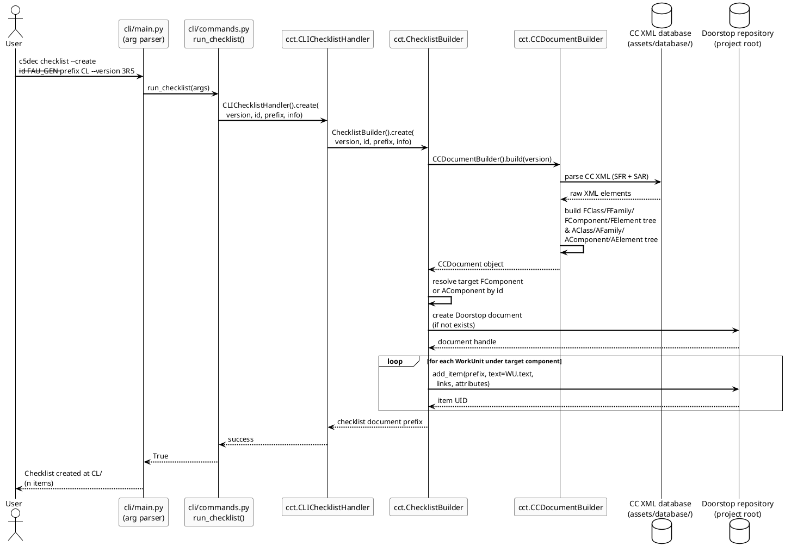

# CC checklist creation – sequence diagram

## Description

This diagram traces the end-to-end flow when a user creates a CC evaluation checklist with `c5dec checklist --create`. The CLI dispatches to `CLIChecklistHandler`, which drives `ChecklistBuilder` to build the full CC object model from the XML database and then materialise one Doorstop work-unit item per SAR work unit in the target Doorstop document prefix.

## Diagram

