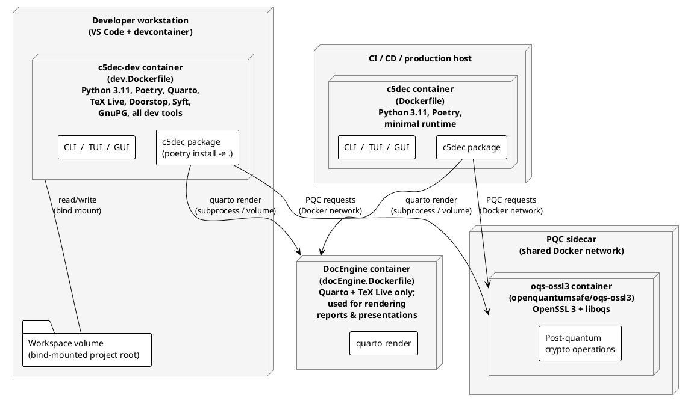

# Deployment diagram

## Description

C5-DEC CAD ships three Docker images that mirror the runtime environments from development to production. The development image and the devcontainer are the primary daily-use targets. A PostQuantum Cryptography (PQC) side-car image provides an `oqs-openssl3` environment for post-quantum operations accessed over a shared Docker network.

## Diagram

