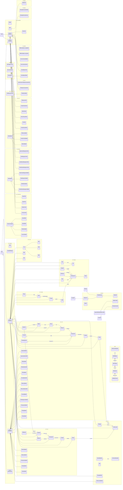

# C5-DEC CAD classes

## Diagram

The diagram below shows the set of all classes comprising C5-DEC CAD, grouped by module and annotated with their inheritance and key composition relationships.

```mermaid
classDiagram
direction RL
    %% ── common.py ──────────────────────────────────────────────────
    namespace Common {
        class HelpFormatter
        class C5decError
        class C5decWarning
        class C5decInfo
        class Capture
        class WarningFormatter
    }
    C5decError --|> Exception
    C5decWarning --|> C5decError
    C5decWarning --|> Warning
    C5decInfo --|> C5decWarning
    HelpFormatter --|> ArgumentDefaultsHelpFormatter
    WarningFormatter --|> Formatter

    %% ── core/cct.py – abstract bases ───────────────────────────────
    namespace CCT_Bases {
        class Index
        class UniqueIDManager
        class BaseClass {
            <<abstract>>
        }
        class BaseBuilder {
            <<abstract>>
        }
        class BaseExporter {
            <<abstract>>
        }
    }
    BaseClass --|> ABC
    BaseBuilder --|> ABC
    BaseExporter --|> ABC

    %% ── core/cct.py – inline / text primitives ──────────────────────
    namespace CCT_Text {
        class Text
        class Italic
        class Bold
        class Math
        class XRef
        class URL
    }
    Text --|> BaseClass
    Italic --|> Text
    Bold --|> Text
    Math --|> Text
    XRef --|> BaseClass
    URL --|> BaseClass

    %% ── core/cct.py – block content ─────────────────────────────────
    namespace CCT_Block {
        class Item
        class List
        class Example
        class Para
        class ParaSequence
        class SubClause
        class Clause
    }
    Item --|> BaseClass
    List --|> BaseClass
    Example --|> BaseClass
    Para --|> BaseClass
    ParaSequence --|> BaseClass
    SubClause --|> ParaSequence
    Clause --|> ParaSequence
    List "1" o-- "*" Item : item
    ParaSequence "1" o-- "*" SubClause : subclause
    ParaSequence "1" o-- "*" Para : para
    ParaSequence "1" o-- "*" Table : table
    ParaSequence "1" o-- "*" Example : example

    %% ── core/cct.py – table elements ────────────────────────────────
    namespace CCT_Table {
        class TEntry
        class TRow
        class TGroup
        class Table
    }
    TEntry --|> BaseClass
    TRow --|> BaseClass
    TGroup --|> BaseClass
    Table --|> BaseClass
    TRow "1" o-- "*" TEntry : entry
    TGroup "1" o-- "1..*" TRow : thead/tbody/tfoot
    Table "1" o-- "*" TGroup : tgroup

    %% ── core/cct.py – Functional Requirements ───────────────────────
    namespace CCT_FR {
        class Operation
        class OperationBuilder
        class OperationBuilder2022
        class FEItem
        class FEItemBuilder
        class FEItemBuilder2022
        class FEList
        class FEListBuilder
        class FEListBuilder2022
        class FElement
        class FElementBuilder
        class FElementBuilder2022
        class FCoAudit
        class FCoAuditBuilder
        class FCoManagement
        class FCoManagementBuilder
        class FComponent
        class FComponentBuilder
        class FFamily
        class FFamilyBuilder
        class FClass
        class FClassBuilder
    }
    Operation --|> BaseClass
    OperationBuilder --|> BaseBuilder
    OperationBuilder2022 --|> BaseBuilder
    FEItem --|> BaseClass
    FEItemBuilder --|> BaseBuilder
    FEItemBuilder2022 --|> BaseBuilder
    FEList --|> BaseClass
    FEListBuilder --|> BaseBuilder
    FEListBuilder2022 --|> BaseBuilder
    FElement --|> BaseClass
    FElementBuilder --|> BaseBuilder
    FElementBuilder2022 --|> BaseBuilder
    FCoAudit --|> BaseClass
    FCoAuditBuilder --|> BaseBuilder
    FCoManagement --|> BaseClass
    FCoManagementBuilder --|> BaseBuilder
    FComponent --|> BaseClass
    FComponentBuilder --|> BaseBuilder
    FFamily --|> BaseClass
    FFamilyBuilder --|> BaseBuilder
    FClass --|> BaseClass
    FClassBuilder --|> BaseBuilder
    FEItem "1" o-- "*" Operation : operation
    FEList "1" o-- "*" FEItem : item
    FElement "1" o-- "0..1" FEList : list
    FElement "1" o-- "*" Operation : operation
    FComponent "1" o-- "*" FElement : elements
    FComponent "1" o-- "0..1" FCoAudit : audit
    FComponent "1" o-- "0..1" FCoManagement : management
    FFamily "1" o-- "*" FComponent : components
    FClass "1" o-- "*" FFamily : families

    %% ── core/cct.py – Assurance Requirements ────────────────────────
    namespace CCT_AR {
        class DCElement
        class WorkUnit
        class WorkUnitBuilder
        class AElement
        class AElementBuilder
        class AComponent
        class AComponentBuilder
        class AFamily
        class AFamilyBuilder
        class AClass
        class AClassBuilder
    }
    WorkUnit --|> BaseClass
    WorkUnitBuilder --|> BaseBuilder
    AElement --|> BaseClass
    AElementBuilder --|> BaseBuilder
    AComponent --|> BaseClass
    AComponentBuilder --|> BaseBuilder
    AFamily --|> BaseClass
    AFamilyBuilder --|> BaseBuilder
    AClass --|> BaseClass
    AClassBuilder --|> BaseBuilder
    WorkUnit "1" o-- "*" DCElement : dc_element
    AElement "1" o-- "*" Operation : operation
    AComponent "1" o-- "*" AElement : elements
    AComponent "1" o-- "*" WorkUnit : work_units
    AFamily "1" o-- "*" AComponent : components
    AClass "1" o-- "*" AFamily : families

    %% ── core/cct.py – CC document and tooling ────────────────────────
    namespace CCT_Doc {
        class Package
        class PackageBuilder
        class CCDocument
        class CCDocumentBuilder
        class ChecklistBuilder
        class CLIChecklistHandler
        class ETR
    }
    Package --|> BaseClass
    PackageBuilder --|> BaseBuilder
    CCDocument --|> BaseClass
    CCDocumentBuilder --|> BaseBuilder
    CCDocument "1" o-- "*" FClass : f_class
    CCDocument "1" o-- "*" AClass : a_class
    CCDocument "1" o-- "*" Package : eal/cap
    CLIChecklistHandler ..> ChecklistBuilder : uses

    %% ── core/cra.py ─────────────────────────────────────────────────
    namespace CRA {
        class CRARequirement
        class CRASection
        class CRACategory
        class CRADatabase
        class CRAChecklistBuilder
    }
    CRADatabase "1" *-- "*" CRACategory : categories
    CRACategory "1" *-- "*" CRASection : sections
    CRASection "1" *-- "*" CRARequirement : requirements
    CRAChecklistBuilder ..> CRADatabase : uses

    %% ── core/isms.py ─────────────────────────────────────────────────
    namespace ISMS {
        class WordTagProcessor
        class DocListAssistant
        class ActivityReport
    }

    %% ── core/pm.py ───────────────────────────────────────────────────
    namespace PM {
        class TimeReportAssistant
    }

    %% ── frontend/tui/foundation ─────────────────────────────────────
    namespace TUI_Foundation {
        class Builder
        class Menu
        class BaseView {
            <<abstract>>
        }
        class PopUpMenu {
            <<abstract>>
        }
        class MenuView
    }
    BaseView --|> Frame
    PopUpMenu --|> Frame
    PopUpMenu --|> ABC
    MenuView --|> BaseView

    %% ── frontend/tui/application.py ─────────────────────────────────
    namespace TUI_App {
        class Application
    }
    Application --|> Menu

    %% ── frontend/tui/miniapps/miniappbase.py ─────────────────────────
    namespace TUI_Base {
        class MiniAppPlaceholderModel
        class MiniAppPlaceholderView
    }
    MiniAppPlaceholderView --|> BaseView

    %% ── frontend/tui/miniapps/cctapp.py ─────────────────────────────
    namespace TUI_CCT {
        class CCT_ArtifactModel["ArtifactModel"]
        class CCBrowserModel
        class CCBrowserView
        class BrowserExportMenu
        class CreateChecklistModel
        class CreateChecklistView
        class FormView
        class CreationExportMenu
        class WorkUnitModel
        class WorkUnitView
    }
    CCBrowserModel --|> CCT_ArtifactModel
    CCBrowserView --|> BaseView
    BrowserExportMenu --|> PopUpMenu
    CreateChecklistModel --|> CCT_ArtifactModel
    CreateChecklistView --|> BaseView
    FormView --|> PopUpMenu
    CreationExportMenu --|> PopUpMenu
    WorkUnitModel --|> CCT_ArtifactModel
    WorkUnitView --|> BaseView

    %% ── frontend/tui/miniapps/ismsapp.py ─────────────────────────────
    namespace TUI_ISMS {
        class MSWordTagProcessingModel
        class MSWordTagProcessingView
        class DocListAssistantModel
        class DocListAssistantView
        class ActivityReportModel
        class ActivityReportView
    }
    MSWordTagProcessingView --|> BaseView
    DocListAssistantView --|> BaseView
    ActivityReportModel --|> ActivityReport
    ActivityReportView --|> BaseView

    %% ── frontend/tui/miniapps/pmapp.py ───────────────────────────────
    namespace TUI_PM {
        class TimeReportModel
        class OpenProjectTimeReportAssistantView
        class TimeReportAssistantView
    }
    TimeReportModel --|> TimeReportAssistant
    OpenProjectTimeReportAssistantView --|> BaseView
    TimeReportAssistantView --|> BaseView

    %% ── frontend/tui/miniapps/ssdlcapp.py ────────────────────────────
    namespace TUI_SSDLC {
        class SSDLC_ArtifactModel["ArtifactModel"]
        class RepositoryManagementModel
        class RepositoryManagementView
        class ItemManagementModel
        class ItemManagementView
        class ItemRelationModel
        class ItemRelationManagementView
        class ArtifactStatusManagementModel
        class ArtifactStatusManagementView
    }
    RepositoryManagementModel --|> SSDLC_ArtifactModel
    RepositoryManagementView --|> BaseView
    ItemManagementModel --|> SSDLC_ArtifactModel
    ItemManagementView --|> BaseView
    ItemRelationModel --|> SSDLC_ArtifactModel
    ItemRelationManagementView --|> BaseView
    ArtifactStatusManagementModel --|> SSDLC_ArtifactModel
    ArtifactStatusManagementView --|> BaseView

    %% ── frontend/tui/miniapps/transformerapp.py ──────────────────────
    namespace TUI_Transformer {
        class TransformerModel
        class ExportModel
        class ExportView
        class ImportModel
        class ImportView
        class PublisherModel
        class PublisherView
        class ConverterModel
        class ConverterView
    }
    ExportModel --|> TransformerModel
    ExportView --|> BaseView
    ImportModel --|> TransformerModel
    ImportView --|> BaseView
    PublisherModel --|> TransformerModel
    PublisherView --|> BaseView
    ConverterModel --|> TransformerModel
    ConverterView --|> BaseView
```