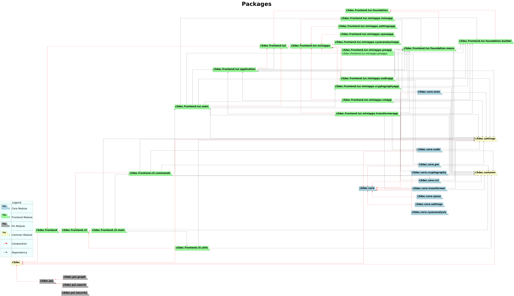

# C5-DEC CAD packages

## Diagram

The diagram below shows the packages of C5-DEC CAD.

<!-- {: width="80%"} -->

```mermaid
graph LR
    subgraph c5dec_root["c5dec"]
        COMMON["c5dec.common"]
        SETTINGS["c5dec.settings"]

        subgraph CORE["c5dec.core"]
            CCT["c5dec.core.cct"]
            CPSSA["c5dec.core.cpssa"]
            CRA["c5dec.core.cra"]
            CRYPTO["c5dec.core.cryptography"]
            ISMS["c5dec.core.isms"]
            PM["c5dec.core.pm"]
            SBOM["c5dec.core.sbom"]
            SSDLC["c5dec.core.ssdlc"]
            TRANSFORMER["c5dec.core.transformer"]
        end

        subgraph FRONTEND["c5dec.frontend"]
            GUI["c5dec.frontend.gui"]

            subgraph CLI["c5dec.frontend.cli"]
                CLI_CMD["commands"]
                CLI_MAIN["main"]
                CLI_UTILS["utils"]
            end

            subgraph TUI["c5dec.frontend.tui"]
                TUI_APP["application"]
                TUI_MAIN["main"]

                subgraph TUI_FOUND["foundation"]
                    TUI_BUILDER["builder"]
                    TUI_MENU["menu"]
                end

                subgraph TUI_MINI["miniapps"]
                    MINI_BASE["miniappbase"]
                    MINI_CCT["cctapp"]
                    MINI_CPSSA["cpssaapp"]
                    MINI_CRYPTO["cryptographyapp"]
                    MINI_ISMS["ismsapp"]
                    MINI_PM["pmapp"]
                    MINI_SETTINGS["settingsapp"]
                    MINI_SSDLC["ssdlcapp"]
                    MINI_TRANSFORMER["transformerapp"]
                end
            end
        end
    end

    %% DEPENDENCIES - CORE
    CCT --> COMMON & SETTINGS
    ISMS --> SETTINGS
    PM --> COMMON & SETTINGS
    SSDLC --> COMMON & SETTINGS
    TRANSFORMER --> COMMON & SETTINGS
    CRA --> COMMON & SETTINGS
    CRA --> TRANSFORMER
    SBOM --> COMMON & SETTINGS

    %% DEPENDENCIES - CLI
    CLI_MAIN --> COMMON & SETTINGS
    CLI_MAIN --> CLI_CMD & CLI_UTILS
    CLI_UTILS --> COMMON & SETTINGS
    CLI_CMD --> COMMON & SETTINGS
    CLI_CMD --> CCT & PM & SSDLC
    CLI_CMD --> TUI_MAIN

    %% DEPENDENCIES - TUI/MAIN
    TUI_MAIN --> TUI_APP
    TUI_MAIN --> MINI_CCT & MINI_CRYPTO & MINI_ISMS & MINI_PM & MINI_SSDLC & MINI_TRANSFORMER
    TUI_MAIN --> COMMON & SETTINGS

    %% DEPENDENCIES - TUI/APPLICATION
    TUI_APP --> TUI_MENU & SETTINGS

    %% DEPENDENCIES - TUI/FOUNDATION
    TUI_MENU --> SETTINGS & COMMON
    TUI_MENU --> TUI_BUILDER & TUI_APP

    %% DEPENDENCIES - TUI/MINIAPPS
    MINI_CCT --> TUI_MENU & TUI_BUILDER & TUI_APP
    MINI_CCT --> SETTINGS & COMMON & CCT

    MINI_CRYPTO --> TUI_MENU & TUI_BUILDER
    MINI_CRYPTO --> CRYPTO & SETTINGS & COMMON

    MINI_ISMS --> TUI_MENU & TUI_BUILDER & ISMS

    MINI_PM --> TUI_MENU & TUI_BUILDER & PM

    MINI_SSDLC --> TUI_MENU & TUI_BUILDER & TUI_APP
    MINI_SSDLC --> SSDLC & SETTINGS & COMMON

    MINI_TRANSFORMER --> TUI_MENU & TUI_BUILDER & TUI_APP
    MINI_TRANSFORMER --> TRANSFORMER & SSDLC & SETTINGS & COMMON
```