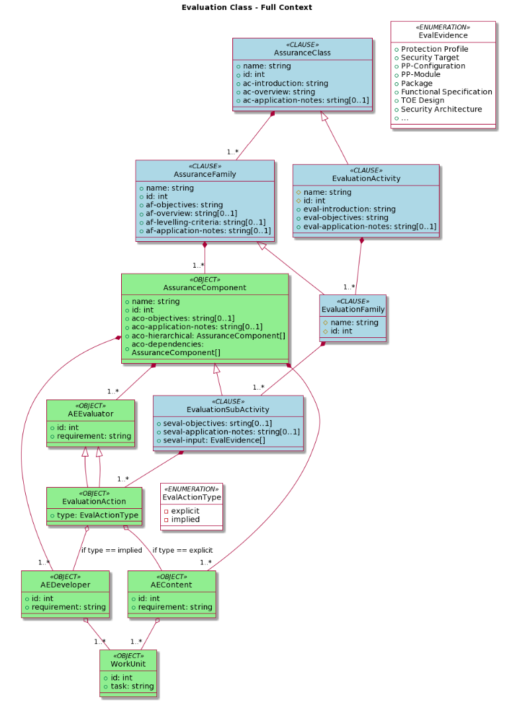

# C5-DEC CCT sec. assurance and eval. act. dependencies

## Diagram

The diagram below shows the C5-DEC CCT security assurance evaluation and evaluation activities dependencies data model.

{: width="80%"}