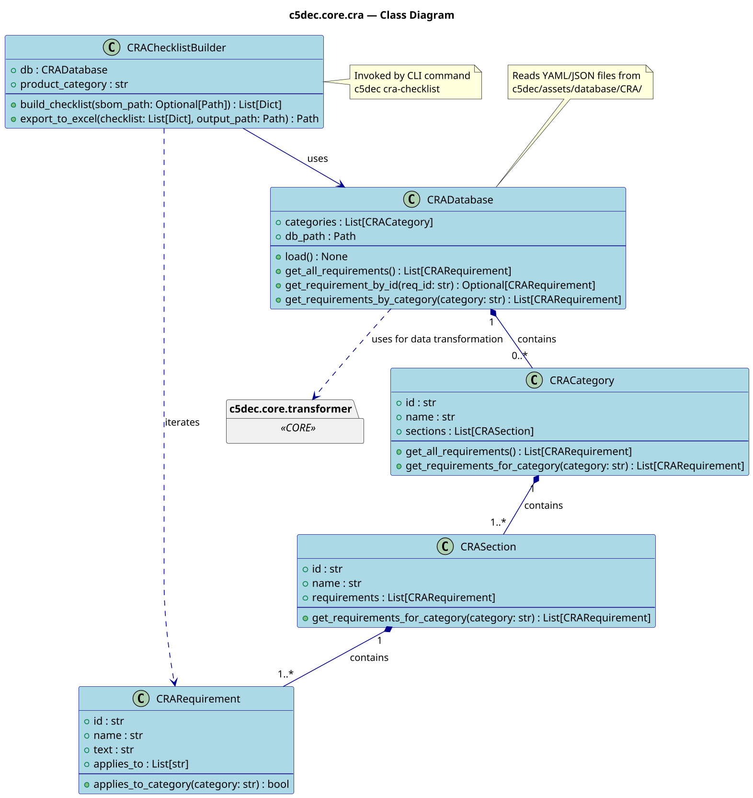

# CRA module class diagram

## Overview

The `c5dec.core.cra` module implements the Cyber Resilience Act (EU Regulation
2024/2847) compliance workflow. It provides an object model for CRA requirements
organized by category and section, a loader for the local CRA database, and a
checklist builder that exports an Excel compliance worksheet.

The module also provides helper functions for linking an SBOM to CRA requirements,
enabling automated pre-verification of SBOM-traceable obligations.

## Diagram

## Key design decisions

- `CRADatabase.load()` reads structured YAML/JSON files from
  `c5dec/assets/database/CRA/` and deserializes them into the class hierarchy.
- `CRAChecklistBuilder` delegates SBOM linkage verification to the
  module-level helper functions `verify_sbom_exists`, `link_sbom_to_cra_requirement`,
  and `auto_verify_sbom_requirement`.
- The module relies on `c5dec.core.transformer` for any format conversion during import.
- All path constants are resolved via `c5dec.settings` (`CRA_DB_PATH`, `CRA_LOG_FILE`).