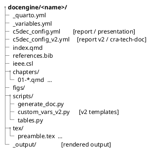
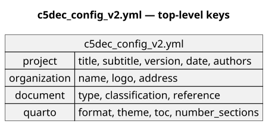
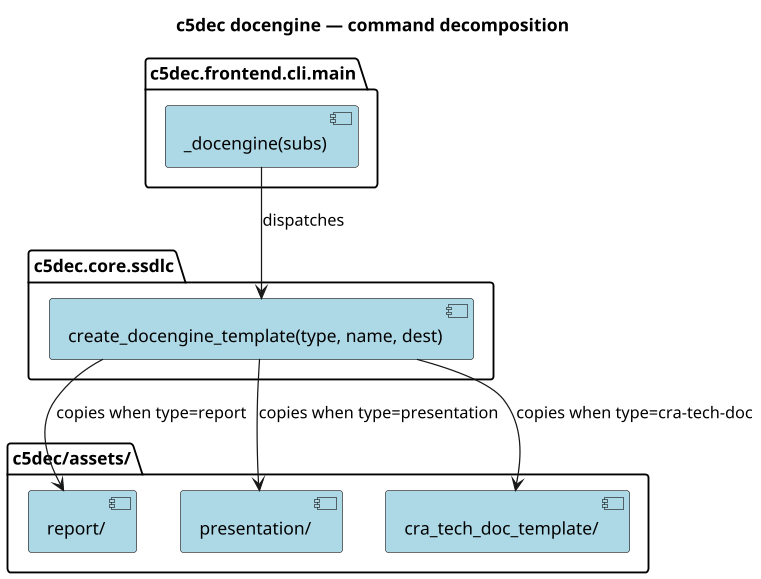

# DocEngine template types and configuration design

## Overview

The DocEngine (`c5dec docengine`) scaffolds three Quarto-based document
templates from the source trees stored in `c5dec/assets/`:

| CLI argument | Source tree | Output format |
|:---|:---|:---|
| `report` | `c5dec/assets/report/` | PDF (LaTeX) + HTML |
| `presentation` | `c5dec/assets/presentation/` | RevealJS HTML |
| `cra-tech-doc` | `c5dec/assets/cra_tech_doc_template/` | PDF (LaTeX) |

## Template directory structure

## c5dec_config_v2.yml schema

The v2 configuration format extends the original `c5dec_config.yml` with
structured project metadata blocks used by `custom_vars_v2.py` to populate
Quarto template variables at render time.

### Key differences from v1

| Feature | `c5dec_config.yml` (v1) | `c5dec_config_v2.yml` (v2) |
|:---|:---|:---|
| Author handling | Single string | List of author objects |
| Organization block | Not present | Explicit `organization` block |
| Document metadata | Flattened | Nested `document` block |
| Quarto overrides | Not present | Explicit `quarto` block |
| Used by | `_quarto.yml` Lua filter | `custom_vars_v2.py` pre-processor |

## DocEngine CLI design

## CRA technical documentation template chapters

The `cra-tech-doc` template pre-populates chapters aligned with CRA Annex V
technical documentation obligations:

| Chapter file | CRA Annex V obligation |
|:---|:---|
| `01-product-description.qmd` | Product description and intended purpose |
| `02-design-development.qmd` | Design, development, and production processes |
| `03-risk-assessment.qmd` | Cybersecurity risk assessment |
| `04-applied-standards.qmd` | Applied harmonised standards and common specifications |
| `05-eu-declaration.qmd` | EU declaration of conformity reference |
| `06-sbom.qmd` | Software Bill of Materials |

## Settings constants

Path constants relating to DocEngine are defined in `c5dec/settings.py`:

| Constant | Path |
|:---|:---|
| `REPORT_TEMPLATE_PATH` | `c5dec/assets/report/` |
| `PRESENTATION_TEMPLATE_PATH` | `c5dec/assets/presentation/` |
| `CRA_TECH_DOC_TEMPLATE_PATH` | `c5dec/assets/cra_tech_doc_template/` |