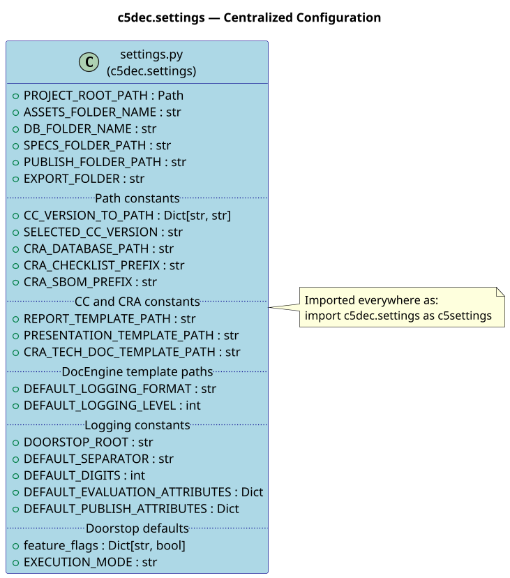

# Centralized settings module

## Overview

C5-DEC CAD centralizes all configuration constants in a single module,
`c5dec/settings.py`, imported project-wide under the canonical alias
`c5settings`.  The module resolves all file-system paths relative to
`PROJECT_ROOT_PATH` and reads runtime parameters from
`c5dec_params.yml` at import time.



## Design rationale

| Concern | Approach |
|:---|:---|
| File-system paths | Resolved relative to `PROJECT_ROOT_PATH` at module load time; consistent across CLI, TUI, GUI, and container deployments |
| CC version selection | Read from `c5dec_params.yml` at import; overridable by CLI arguments at runtime |
| Feature flags | Dict controlling which modules are active (`ssdlc`, `cct`, `cryptography`, `cpssec`, `isms`, `pm`, `transformer`, `cra`, `sbom`) |
| Doorstop defaults | Centralized UID format, evaluation attributes, and publish attributes for all Doorstop operations |
| Logging | Graduated format/level constants supporting `-v` / `-vv` / `-vvv` verbosity |

## Usage convention

All modules import the settings module using the canonical alias:

```python
import c5dec.settings as c5settings
```

Path constants are then referenced as `c5settings.SPECS_FOLDER_PATH`,
`c5settings.CRA_DATABASE_PATH`, etc.  No module hard-codes file paths.