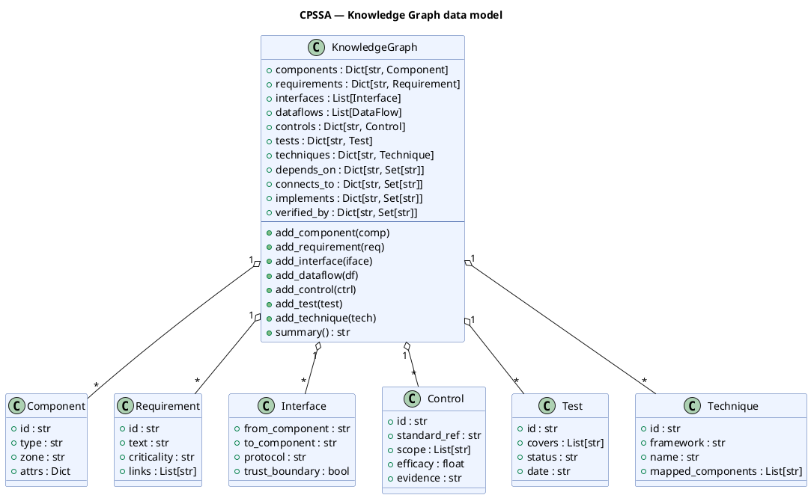

# Doorstop ingestion helpers

## Overview

The ingestion layer reads Doorstop architecture items (ARC/HARC/LARC) from
a C5-DEC SSDLC project and normalizes them into plain Python dicts suitable
for consumption by the threat-model generators and DFD builder.

All ingestion helpers are private functions in `c5dec/core/cpssa/cpssa.py`.

## Key functions

| Function | Purpose |
|:---|:---|
| `_read_doorstop_items(doc_path)` | Reads all Markdown item files from a Doorstop document directory, parsing YAML frontmatter and body text into a list of dicts |
| `_doorstop_text(item)` | Extracts the display text from an item dict (falls back from `header` to first `# Heading` to first 60 chars of `text`) |
| `_find_arc_dir(project_path, arc_folder)` | Locates the architecture item directory by searching for `arc`, `harc`, or `larc` subdirectories containing `.doorstop.yml` |
| `_find_specs_root(project_path)` | Discovers the Doorstop specs root directory from a project path |
| `_collect_arc_items(arc_dir, limit)` | Reads and filters architecture items, enforcing the 40-item processing cap |
| `_collect_links(item)` | Extracts Doorstop link UIDs from an item's `links` field |
| `_collect_flows(item)` | Parses the `flows` YAML field for data-flow definitions; falls back to ARC-prefixed links when `flows` is absent |

## Processing pipeline

```
Doorstop .md files
    → _read_doorstop_items() — parse YAML frontmatter + body
    → _collect_arc_items() — filter, cap at 40 items
    → _collect_flows() / _collect_links() — extract relationships
    → normalized dicts ready for threat-model / DFD generation
```

## Data flow fallback convention

When the `flows` field is absent from an item, the ingestion layer falls
back to reading entries in the Doorstop `links` field whose UID starts with
an architecture-document prefix (`ARC-`, `HARC-`, `LARC-`) and constructs
minimal flow dicts using item-level `protocol` and `port` fields.

