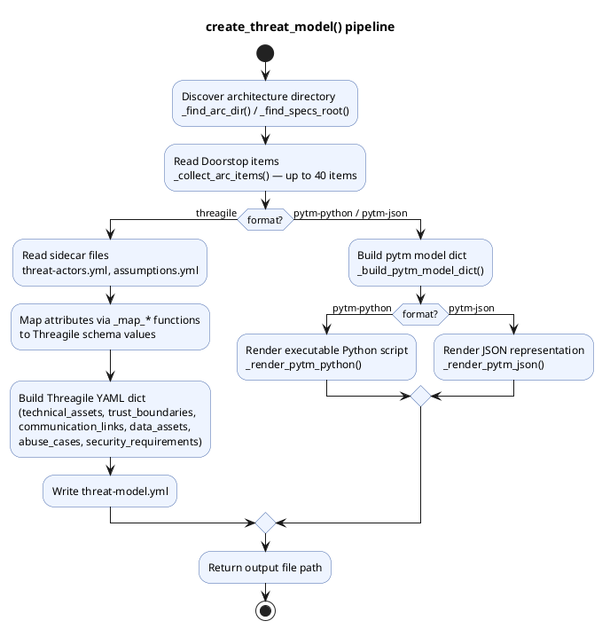

# Threat model generation — `create_threat_model()`

## Overview

`create_threat_model()` reads Doorstop architecture (ARC/HARC/LARC) items
from a C5-DEC SSDLC project and produces a threat-model template in one of
three output formats: Threagile YAML, pytm Python script, or pytm JSON.

## Function signature

```python
def create_threat_model(
    project_path: Path,
    output_path: Optional[Path] = None,
    format: str = "threagile",
    arc_folder: Optional[str] = None,
    specs_path: Optional[Path] = None,
) -> str:
```

## Processing pipeline



## Output formats

| Format | Default file | Content |
|:---|:---|:---|
| `threagile` | `threat-model.yml` | Complete Threagile-compatible YAML with technical assets, trust boundaries, communication links, data assets, abuse cases, and security requirements |
| `pytm-python` | `threat-model.py` | Executable pytm Python script with `TM`, `Boundary`, `Server`/`ExternalEntity`/`Datastore`/`Process`, and `Dataflow` objects |
| `pytm-json` | `threat-model.json` | JSON representation of the pytm model dict |

## Threagile output structure

The Threagile YAML contains:

- **`technical_assets`**: One entry per ARC item with technology, encryption, CIA ratings, machine type, data formats
- **`trust_boundaries`**: Zone-based groupings from the `zone` attribute
- **`communication_links`**: Data flows derived from `flows` field (with link fallback)
- **`data_assets`**: Referenced data assets from `data_assets`/`data_assets_processed`/`data_assets_stored`
- **`abuse_cases`**: Synthesized from trust-boundary crossings and internet-facing assets
- **`security_requirements`**: Extracted from items with security-related attributes

## Sidecar files

Two optional YAML files in the ARC item directory enrich the output:

- `threat-actors.yml` — threat actor definitions
- `assumptions.yml` — documented assumptions

## Processing limit

At most 40 architecture items are processed per invocation.