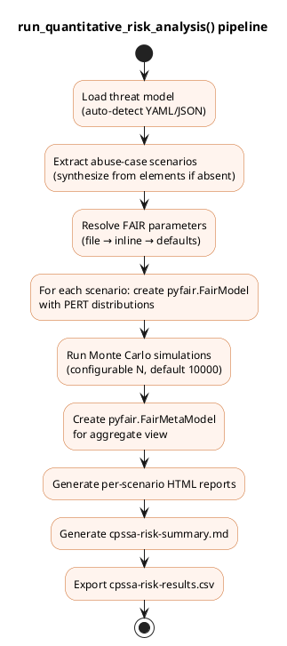

# Quantitative risk analysis — `run_quantitative_risk_analysis()`

## Overview

`run_quantitative_risk_analysis()` runs a FAIR-based Monte Carlo simulation
via the `pyfair` library for each abuse-case scenario and produces an
Annualised Loss Expectancy (ALE) summary with supporting output artifacts.

## Function signature

```python
def run_quantitative_risk_analysis(
    threat_model_path: Union[str, Path],
    output_path: Optional[Union[str, Path]] = None,
    simulations: int = 10000,
    fair_params_path: Optional[Union[str, Path]] = None,
) -> str:
```

## Calibration parameter resolution

Parameters are resolved in order of precedence:

1. **Dedicated FAIR parameters file** (`fair_params_path`) — YAML mapping
   scenario names to PERT bounds (generated by `generate_fair_input_template`)
2. **Inline in threat model** — abuse case values as dicts containing FAIR
   node keys (`lef`, `lm`, `tef`, `vulnerability`, etc.)
3. **Fallback defaults** — conservative placeholders (a warning is emitted
   for each scenario that uses defaults)

## Processing pipeline



## FAIR model configuration

For each scenario, a `pyfair.FairModel` is created with PERT distributions.
The simple path uses:

- **LEF** (Loss Event Frequency): `model.input_data("Loss Event Frequency", low, mode, high)`
- **LM** (Loss Magnitude): `model.input_data("Loss Magnitude", low, mode, high)`

Advanced decomposition nodes (when provided): `tef`, `vulnerability`,
`contact`, `action`, `tc`, `cs`, `pl`, `sl`, `slef`, `slem`.

## Output artifacts

All outputs are written to the `output_path` directory (defaults to the
threat model's parent directory):

| File | Content |
|:---|:---|
| `cpssa-risk-summary.md` | Markdown summary with input parameters table and ALE statistics per scenario |
| `cpssa-risk-results.csv` | Raw Monte Carlo simulation results |
| `cpssa-risk-{N}.html` | One interactive pyfair report per scenario (indexed from 1), comparing individual model against meta-model |

## Dependencies

- **pyfair** — FAIR Monte Carlo simulation engine (imported at module level)
- **pyyaml** — YAML parsing for threat model and FAIR parameters

## Error handling

- Raises `C5decError` if the threat model file is not found or unparseable
- Emits warning-level log messages for scenarios using fallback defaults
- Returns the absolute path of `cpssa-risk-summary.md`