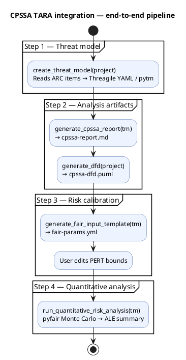

# CPSSA orchestration and CLI integration

## Overview

The CPSSA module exposes five stateless public functions that form a
complete TARA workflow pipeline.  All functions are re-exported from
`c5dec.core.cpssa` and integrated into the CLI via `c5dec cpssa`
subcommands.

## Public API

```python
from c5dec.core.cpssa import (
    create_threat_model,
    generate_cpssa_report,
    generate_dfd,
    generate_fair_input_template,
    run_quantitative_risk_analysis,
)
```

## End-to-end workflow



## CLI subcommands

| Command | Function called | Description |
|:---|:---|:---|
| `c5dec cpssa create-threat-model [--format F] [--arc-folder P]` | `create_threat_model()` | Generate Threagile / pytm threat model |
| `c5dec cpssa generate-report --model M` | `generate_cpssa_report()` | Generate CPSSA Markdown report |
| `c5dec cpssa generate-dfd [--project P] [--arc-folder P]` | `generate_dfd()` | Generate PlantUML DFD |
| `c5dec cpssa fair-input --model M` | `generate_fair_input_template()` | Generate FAIR calibration template |
| `c5dec cpssa risk-analysis --model M [--simulations N] [--fair-params F]` | `run_quantitative_risk_analysis()` | Run FAIR Monte Carlo analysis |

## Function conventions

All five functions follow the same design conventions:

- Accept `Path`-like inputs
- Write output to disk (configurable `output_path`)
- Return the **absolute path string** of the primary written file
- Raise `common.C5decError` on unrecoverable errors
- Log progress and warnings via `common.logger(__name__)`

## Package layout

```
c5dec/core/cpssa/
├── __init__.py                # Public re-exports
├── cpssa.py                   # All five TARA integration functions + helpers
├── threagile-mappings.yml     # Doorstop → Threagile schema value mappings
├── threagile-schema.json      # Threagile JSON schema reference
└── examples/
    └── water-treatment/       # Self-contained ICS / SCADA demo
```

## Dependencies

| Library | Purpose |
|:---|:---|
| `pyfair` | FAIR Monte Carlo simulation engine |
| `pyyaml` | YAML parsing for threat models, mappings, sidecar files |
| `c5dec.common` | Logging (`logger`), error handling (`C5decError`) |
| `c5dec.settings` | Path constants |