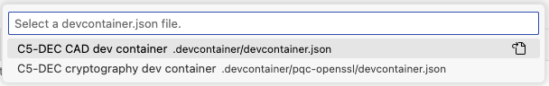
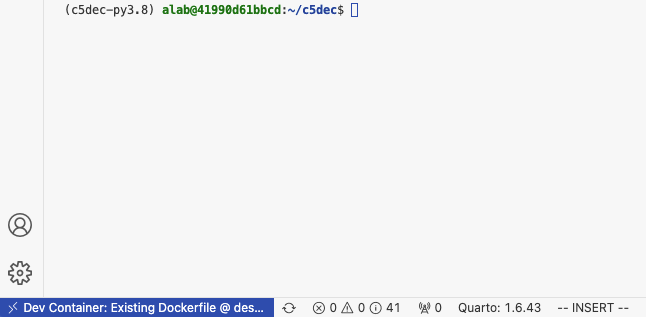

# TC: Test containerized deployment on x86-64

Test the C5-DEC initialization and setup scripts for containerized deployment.

## Preconditions and setup actions
- A device/VM with an x86_64 hardware architecture
- Access to the C5-DEC deployment artifacts
- [Docker Engine](https://docs.docker.com/engine/) (or daemon or [Docker Desktop](https://www.docker.com/products/docker-desktop/)) running with the right privileges for the testing user
- Microsoft [Visual Studio Code](https://code.visualstudio.com/) installed (v1.98.2)
- Microsoft VS Code [Dev Containers](https://code.visualstudio.com/docs/devcontainers/containers) installed, i.e., the VS Code [extension](https://marketplace.visualstudio.com/items?itemName=ms-vscode-remote.remote-containers) (v0.401.0)

## Test steps

1. Clone this repository:

```sh
git clone https://github.com/AbstractionsLab/c5dec.git 
```

2. Start Docker Desktop if not already running;
3. Open the project folder in VS Code;
4. Select the "Reopen in Container" option in the notification that pops up in VS Code; or launch the command palette (Cmd/Ctrl+Shift+P) and select "Dev Containers: Reopen in Container" from the list of available commands. You will then be prompted to select a dev container configuration: the `C5-DEC CAD dev container` provides the bulk of the functionality, while the `C5-DEC CAD cryptography dev container` provides an environment with [OpenSSL](https://docs.openssl.org/master/man7/ossl-guide-libcrypto-introduction/) and the [OQS-OpenSSL provider](https://github.com/open-quantum-safe/oqs-provider) installed.

{: width="60%"}

5. Select the `C5-DEC CAD dev container`. Once selected, wait for the container to build and start. This may take a few minutes, depending on your internet connection and the performance of your machine.
6. Once the container is up and running, you will see a terminal window open in VS Code, and you can start using C5-DEC CAD. If a terminal window does not open automatically, you can open a new terminal by selecting "Terminal" from the top menu and then "New Terminal". This will open a terminal window inside the container, with a Poetry shell activated. If the shell is not automatically activated upon reopening the project in a container, simply run

```sh
poetry shell
```

## Expected outcome

6. Container creation done successfully, a new VS Code terminal session connecting to the C5-DEC container opened and Python environment via Poetry shell activated, e.g., similar to the view below:

{: width="60%"}
