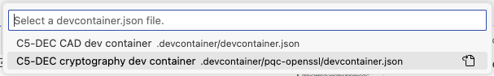

# TC: Test PQ cryptography container

Test the C5-DEC cryptography dev container deployment.

## Preconditions and setup actions
- Access to the C5-DEC deployment artifacts
- [Docker Engine](https://docs.docker.com/engine/) (or daemon or [Docker Desktop](https://www.docker.com/products/docker-desktop/)) running with the right privileges for the testing user
- Microsoft [Visual Studio Code](https://code.visualstudio.com/) installed (v1.98.2)
- Microsoft VS Code [Dev Containers](https://code.visualstudio.com/docs/devcontainers/containers) installed, i.e., the VS Code [extension](https://marketplace.visualstudio.com/items?itemName=ms-vscode-remote.remote-containers) (v0.401.0)

## Test steps
1. Clone this repository:

```sh
git clone https://github.com/AbstractionsLab/c5dec.git 
```

2. Open the project folder in VS Code;
3. Select the `C5-DEC cryptography dev container`, to create and connect to the OQS-OpenSSL provider, i.e., select the "Reopen in Container" option in the notification that pops up in VS Code; or launch the command palette (Cmd/Ctrl+Shift+P) and select "Dev Containers: Reopen in Container" from the list of available commands. Then, select `C5-DEC cryptography dev container`, which provides an environment with [OpenSSL](https://docs.openssl.org/master/man7/ossl-guide-libcrypto-introduction/) and the [OQS-OpenSSL provider](https://github.com/open-quantum-safe/oqs-provider) installed.



This allows you to use post-quantum cryptography algorithms while benefitting from direct access to your host file system, thanks to volume mounting. To use the OQS-OpenSSL provider, we recommend consulting the [OQS-OpenSSL usage documentation](https://github.com/open-quantum-safe/oqs-provider/blob/main/USAGE.md#sample-commands).

4. To get a list of the available quantum-safe signature algorithms, run the following command in the VS Code terminal:

```sh
openssl list -signature-algorithms -provider oqsprovider
```

5. To get a list of the available quantum-safe KEM algorithms, run:

```sh
openssl list -kem-algorithms -provider oqsprovider
```

## Expected outcome
4. The command should return a list of the available quantum-safe signature algorithms:
```sh
{ 1.2.840.113549.1.1.1, 2.5.8.1.1, RSA, rsaEncryption } @ default
  { 1.2.840.10040.4.1, 1.3.14.3.2.12, DSA, DSA-old, dsaEncryption, dsaEncryption-old } @ default
  { 1.2.840.10040.4.3, 1.3.14.3.2.27, DSA-SHA, DSA-SHA-1, DSA-SHA1, DSA-SHA1-old, dsaWithSHA, dsaWithSHA1, dsaWithSHA1-old } @ default
  { 1.3.101.112, ED25519 } @ default
  { 1.3.101.113, ED448 } @ default
  { 1.2.156.10197.1.301, SM2 } @ default
  { 2.16.840.1.101.3.4.3.1, DSA-SHA2-224, DSA-SHA224, dsa_with_SHA224 } @ default
  { 2.16.840.1.101.3.4.3.2, DSA-SHA2-256, DSA-SHA256, dsa_with_SHA256 } @ default
  { 1.2.840.1.101.3.4.3.3, DSA-SHA2-384, DSA-SHA384, dsa_with_SHA384, id-dsa-with-sha384 } @ default
  { 1.2.840.1.101.3.4.3.4, DSA-SHA2-512, DSA-SHA512, dsa_with_SHA512, id-dsa-with-sha512 } @ default
  { 2.16.840.1.101.3.4.3.5, DSA-SHA3-224, dsa_with_SHA3-224, id-dsa-with-sha3-224 } @ default
  { 2.16.840.1.101.3.4.3.6, DSA-SHA3-256, dsa_with_SHA3-256, id-dsa-with-sha3-256 } @ default
  { 2.16.840.1.101.3.4.3.7, DSA-SHA3-384, dsa_with_SHA3-384, id-dsa-with-sha3-384 } @ default
  { 2.16.840.1.101.3.4.3.8, DSA-SHA3-512, dsa_with_SHA3-512, id-dsa-with-sha3-512 } @ default
  { 1.3.36.3.3.1.2, ripemd160WithRSA, RSA-RIPEMD160 } @ default
  { 1.2.840.113549.1.1.5, RSA-SHA-1, RSA-SHA1, sha1WithRSAEncryption } @ default
  { 1.2.840.113549.1.1.14, RSA-SHA2-224, RSA-SHA224, sha224WithRSAEncryption } @ default
  { 1.2.840.113549.1.1.11, RSA-SHA2-256, RSA-SHA256, sha256WithRSAEncryption } @ default
  { 1.2.840.113549.1.1.12, RSA-SHA2-384, RSA-SHA384, sha384WithRSAEncryption } @ default
  { 1.2.840.113549.1.1.13, RSA-SHA2-512, RSA-SHA512, sha512WithRSAEncryption } @ default
  { 1.2.840.113549.1.1.15, RSA-SHA2-512/224, RSA-SHA512-224, sha512-224WithRSAEncryption } @ default
  { 1.2.840.113549.1.1.16, RSA-SHA2-512/256, RSA-SHA512-256, sha512-256WithRSAEncryption } @ default
  { 2.16.840.1.101.3.4.3.13, id-rsassa-pkcs1-v1_5-with-sha3-224, RSA-SHA3-224 } @ default
  { 2.16.840.1.101.3.4.3.14, id-rsassa-pkcs1-v1_5-with-sha3-256, RSA-SHA3-256 } @ default
  { 2.16.840.1.101.3.4.3.15, id-rsassa-pkcs1-v1_5-with-sha3-384, RSA-SHA3-384 } @ default
  { 2.16.840.1.101.3.4.3.16, id-rsassa-pkcs1-v1_5-with-sha3-512, RSA-SHA3-512 } @ default
  { 1.2.156.10197.1.504, RSA-SM3, sm3WithRSAEncryption } @ default
  ED25519ph @ default
  ED25519ctx @ default
  ED448ph @ default
  ECDSA @ default
  { 1.2.840.10045.4.1, ECDSA-SHA-1, ECDSA-SHA1, ecdsa-with-SHA1 } @ default
  { 1.2.840.10045.4.3.1, ECDSA-SHA2-224, ECDSA-SHA224, ecdsa-with-SHA224 } @ default
  { 1.2.840.10045.4.3.2, ECDSA-SHA2-256, ECDSA-SHA256, ecdsa-with-SHA256 } @ default
  { 1.2.840.10045.4.3.3, ECDSA-SHA2-384, ECDSA-SHA384, ecdsa-with-SHA384 } @ default
  { 1.2.840.10045.4.3.4, ECDSA-SHA2-512, ECDSA-SHA512, ecdsa-with-SHA512 } @ default
  { 2.16.840.1.101.3.4.3.9, ECDSA-SHA3-224, ecdsa_with_SHA3-224, id-ecdsa-with-sha3-224 } @ default
  { 2.16.840.1.101.3.4.3.10, ECDSA-SHA3-256, ecdsa_with_SHA3-256, id-ecdsa-with-sha3-256 } @ default
  { 2.16.840.1.101.3.4.3.11, ECDSA-SHA3-384, ecdsa_with_SHA3-384, id-ecdsa-with-sha3-384 } @ default
  { 2.16.840.1.101.3.4.3.12, ECDSA-SHA3-512, ecdsa_with_SHA3-512, id-ecdsa-with-sha3-512 } @ default
  HMAC @ default
  SIPHASH @ default
  POLY1305 @ default
  CMAC @ default
  dilithium2 @ oqsprovider
  p256_dilithium2 @ oqsprovider
  rsa3072_dilithium2 @ oqsprovider
  dilithium3 @ oqsprovider
  p384_dilithium3 @ oqsprovider
  dilithium5 @ oqsprovider
  p521_dilithium5 @ oqsprovider
  mldsa44 @ oqsprovider
  p256_mldsa44 @ oqsprovider
  rsa3072_mldsa44 @ oqsprovider
  mldsa44_pss2048 @ oqsprovider
  mldsa44_rsa2048 @ oqsprovider
  mldsa44_ed25519 @ oqsprovider
  mldsa44_p256 @ oqsprovider
  mldsa44_bp256 @ oqsprovider
  mldsa65 @ oqsprovider
  p384_mldsa65 @ oqsprovider
  mldsa65_pss3072 @ oqsprovider
  mldsa65_rsa3072 @ oqsprovider
  mldsa65_p256 @ oqsprovider
  mldsa65_bp256 @ oqsprovider
  mldsa65_ed25519 @ oqsprovider
  mldsa87 @ oqsprovider
  p521_mldsa87 @ oqsprovider
  mldsa87_p384 @ oqsprovider
  mldsa87_bp384 @ oqsprovider
  mldsa87_ed448 @ oqsprovider
  falcon512 @ oqsprovider
  p256_falcon512 @ oqsprovider
  rsa3072_falcon512 @ oqsprovider
  falconpadded512 @ oqsprovider
  p256_falconpadded512 @ oqsprovider
  rsa3072_falconpadded512 @ oqsprovider
  falcon1024 @ oqsprovider
  p521_falcon1024 @ oqsprovider
  falconpadded1024 @ oqsprovider
  p521_falconpadded1024 @ oqsprovider
  sphincssha2128fsimple @ oqsprovider
  p256_sphincssha2128fsimple @ oqsprovider
  rsa3072_sphincssha2128fsimple @ oqsprovider
  sphincssha2128ssimple @ oqsprovider
  p256_sphincssha2128ssimple @ oqsprovider
  rsa3072_sphincssha2128ssimple @ oqsprovider
  sphincssha2192fsimple @ oqsprovider
  p384_sphincssha2192fsimple @ oqsprovider
  sphincsshake128fsimple @ oqsprovider
  p256_sphincsshake128fsimple @ oqsprovider
  rsa3072_sphincsshake128fsimple @ oqsprovider
  mayo1 @ oqsprovider
  p256_mayo1 @ oqsprovider
  mayo2 @ oqsprovider
  p256_mayo2 @ oqsprovider
  mayo3 @ oqsprovider
  p384_mayo3 @ oqsprovider
  mayo5 @ oqsprovider
  p521_mayo5 @ oqsprovider
  CROSSrsdp128balanced @ oqsprovider
```

5. The command should return a list of the available quantum-safe KEM algorithms:
```sh
{ 1.2.840.113549.1.1.1, 2.5.8.1.1, RSA, rsaEncryption } @ default
  { 1.2.840.10045.2.1, EC, id-ecPublicKey } @ default
  { 1.3.101.110, X25519 } @ default
  { 1.3.101.111, X448 } @ default
  frodo640aes @ oqsprovider
  p256_frodo640aes @ oqsprovider
  x25519_frodo640aes @ oqsprovider
  frodo640shake @ oqsprovider
  p256_frodo640shake @ oqsprovider
  x25519_frodo640shake @ oqsprovider
  frodo976aes @ oqsprovider
  p384_frodo976aes @ oqsprovider
  x448_frodo976aes @ oqsprovider
  frodo976shake @ oqsprovider
  p384_frodo976shake @ oqsprovider
  x448_frodo976shake @ oqsprovider
  frodo1344aes @ oqsprovider
  p521_frodo1344aes @ oqsprovider
  frodo1344shake @ oqsprovider
  p521_frodo1344shake @ oqsprovider
  kyber512 @ oqsprovider
  p256_kyber512 @ oqsprovider
  x25519_kyber512 @ oqsprovider
  kyber768 @ oqsprovider
  p384_kyber768 @ oqsprovider
  x448_kyber768 @ oqsprovider
  x25519_kyber768 @ oqsprovider
  p256_kyber768 @ oqsprovider
  kyber1024 @ oqsprovider
  p521_kyber1024 @ oqsprovider
  mlkem512 @ oqsprovider
  p256_mlkem512 @ oqsprovider
  x25519_mlkem512 @ oqsprovider
  mlkem768 @ oqsprovider
  p384_mlkem768 @ oqsprovider
  x448_mlkem768 @ oqsprovider
  X25519MLKEM768 @ oqsprovider
  SecP256r1MLKEM768 @ oqsprovider
  mlkem1024 @ oqsprovider
  p521_mlkem1024 @ oqsprovider
  p384_mlkem1024 @ oqsprovider
  bikel1 @ oqsprovider
  p256_bikel1 @ oqsprovider
  x25519_bikel1 @ oqsprovider
  bikel3 @ oqsprovider
  p384_bikel3 @ oqsprovider
  x448_bikel3 @ oqsprovider
  bikel5 @ oqsprovider
  p521_bikel5 @ oqsprovider
  hqc128 @ oqsprovider
  p256_hqc128 @ oqsprovider
  x25519_hqc128 @ oqsprovider
  hqc192 @ oqsprovider
  p384_hqc192 @ oqsprovider
  x448_hqc192 @ oqsprovider
  hqc256 @ oqsprovider
  p521_hqc256 @ oqsprovider
```