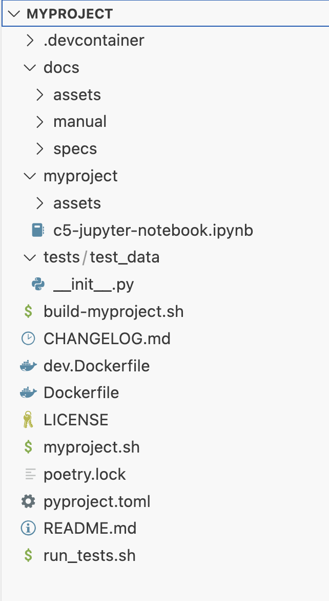

# TC: Test the creation of an empty C5-DEC-based project

Verify that the `c5dec new` command creates a project structured in agreement with the C5-DEC model.

## Preconditions and setup actions
- Access to the C5-DEC deployment artifacts obtained from the Git repository
- [Docker Engine](https://docs.docker.com/engine/) (or daemon or [Docker Desktop](https://www.docker.com/products/docker-desktop/)) running with the right privileges for the testing user
- A terminal running a shell (e.g., bash, zsh)

### Test dependencies
- **TSS-001** or **TSS-002** executed successfully

## Test steps
1. Go to the C5-DEC project folder. E.g., in the path where C5-DEC was cloned from GitHub: `cd c5dec`.
2. Run `./c5dec.sh new`.
3. Run `ls` or equivalent and verify that a zip folder named `myproject.zip` has been created.
4. Unzip the file and access its contents (e.g., via a shell command, in a system explorer or in VS Code).

## Expected outcome
3. The ZIP file `myproject.zip` exists at the current path.
4. The project folder has the structure shown below:

{: width="34%"}
