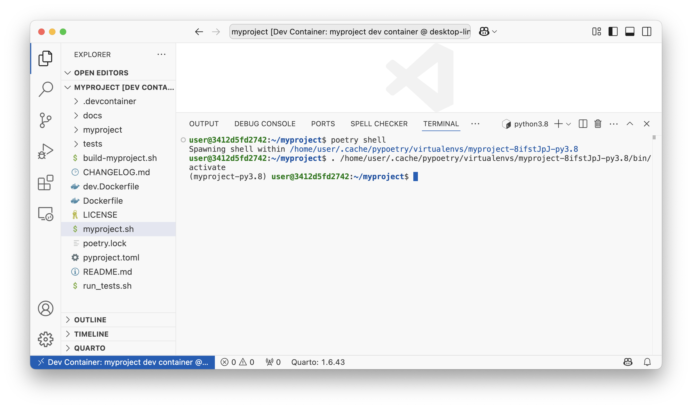

# TC: Test new project in VS Code
Validate that the empty C5-DEc-based project opens correctly in VS Code.

## Preconditions
- Access to the C5-DEC deployment artifacts obtained from the Git repository
- [Docker Engine](https://docs.docker.com/engine/) running with the right privileges for the testing user
- Microsoft [Visual Studio Code](https://code.visualstudio.com/) installed (v1.98.2)
- Microsoft VS Code [Dev Containers](https://code.visualstudio.com/docs/devcontainers/containers) installed, i.e., the VS Code [extension](https://marketplace.visualstudio.com/items?itemName=ms-vscode-remote.remote-containers) (v0.401.0)

### Test dependencies
- **TSS-005** executed successfully

## Setup actions
To keep a clean separation of the tested artifact, copy or move the unzipped project created during the execution of TSS-005 to a location of your choice outside the C5-DEC project folder.

## Test steps
1. Open `myproject` in VS Code.
2. Select the "Reopen in Container" option in the notification that pops up. Alternatively, launch the command palette (Cmd/Ctrl+Shift+P) and select "Dev Containers: Reopen in Container" from the list of available commands.
3. Open a terminal in VS Code if it none is open and run
```sh
poetry shell
```
4. To verify that dependencies are installed, check the version of quarto. You can try other dependencies of your choice (e.g doorstop, kryptor, etc.)
```sh
quarto -V
```

## Expected outcome
3. A `myproject` shell is created

{: width="65%"}

4. `1.6.43` is shown as the output.